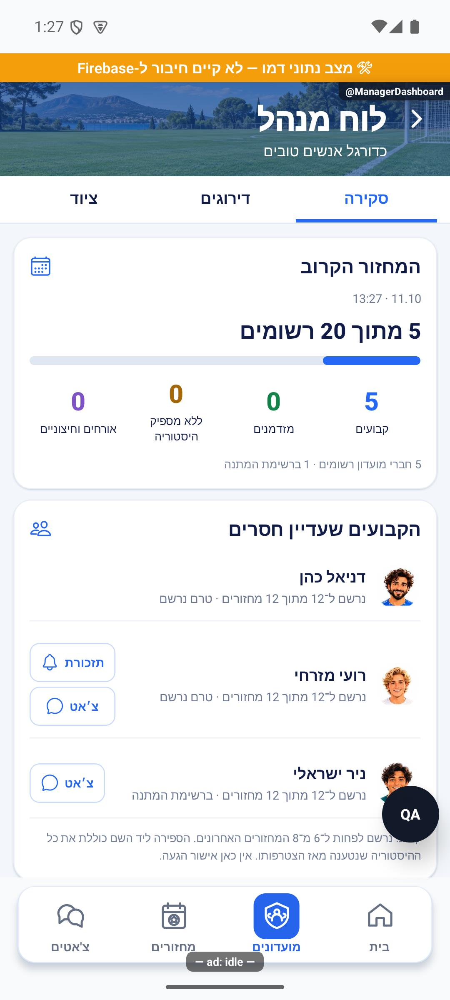

# תיקון דיווחי הפולס — 9.10.2026

היקף שאושר: דיווחים שנשלחו מהאפליקציה בלבד, ללא משימות כלליות או רעיונות. נבדקו 11 דיווחים וצילומיהם. שמונה תוקנו ונסגרו עם הסבר; שלושה נשארו פתוחים. השינויים מקומיים, ללא פרסום גרסה, דחיפה לגיט או שינוי הרשאות.

| דיווח | תוצאה |
|---|---|
| `yFYHRAHWF61uXTRmqN9S` | הוסרה תגית למנהלים בלבד; שער ההרשאות נשמר |
| `aBYPSrgu9B0yofU3mSeV` | הוסרו מדד ופירוט ביטולים מאוחרים מהתצוגה |
| `7cnnuMg5QLClKziIKEdN`, `m3dNZmSbEyEQGSaJRXNr` | ליד שחקן מוצגת ההיסטוריה הכוללת שנטענה; חלון שמונת המחזורים מוסבר בנפרד |
| `Cd0JSGBVPUM9Qqhf4l8Y` | אומת שהמספר הוא רצף ולא סכום; נוסף כיתוב מפורש ובדיקה שהרשמה עוצרת את הרצף |
| `omh1KoGj2QrZvOTBPcwK` | מגמה מתמשכת מזוהה גם עם מישור ותיקון קטן, עם הגנה מפני חריג בודד |
| `gL8tKeNZvR2jhptdca0J` | צ׳אט פרטי זמין גם כשההרשמה סגורה וההסבר מפורש; זמינות התזכורת בדיווח נפרד |
| `ShPci0VaBioMugv6qNZn` | חמש דמויות בשורה, עם התאמת גודל לרוחב הרשת |
| `RrllhMNVH4BYeEZIc9Nx` | פתוח: שני שירותי התזכורת מוכנים ונבנו; ממתינים לאישור פריסה ולאימות לאחריה |
| `iPTIcrULdg0hWvbqSYgV` | פתוח: לא שוחזר גם עם 12 משחקונים בדמו, שלוש גלילות עמוקות ושלוש החלפות ללשונית סטטיסטיקה בלחיצה ראשונה |
| `5TM2eJgxdTedwA6IhJrt` | פתוח: בשלוש חזרות של גלילה לתחתית המועדון וחזרה לראשו, לחיצה ראשונה על שחקנים עבדה |

תוצאות שחזור הכפתורים: `artifacts/manager-dashboard/scroll-tap-results.json`, שישה מעברים שהצליחו. אין בכך הוכחה שהכשל במכשיר המדווח נפתר. לא נעשה שינוי השערתי ברכיבי המגע ולא נסגרו שני הדיווחים.

אימות: 209 חבילות בדיקה ו־3,030 בדיקות עברו, בדיקת טיפוסים נקייה ובניית שרת הצליחה. זוגות מסמכי הפיצ׳ר עודכנו, שלושה צילומים חדשים נרשמו במניפסט, וחמש קבוצות תיקונים נרשמו ביומן השחרור עם צילומי הוכחה. צילום וניסוי אינטראקטיבי בוצעו באימולטור אנדרואיד במצב דמו; קריאת ציוני המועדון האמיתי נעשתה ללא כתיבה. לא נבדק אייפון, לא נשמר דירוג או פרופיל ולא נשלחה תזכורת.

