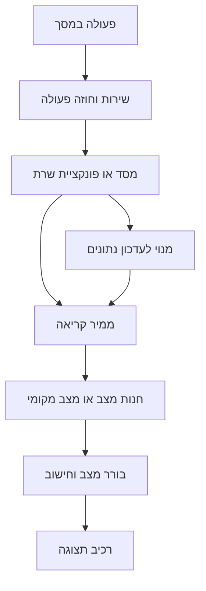

# איך המערכת עובדת מאחורי הקלעים

עודכן 10.10.2026 מול הקוד המקומי, כולל חוזי שמירת המחזור ותיקון התאוששות הניווט; מפת השכבות המקורית נשענה על `8e8fde5`. זהו מפתח משותף למסמכי הפיצ׳רים, ולא תחליף לאלגוריתם המפורט של כל פיצ׳ר. שינוי מקומי אינו הוכחת פריסה. [בחירת פיצ׳ר והסבר פשוט או מעמיק](document-pairs.md).

## שכבות ואחריות

| שכבה | מקור | האחריות והגבול |
|---|---|---|
| הפעלה ושערים | `App.tsx`, `src/navigation/RootNavigator.tsx`, `entryGate.ts` | בחירת זרימת כניסה, שחזור זהות, שכבות עדכון והודעות; לא מקור חישוב סטטיסטיקות |
| ניווט | `src/navigation/*Stack.tsx`, `MainTabs.tsx` | רישום יעדים ופרמטרים; מסך משותף חייב להיות רשום בכל מחסנית מארחת |
| מסכים ורכיבים | `src/screens`, `src/components` | קלט, נראות, אירועים ותוצאות; `ProfileScreen` הוא מסך הבית |
| חנויות מצב | `src/store` | נתונים משותפים, בחירת מועדון, טעינה ומנויים; אינם זהים למסד המתמשך |
| שירותים | `src/services` | בקשות, הרשמה, עריכת נתונים, מנויים וחידוש פעולות |
| חוזים וחישובים | `src/utils`, `gameLifecycle.ts` | הכרעות, נוסחאות וסדרי עדיפות שניתנים לבדיקה בלי מסך |
| טיפוסים וממירים | `src/types`, `src/firebase/firestore.ts` | חוזה שדות וקישור בין מסמך מסד לאובייקט שהיישום באמת מקבל |
| שרת | `functions/src` | פעולות מאובטחות, צבירת תוצאות, עונות והתראות; שינוי מקומי בקוד אינו פריסה |
| אחסון מקומי | `src/services/storage.ts`, שירותים עם `AsyncStorage` | בחירות, חותמות הצגה וטיוטות; לא הוכחה שנתון עסקי נשמר בשרת |
| מערכת המכשיר | `plugins`, `modules`, `targets`, `vendor` | שעון, הרשאות, ערכות מקוריות ומסלולי רקע; בדיקת דמו אינה אימות שלהם |

זו זרימה טיפוסית ולא חוק שכל שירות משתמש באותה חנות: יש מסכים שקוראים שירות ישירות ושומרים מצב מקומי. לפני שינוי יש לעקוב אחר אתר הקריאה הספציפי במסמך המעמיק.

## קריאה, מנוי וזהות

### גבול מסך מקורי והתאוששות משגיאה

`ErrorBoundary` ב־`App.tsx` עוטף את עץ הניווט ויכול להסירו כשילד זורק שגיאה. ב־`@react-navigation/native-stack@6.11.0` מעטפת `styles.scene` שינתה את קיומה כתצוגה מקורית כאשר המיקוד שינה `importantForAccessibility`. יחד עם מעבר הסרה של `react-native-screens`, התוכן נשאר מחובר להורה הישן בעת ניסיון להעבירו למעטפת שהתממשה מחדש. כשל מכוון בזמן כניסה לצ׳אט שחזר זאת בבניית פיתוח חדשה של אנדרואיד עם מנוע התצוגה החדש.

הטלאי `patches/@react-navigation+native-stack+6.11.0.patch` מייצב את **מעטפת הסצנה המדויקת** בעזרת `collapsable={false}`. הוא אינו משנה את המסך המקורי, הפניות או חוזה הניווט. `postinstall.cjs` מחיל אותו ואז מפעיל `verify-native-stack-scene.cjs`: בדיקת גרסה, נקודת כניסה `src/index.tsx` ובדיקת עץ תחביר שמאתרת סצנה יחידה עם המאפיין. שדרוג תלות דורש אימות מחדש. התקנה בלי הטלאי נכשלת בבדיקה; התקנה מחדש מחילה אותו ועוברת. שש בדיקות רגרסיה מגינות על המיקום, הגרסה, סדר ההתקנה והיעדר הזרקת כשל זמנית.

בניסוי השוואה מקומי אותו כשל גרם לקריסה לפני הטלאי, ואחרי הטלאי הציג התאוששות שמישה וחזרה לבית באותו תהליך. מועמד מוקדם של `ScreenContext` לא פתר את הבעיה והוסר. שגיאת שירות הדמה שהציתה את המקרה הראשוני תוקנה בנפרד; אין זו הוכחת קריסת צ׳אט בייצור, טיפול בכל שגיאה או בדיקת אייפון. מסך ההתאוששות מגדיר `StatusBar` של `react-native` עם `dark-content` ורקע `colors.bg`, לקריאות ללא שינוי שקיפות או שטח החלון. הצילום הסופי `fallback-rn-statusbar-visible.png` מאמת זאת; הכשל הזמני הוסר וכל שש הבדיקות עברו שוב אחרי הצילום. [החקירה, הצילומים ומגבלות ההוכחה](../../artifacts/pre-release-2026-10-10/native-ra01/source-investigation.md).

דוגמה מאומתת: `groupService.listForUser` ו־`subscribeForUser` מגינים על זהות המשתמש המבוקש מול סשן ההתחברות. `groupStore.hydrate` טוענת את המידע ההתחלתי, ו־`subscribe` מחברת עדכונים ומפרקת מנוי קודם. יש הבדל בין ״טרם נטען״, ״נטען וריק״ ו״הקריאה שייכת למשתמש קודם״. `StaleSessionError` מאפשרת לזהות את המצב האחרון; החזרת מערך ריק במקום שגיאה תשנה את משמעות התוצאה ועלולה למחוק בחירה תקפה.

ממירי המסד אינם העברה עיוורת של כל השדות. למשל `GameDoc.fromFirestore` משחזרת `participantIds` במידע ישן ומפעילה `readLiveMatch`. לכן הוספת שדה לטיפוס או לכתיבה בלבד אינה מספיקה. ראיית דמו עשויה לעקוף בדיוק את הממיר שבגללו הנתון חסר אצל משתמש אמיתי.

## מחזור חי, משחק וצבירה

`gameLifecycle.ts` מנרמלת מצב ישן `open` עם `liveMatch.phase='live'` כפעיל. הרשאת כניסה לצפייה והרשאת שליטה הן שאלות שונות. מצב סופי הוא הסתיים או בוטל; שעת ההתחלה לבדה אינה הוכחת משחק.

`eveningPlayed.ts` היא מקור ההכרעה לקיום ערב; [סדר ההכרעה המלא](shared/data-and-state-contracts.md). ערב אחד יכול לכלול כמה משחקים, ולכן יש להפריד את המונים בכל מסך, היסטוריה, תואר וצבירה.

[`commitProtocol.ts`](../../functions/src/commitProtocol.ts) מרכזת את בדיקת החתימה וחידוש שמירת המשחק. בחוזה המקומי העדכני ל־10.10.2026, `commitRoundStats` כותבת באותה אצווה אטומית היסטוריה, חתימת `committedRounds/{roundId}`, מוני סטטיסטיקה וניקוי הלוח. יצירת חתימה ותנאי גרסת המחזור מונעים כפילות ומבטלים את האצווה אם שער נוסף בינתיים. הלקוח אינו מנקה את הלוח אחרי התשובה, ומתקדם לפי המנצחת ומדיניות התיקו שנשמרו בשרת.

אם כבר נשמר, משוחזרת רק היסטוריה חסרה בלי לדרוס קיימת; אין הגדלה חוזרת. קוראים ישנים בלי `liveGoalIds` שומרים על מסלול תאימות. הלקוח החדש דורש תשובת `protocol: 2`; פריסת השרת נדרשת לפני הפצתו. סיום המחזור כולו מחודש בשלבים חתומים דרך `onGameRosterChanged`: הופעות, דירוגים, צמדים, סיכום והשלמה. הצמדים קודמים לסיכום העשוי לחתום עונה, ובכל אצווה מצטברת נבדקת העונה וגרסת המועדון. אין טענה שכל המחזור כולו הוא עסקה אחת. בדיקות מבודדות אינן הוכחת פריסה או תיקון נתונים היסטוריים. יש לקרוא גם את `liveRoundCommit.ts`, `statBatch.ts` ומסמכי המחזור והעונה לפני שינוי.

## איך קוראים נוסחה נכון

במסמך פיצ׳ר שיש בו חישוב צריך לזהות:

1. **מקור:** מסמך משתמש, נתוני מועדון פעיל, תמונת עונה חתומה, רשימת משחקים או צמדים.
2. **יחידה:** מחזור, משחק, ניסיון פנדל, שער שדה, שנייה או מילישנייה.
3. **תחום:** אישי לאורך החיים, מועדון מסוים, עונה פעילה או עונה נבחרת.
4. **מונה ומכנה:** למשל הצלחות מתוך ניסיונות; הנתון אינו אחוז רק מפני שמצויר סימן אחוז.
5. **סינון:** מי השתתף בפועל, איזה ערב התקיים, האם אורחים נכללים ואיך מתייחסים לתיקו.
6. **חסר ועיגול:** מה קורה במכנה אפס, מידע חסר, שדה ישן וכשל קריאה; האם מעגלים לפני מיון או רק בתצוגה.

הדוגמאות המספריות במסמכים מסבירות את הנוסחה מהקוד. הן אינן נתונים שנמדדו בחשבון הבעלים. פיצ׳ר שאינו מחשב מספר מתועד כתנאים, קדימות והשלכות, בלי נוסחה מומצאת.

## התחברות באמצע פעולה

[`pending-actions.md`](entry/pending-actions.md) מתעדת את הגשר בין בקשת המשתמש, טיוטה, התחברות וחידוש. מקורות משותפים: `pendingAction.ts`, `draftStore.ts`, `actionCoordinator.ts`, `actionResumers.ts`, `authUpgrade.ts`. חוזה מרכזי הוא שימור כוונה וחידוש פעם אחת, בלי להפוך בקשה ממתינה לאישור להבטחת מקום בסגל.

הצעת התראות מגיעה אחרי תוצאה עסקית, דרך הכרזה נפרדת ומארח; [פירוט התור והצינון](shared/notification-offer.md). כשל הצגה או הרשאה אינו אמור לבטל הצטרפות שהצליחה.

## אמינות הראיות ועדכון עתידי

`USE_MOCK_DATA` ב־`src/firebase/config.ts` בוחרת מסלול דמו לפי ההגדרות והכפייה המפורשת. השירותים מחזיקים ענפים שונים, ולכן צילום דמו מוכיח את הממשק המצולם ולא הרשאת מסד, פונקציית שרת או גשר מקורי. יש לקרוא גם את ענף הנתונים האמיתי לפני תיקון.

לכל שינוי יש שני עדכונים: ההסבר הפשוט מתאר מה המשתמש מרגיש ועושה; המעמיק מתאר אילו תנאים/שדות/פונקציות השתנו ומפנה לראיות. [כללי התחזוקה](maintenance.md) ו־[תוכנית האימות](validation-plan.md) מגדירים איך לשמור את הזוגות מעודכנים. אין הבטחת זיכרון בלי קריאה; המטרה היא קריאה ממוקדת שתספיק להתמצאות ותוביל למקור המדויק.
