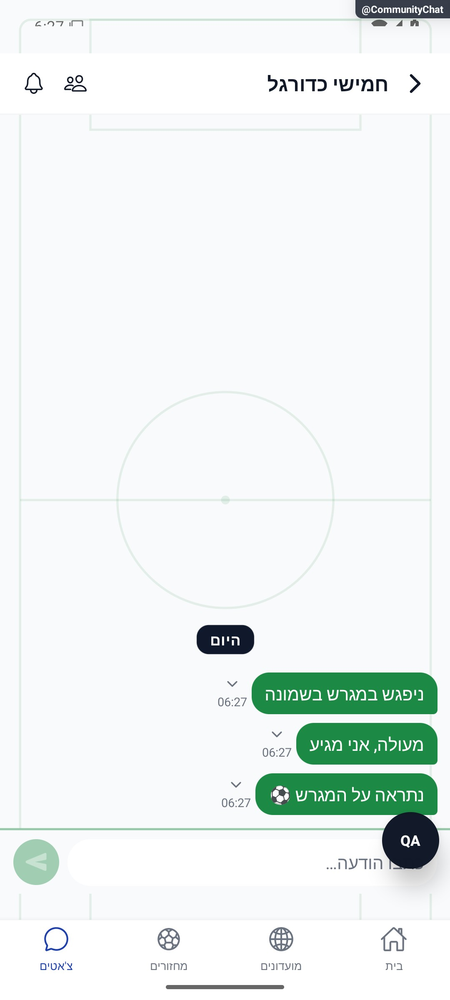

# כותבים וקוראים הודעות

בשיחה כותבים הודעה ורואים הודעות חדשות כשהן מגיעות. אפשר לראות מי מקליד ומי קרא, ולהמשיך לקרוא הודעות קודמות בלי לקפוץ תמיד לתחתית.

[לפירוט המעמיק](message-interface.md)

## תיקוני סבב הבאגים — 8.10.2026

תקלה בטעינת החסימות לא חושפת מחדש הודעות של משתמש חסום.

## השלמת הנפשות — 8.10.2026

בועות חדשות נכנסות בתנועה קצרה כשנמצאים בתחתית השיחה. בזמן קריאת הודעות ישנות אין כניסה מונפשת או קפיצה כפויה בגלל התנועה החדשה.

[פרטי האימות והמגבלות](../../changes/2026-10-08-motion-completion.md). מקור: `9ec0dfd` עם שינויים מקומיים; טרם פורסמה גרסה.
