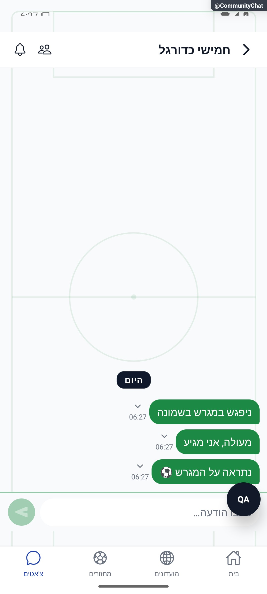

# כותבים וקוראים הודעות

## מדידת פעולות ואמינות נתונים, 5.11.2026

נוספה הכנה למדידת הפעולות ברכיבים המתועדים כאן. בפולס אפשר לראות ביצועים וחשבונות ייחודיים לפי פעולה ותקופה, כאשר קיים כיסוי מדידה. איסוף החשבונות החדש עדיין כבוי והמימוש מקומי. [פירוט והיקף הבדיקות](../../audits/2026-11-04-system-night/product-measurement.md).

## שיפורי טעינה משותפים, 4.11.2026

עודכנו מנגנוני הטעינה המשותפים כדי לצמצם עבודה וקריאות חוזרות. דרך השימוש בפיצר נשמרת. השינוי מקומי וטרם הופץ, ואין אימות מכשיר חדש של המסך הזה. [היקף, מדידות ומגבלות](../../changes/2026-11-04-screen-performance.md).

## התאמת מבנה שלדי הטעינה, 3.11.2026

נבדקה השפעת התאמת השלדים במקורות המשותפים. אין שינוי בנתונים, בחישובים או בפעולות העצמאיות של המסך. השינוי מקומי וטרם הופץ. נבדקו אזורי מקור בדפדפן בשלושה רוחבים, ללא בדיקת מכשיר חדשה. [המידות, הבדיקות והמגבלות](../../changes/2026-11-03-skeleton-layout-alignment.md).

כל 6,820 הבדיקות ובדיקת הטיפוסים עברו. האימות החזותי במשימה זו הוא בדפדפן בלבד.

## ליטוש מקומי והשפעת רכיבים, 3.11.2026

השיפור ברכיבים המשותפים המשמשים את כתיבה, קריאה ומצבי חיבור כולל שמות לפעולות נוספות בכותרת. אין שינוי בתוכן הודעות, בשליחה או בהרשאות השיחה. הבדיקה הממוקדת של רכיבי המקור אינה בדיקה חדשה של המסך המלא במכשיר.

[הראיות והמגבלות של המשימה](../../changes/2026-11-03-overnight-mission.md).

## בדיקת קצה ואימות מקורי, 2.11.2026

עדכוני הודעות מפנים כעת כלפי מטה, אל ההודעות החדשות. החלפת שיחה או חשבון מתחילה מצב קריאה נפרד, בלי להעביר תוכן או חיווי מהשיחה הקודמת. מקומי וטרם הופץ. [שחזור, תיקונים, בדיקות ומגבלות](../../changes/2026-11-02-experience-review.md).

## המשכיות ומשוב בשימוש, 2.11.2026

כשקוראים הודעות קודמות, הודעות נכנסות אינן מושכות לקריאה האחרונה. מופיעה אפשרות להציג אותן, עם הדגשה קצרה, והשליחה ממשיכה כרגיל. מימוש מקומי שטרם הופץ. [התנהגות, בדיקות, צילומים ומגבלות](../../changes/2026-11-02-experience-polish.md).

## בקשות לשיחה אישית, 2.11.2026

שליחת בקשה ותשובה המאשרת ממתינות לאישור השרת, עם ניסיון יציב ושמירת טיוטה בכשל. בשיחות אחרות נשמר מסלול השליחה הקיים. המימוש מקומי וטרם הופץ או נפרס. [התנהגות, בדיקות ומגבלות](../chat/message-requests.md).

## התאוששות משגיאות בפולס, 28.10.2026

עודכנה תשתית הבדיקות המשותפת בעקבות תיקוני טעינה. לא בוצע שינוי מכוון בפעולות המתוארות בעמוד זה ולא בוצע אימות מכשיר חדש.

השינוי מקומי וטרם הופץ. [ממצאים, בדיקות ומגבלות](../../changes/2026-10-28-pulse-errors.md).

## הרחבת אבחון דיווחים, 27.10.2026

הדיווחים יוכלו לכלול מה ניסו לבצע, מה היה מצב האפליקציה ומה החזיר השרת. פרטים חסרים מוצגים כלא ידועים, ומספר מוגבל של מופעים נשמר בלי למחוק את המופע הראשון. השינוי מקומי וטרם הופץ, ואינו משלים פרטים לדיווחים ישנים. [היקף, ראיות ומגבלות](../../changes/2026-10-27-diagnostic-context.md).

בתיקוני 27.10 עברו כל 6192 הבדיקות המקומיות ובדיקת הטיפוסים. התיקון עדיין מקומי; הצילום הוא רינדור דפדפן, ללא בדיקת מכשיר חדשה.

בדיקות הקוד הושלמו, אך השינוי עדיין מקומי ולא הופץ. פרטים שלא נאספו בדיווחים ישנים אינם משוחזרים בדיעבד.

## כשל קריאת שיחה וניסיון חוזר, 27.10.2026

אם השיחה לא נטענה בגלל תקלה בחיבור, מוצגת הודעת כשל ואפשר לנסות שוב. הודעות שכבר נטענו נשארות כשיש ניתוק זמני, ותשובה משיחה שכבר נסגרה אינה מחליפה את השיחה הנוכחית. התיקון מקומי וטרם הופץ. נבדקו הלוגיקה ורינדור דפדפן, ללא אימות מכשיר חדש. [מצבים, צילומים ומגבלות](message-interface.md#כשל-קריאת-שיחה-וניסיון-חוזר-27102026).

## תיעוד כשלים — 20.10.2026

נוסף תיעוד אוטומטי לנקודות כשל במסלול הזה, עם מקור התקלה. הפעולה המקורית שומרת על ערכי החזרה והודעות השגיאה שלה. השינוי מקומי, טרם הופץ, ואין אימות מסירה חיה לפולס.

[דוח דיווח השגיאות והראיות](../../changes/2026-10-20-error-reporting-audit.md).

## עדכון 11.10.2026

הודעות ושורת הכתיבה קיבלו עיצוב כחול ועדין. בשיחת מחזור שהסתיים מוצג זמן עד סגירת הכתיבה, ולאחר מכן אפשר להמשיך לקרוא. השינוי מקומי וטרם הופץ.

## עדכון מקומי — 10.10.2026

הודעות חדשות ממשיכות לעדכן קריאה וגלילה גם בשיחות ארוכות. אם אתם קוראים הודעות ישנות, הודעה חדשה אינה מקפיצה אתכם לתחתית.

התנהגות הכשל נבדקה בקוד מבודד; לא הורצה במכשיר מול הנתונים האמיתיים.

בשיחה כותבים הודעה ורואים הודעות חדשות כשהן מגיעות. אפשר לראות מי מקליד ומי קרא, ולהמשיך לקרוא הודעות קודמות בלי לקפוץ תמיד לתחתית.

[לפירוט המעמיק](message-interface.md)

## תיקוני סבב הבאגים — 8.10.2026

תקלה בטעינת החסימות לא חושפת מחדש הודעות של משתמש חסום.

## השלמת הנפשות — 8.10.2026

בועות חדשות נכנסות בתנועה קצרה כשנמצאים בתחתית השיחה. בזמן קריאת הודעות ישנות אין כניסה מונפשת או קפיצה כפויה בגלל התנועה החדשה.

[פרטי האימות והמגבלות](../../changes/2026-10-08-motion-completion.md). מקור: `9ec0dfd` עם שינויים מקומיים; טרם פורסמה גרסה.

## התאמה למסך — 8.10.2026

נוספה התאמה שמרחיקה תוכן משורות המערכת של הטלפון. [פירוט ומגבלות הבדיקה](../shared/menus-and-motion.md#התאמה-לשטח-הבטוח--8102026).

## בידוד שיחות הדמו — 10.10.2026

שיחות במצב הדמו אינן מתחברות למסד הנתונים. אפשר לפתוח מסך שיחה ריק לצורך בדיקת התצוגה; אין בו הודעות אמת, הקלדה של שחקנים אחרים או אישורי קריאה. שליחה, מחיקה, השתקה, חסימה ודיווח בדמו נדחים במפורש ואינם נחשבים לפעולה שהושלמה.

במצב רגיל, כשל בהכנת ההאזנה או בשחזור ההתחברות מגיע לטיפול השגיאות של השיחה. יציאה לפני שההתחברות הושלמה מבטלת את פתיחת ההאזנה לשיחה הישנה. בדיקות הקוד המבודדות עברו; האימות החוזר של המעבר באמולטור מתועד בדוח הבדיקה ואינו בדיקת מסירה בין משתמשים אמיתיים.

## הקשחת אבטחה מקומית — 11.10.2026

זהות כותב ההודעה ומועד השליחה נקבעים על ידי המערכת. דיווח על הודעה עובר בשרת ואינו מאפשר להמציא הודעה מדווחת.

## תמיכה זמינה — 14.10.2026

אפשר לפנות לצוות מתוך חלונית מעל המסך ולצרף צילום לפי בחירה, עם הגדלה והסרה לפני שליחה. [פירוט](../shared/support-chat.simple.md).

## התאמת בדיקת המקור המשותפת בלילה של 25.10.2026

עודכן אופן הפעלת בדיקת מקור משותפת בעקבות קיצור טעינת הסטטיסטיקה. אין שינוי נוסף בפעולות המתוארות כאן, והן לא נבדקו מחדש במכשיר בסבב הזה. [בדיקות ומגבלות](../../changes/2026-10-24-loading-performance.md).

## המשך קיצור טעינות בלילה של 25.10.2026

עודכנו קריאות מידע משותפות או מתאם הבדיקה שלהן כדי לצמצם טעינות מיותרות. אין שינוי נוסף בפעולות העצמאיות המתוארות כאן, ואין אימות מכשיר חדש שלהן בסבב הזה. [בדיקות, ראיות ומגבלות](../../changes/2026-10-24-loading-performance.md).
