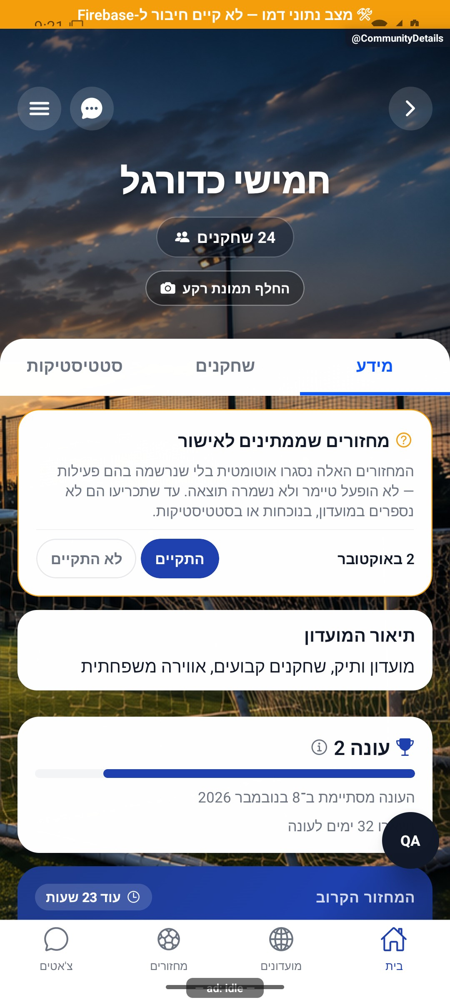
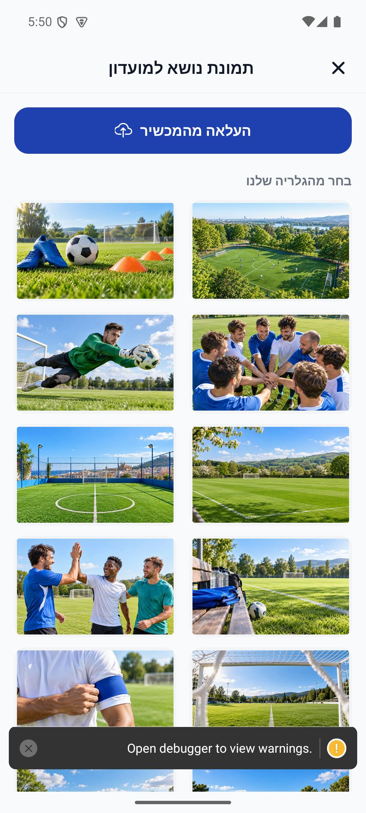
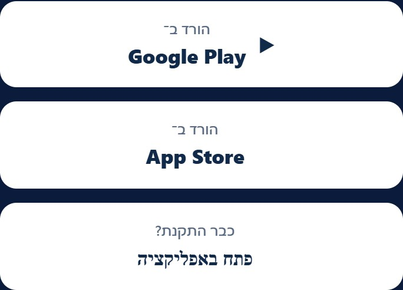

# רקעי מועדון והזמנות

## תצוגת התמונה — 8.10.2026

רכיב המעבר בין רקעים מגדיר כעת גודל מפורש לשכבה הנוכחית ולקודמת בתוך משטח חיתוך. כך נכס מקומי אינו מציג את מידות הקובץ במקום מידות כותרת המועדון. סדר הקדימות של מקור הרקע, ההעלאה, שמירת בחירה, השיתוף וההזמנות נשארו ללא שינוי. נצפתה תמונה מקומית באמולטור אנדרואיד; העלאה וכתיבה לייצור לא הופעלו. [תיקון וגבולות אימות](../../changes/2026-10-08-cover-layout.md).

[להסבר הקצר והפשוט](covers-and-invitations.simple.md)

עודכן: 07.10.2026; מקור: `8e8fde5`. כניסה: `CommunityDetails` → שינוי רקע/שיתוף/הזמנת חברים. אלה חלונות ופעולות בתוך מסך, לא נתיבי מסך עצמאיים.

הצילום לעיל נצפה ומסומן במניפסט כצילום אמולטור ממשימה קודמת, ללא קומיט מקור; אינו בדיקת בינארי החנות הנוכחי. הוא מראה את ששת רקעי היום בחלק התחתון, אך אינו מכסה את ראש הגלריה או מסלול ההעלאה.

## רקעים

גלריה של 16 רקעים: `c01`–`c10` הוחלפו בעשר תמונות יום מגוונות: מגרש ממבט אווירי, ציוד אימון, מעגל קבוצה, שוער, מגרש כפרי, מגרש עירוני, ספסל, חגיגת חברים, מבט מתוך שער וסרט קפטן. `c11`–`c16` הן שש תמונות היום הקודמות, שנשמרו ללא שינוי. מזהי הגלריה נשמרים. לאחר בקשת הבעלים, 25 מועדונים שבחרו רקע ישן קיבלו במסד מזהה אקראי אחר מתוך עשרת הרקעים החדשים. תמונה שהועלתה גוברת על רקע מובנה, ולאחריהם ברירת מחדל. בחירה ברקע מובנה שומרת `coverImageId` ומנקה `coverPhotoUrl` כדי שהתמונה הישנה לא תמשיך לגבור.

| פעולה | מי ונתונים | מצבים |
|---|---|---|
| בחירה בגלריה | מנהל; מזהה רקע | שמירה מיידית, בחירה מסומנת, עסוק/שגיאה |
| העלאה מהמכשיר | מנהל; הרשאת ספרייה ותמונה | ביטול אינו שגיאה; הרשאה נדחית/העלאה נכשלת |
| הצגת רקע | כל מי שרואה מועדון | אותה קדימות בתצוגה ציבורית, כרטיסים ופרטים |

שינוי מטא־נתונים אחרי העלאה שנכשלה עלול להשאיר קובץ שאינו משויך; אין למחוק קבצי אחסון במסגרת מיפוי. מקור: `src/data/coverImages.ts`, שירות העלאת מדיה, `src/services/groupService.ts`, קוראי מועדון ומרכיבי הרקע. לוגו עצמאי המתואר בארכיון 087 לא אותר בקוד הנוכחי ולכן אינו יכולת קיימת מתועדת.

## שיתוף והזמנת חברים

קישור קצר מבוסס שירות ההזמנות, עם גיבוי לקישור ארוך. פרטי שם/תיאור ומזמין משמשים להצגת הקישור. פתיחת גיליון שיתוף אינה הוכחה שהמשתמש שלח הודעה ולא הרשאה לשלוח בשמו.

`inviteFriendsToGroup` מאמת חברות קיימת ומוציא כבר־חברים/ממתינים. השרת מגביל בחירה לפי מקום ומכסה, עד 500; ברירת מחדל 500 במועדון ללא מכסה. במועדון פתוח מוזמנים מצורפים לרשימת שחקנים, ובסגור לרשימת ממתינים בהתאם למימוש השרת. ההתראה נשלחת אחרי העדכון; תקלה במסירתה אינה בהכרח כשל חברות.

## בדיקות וראיות

קוד השיתוף ופונקציית `inviteFriendsToGroup` נקראו; לא הועלתה תמונה ולא נשלחה הזמנה. אין צילום עדכני של חלון הגלריה במקבץ המסכים הנוכחי; חומר השיחה וצילומים קודמים הם ראיה היסטורית בלבד. יש להשלים צילום הגלריה, הרשאה נדחית, בחירה ושיתוף קצר/גיבוי. יש לבדוק קישור על מכשיר ללא התקנה ובמכשיר מותקן לפני שינוי שיטת ההזמנה.

## הצעות בלבד

להוסיף תיאור נגיש לרקע ולסמן בחירה בלי להסתמך רק על צבע; להראות תצוגה מקדימה ביחס החיתוך האמיתי; להציג ספירת מוזמנים ומקום שנותר לפני אישור. שינוי הרקע יכול להתחלף בשקיפות קצרה לאחר שמירה, בלי להציג בחירה שלא נשמרה.

## פירוט טכני נוסף — זרימה, חישוב ונקודות שינוי

`handleSelectBuiltinCover` כותב `coverImageId` ובמקביל `coverPhotoUrl: ''`, כדי שהתמונה שהועלתה לא תמשיך לגבור על הבחירה. העלאה מהמכשיר קודמת לכתיבת הכתובת ב־`updateGroupMetadata`; בזמן העלאה `uploadingCover` מונע כניסה כפולה. כשל שמירת המטא־נתונים אחרי העלאה אינו מבטל בהכרח את קובץ האחסון.

`inviteFriendsToGroup` עובר דרך פונקציה נקראת בשרת, ושיתוף קישור אינו אישור אוטומטי במועדון סגור. שינוי נכס חייב לשמר מזהים של רקעים שכבר נבחרו, לוודא שהממיר קורא את השדות ולהבחין בין סירוב הרשאה, ביטול בורר, כשל העלאה וכשל שמירה. צילום הגלריה היסטורי לפי המניפסט, ואינו אימות העלאה נוכחית.

הפירוט מתאר את הקוד שנקרא, ולא בדיקת כתיבה או הרשאות בסביבת הייצור. יש לקרוא את הקוד הממוקד וההפרש מאז מקור המיפוי לפני תיקון; בדיקות המוזכרות כאן לא הורצו מחדש לצורך עריכת התיעוד.

## עדכון 8.10.2026 — תנועה ותיקוני דיווחים

`CoverImagePicker` מנפיש את סימון הבחירה. `CommunityStadiumHero` משתמש ב־`CoverCrossfade`: התמונה האחרונה שנטענה נשארת מאחור, והתמונה החדשה עולה באטימות לאחר `onLoad`, במשך 250 אלפיות שנייה. בחירה חדשה מבטלת תנועה קודמת; אירוע טעינה עם מפתח ישן אינו מחליף תמונה נוכחית. `CommunityShareInviteCta` מפעיל פעימה של 220 על סמל השיתוף בלבד; פתיחת חלון שיתוף אינה מוצגת כמסירה מוצלחת.

**ראיה ומגבלות:** החלפת רקע מובנה הורצה בדמו והוקלטה. טעינת תמונה מרוחקת, כשל טעינה ופעולת השיתוף החיצונית לא הורצו.

בדיקת הטיפוסים ו־183 חבילות הבדיקות עברו, 2,752 בדיקות. מצב המקור: `9ec0dfd` עם שינויים מקומיים; אין גרסה חדשה שפורסמה. [יומן השינוי וההקלטות](../../changes/2026-10-08-motion-and-pulse.md).

## תיקוני סבב הבאגים — 8.10.2026

R02: CoverCrossfade מציבה active לפי imageKey בזמן רינדור; onLoad/onError בודקות אותו. loadedKey מונע מאפקט מאוחר לאפס אטימות אחרי טעינה מהמטמון. כשל משמר loaded ומבטל תנועה. החלפה בדמו אינה בדיקת רשת מרוחקת; מצבי תזמון נבדקו בקריאת קוד בלבד.

[ראיות, בדיקות ומגבלות](../../changes/2026-10-08-audit-fixes.md).

רקע נטען בתצוגת המוצר הרגילה בדמו. כשל קריאה יזום בכרטיס אימות המחזורים אינו כשל תמונה; טעינה מרוחקת וכשל תמונה אינם מוכחים בצילום זה.

## רענון הגלריה — 8.10.2026

עשר התמונות החדשות נצפו בגלריה באמולטור. שש הקודמות נשמרו ונצפו בגלילה; אזהרת פיתוח מכסה חלק מתחתית הצילום. לא נשמרה בחירה ולא בוצעה כתיבה למועדון בייצור; אייפון לא נבדק. בדיקת הטיפוסים ו־2,820 בדיקות ב־191 חבילות עברו. [מקורות והוראות היצירה](../../changes/2026-10-08-club-covers-refresh.md).

## החלפה אקראית למועדונים קיימים — 8.10.2026

לפי בקשת הבעלים, עודכנו בפועל 25 מועדונים עם `coverImageId` בטווח `c01`–`c10` וללא תמונה שהועלתה. לכל מועדון הוגרל מזהה אחר מתוך עשרת החדשים ונשמר במסד, כך שהבחירה קבועה בין מסכים, מכשירים ופתיחות. שבע תמונות שהועלו ושתי בחירות מהשש הקודמות נשמרו; 187 מועדונים ללא מזהה רקע נבחר נשארו עם ברירת המחדל.

הקריאה בוצעה באמצעות שאילתה. העדכון נגע רק ב־`coverImageId`, עם תנאי התאמה לזמן העדכון שנקרא ובדיקה חוזרת שאין `coverPhotoUrl` לא ריק. אפס רשומות השתנו במקביל, ואימות לאחר הכתיבה אישר את כל 25 השיוכים. התוכנית וגיבוי המזהים הקודמים שמורים מקומית ב־`artifacts/club-cover-randomization-plan.json`, ואישור הכתיבה ב־`artifacts/club-cover-randomization-receipt.json`. אין החלפה אקראית בכל רינדור. צילום הגלריה לעיל מוכיח את הנכסים החדשים; אינו צילום של המועדונים בייצור. הקוד לא השתנה במשימה זו, והבדיקות שעברו במשימת רענון הגלריה תקפות לאותו קוד.

## תיקוני ההזמנה וההיכרות — 8.10.2026

שני עותקי `invite.html` משתמשים ב־`buildStoreHref`, לרבות שינוי יעד לאחר פתרון קוד. מטען החנות כולל `target_type`, `target_id`, מזמין `by` ומקור/קמפיין/מזהה קישור. `referrerInvite` קורא את הפורמט המפורש וגם את פורמטי ההזמנה והמעקב הישנים. יעד מועדון אינו הופך להזמנה כללית כשיש מקור מעקב. `appQuery` משמר גם `l`. כל כפתורי ההורדה לאייפון עוברים דרך `installIOS`, ממתינים להעתקה עד 1,200 מילישניות ומטפלים בדחייה; בכשל מוצע להמשיך לחנות ולחזור לקישור המקורי. נוסף קישור מפורש למי שכבר התקין, דרך הסכימה הקיימת. לא נטען שאייפון יכול לשחזר תמיד ללא הרשאה. שינויים בתבניות ובשיוך דורשים פריסה מאושרת של האירוח ושל הפונקציות המגישות תבניות, שלא בוצעה.

מקור: `a348b9f` עם תיקונים מקומיים. ראיות ובדיקות: [דוח התיקון](../reviews/onboarding-fixes-2026-10-08.md).

## מצב ההזמנות לאחר התיקונים המקומיים — 9.10.2026

הממצאים של הסקירה החוזרת מ־8.10 תוקנו מקומית, ובהמשך נבדקו ותוקנו גם מקרי קצה נוספים בסבב של ארבעה סוכני אסטרטגיה וארבעה בודקים. הסטטוס ההיסטורי של שמונה תקלות ושני פערים פתוחים אינו מצב הקוד הנוכחי. קדימות הזמנה חדשה, שמירת ייחוס לאורח, מניעת ניקוי בידי ניסיון ישן ושמירת בחירה מפורשת מפורטים גם במסמכי הכניסה. זהו מצב קוד מקומי, לא אישור שהקוד כבר נפרס או שהתקנה אמיתית מהחנות נבדקה. [דוח התיקונים, הראיות והגבולות העדכניים](../reviews/onboarding-expanded-fixes-2026-10-09.md).

### כתובות, יעד ונתונים

| כתובת | התנהגות מקומית נוכחית |
|---|---|
| `/` | הפניה ל־`/app` עם השאילתה והמקטע; פרטי שיתוף אינם נתקעים בדף הראשי הישן |
| `/get` | בלי פרטי הזמנה או מעקב: חנות לפי מכשיר, ובמחשב בחירת שתי חנויות; עם פרטים: הפניה ל־`/go` עם השאילתה |
| `/app` | דף כללי או הזמנה אישית לפי המזמין; קוד בשאילתה נפתר לפני פעולה |
| `/go` | מסלול שיווקי המשמר מקור, קמפיין, מזמין ויעד; קוד בשאילתה נפתר כמו ב־`/app` |
| `/session/<id>` | הזמנה למחזור המסוים, עם פענוח מזהה לפני קידודו לכתובת הבאה |
| `/team/<id>` | הזמנה למועדון המסוים |
| `/c/<id>` | תצוגת המועדון באתר; כפתור פתיחת היישום מתרגם ל־`team/<id>` ושומר את פרטי ההזמנה והמעקב הנתמכים |
| `/i/<code>` | השרת פותר קוד ומזריק יעד ומזמין קנוניים לפני הפעלת הדף |
| `/app?code=<code>` | כתובת חלופית לקוד קצר; אינה נחשבת הזמנה כללית רק מפני שהנתיב הוא `app` |

הכתובת החלופית `/go?code=<code>` משתמשת באותו פתרון קוד. `public/invite.html` הוא דף ההזמנה, `public/c/index.html` תצוגת המועדון, ו־`public/get.html` מסלול ההורדה. תבניות השרת מועתקות מ־`public` בעת בניית הפונקציות; יש לפרוס את האירוח ואת הפונקציות המאושרות יחד לפני שהשינוי המקומי מגיע למשתמשים.

`serveInviteCode` ב־`functions/src/index.ts` מחזיר ב־`/i/<code>?resolve=1` תשובת נתונים בלבד, ללא עדכון ספירות. השדה `invitedBy` הקנוני גובר על מזמין בשאילתה גם כשהוא מחרוזת ריקה; אין לייחס הזמנה למזמין שנוסף לכתובת כאשר הקוד אינו מכיל אותו. תשובות הפתרון והדף הקצר מסומנות `Cache-Control: no-store`. כניסת דפדפן רגילה נספרת בשרת, והזרקת `clickTracked: true` מונעת מהדף לספור שוב את אותו מזמין. הזרקת JSON מחליפה `<` ב־`\u003c`, ושמות המזמינים מוצגים באמצעות `textContent` ובידוד כיווניות, בלי לפרש אותם כתגיות.

יעד של הזמנת מחזור נשאר המחזור המקורי, גם אם התצוגה המקדימה מציינת שהסתיים או בוטל. הדף אינו מחליף בשקט את הקישור למועדון של המחזור. תצוגה מקדימה היא מידע נלווה: בקשה שלה שאינה חוזרת אינה מונעת פתיחת יעד שכבר נפתר.

### מעבר לחנות וליישום

`appQuery` משמר מזמין `invitedBy`, מקור `s`, קמפיין `c`, יעד מעקב `g` ומזהה קישור `l`. המקור נקרא מקידוד `b`, ואם הקידוד פגום נלקח `s` או `utm_source`. `buildStoreHref` מקודד בפניית חנות Android את `target_type`, `target_id`, `by`, `utm_source`, `utm_campaign`, `g` ו־`l` לפי הנתונים הקיימים. `parseReferrerInvite` תומכת בפורמט המפורש ובפורמטים ההיסטוריים; `installReferrerService` קורא את ההפניה בהתקנה חדשה. הזמנה מאוחרת מן החנות אינה דורסת קישור חדש שהמשתמש פתח בינתיים.

פתרון קוד חלופי מוגבל לארבע שניות. כל כפתורי ההזמנה ממתינים לאותה הבטחת פתרון, לרבות העוגן של חנות Android והכפתור למי שכבר התקין. בכשל או בזמן קצוב נשמרת כתובת `/i/<code>` המלאה: ב־Android דרך `invite_url` בפניית החנות, וב־Apple בלוח. `resolveIncomingInvite` והאחסון של כתובת לא פתורה מאפשרים ניסיון התאוששות מוגבל; אין להסיק יעד לא ידוע או לשמור מזמין לא מאומת כאילו הקוד נפתר. התנהגות הניסיון החוזר וקדימותו לקישור חדש מפורטות במסמכי הכניסה.

`installIOS` ממתינה להעתקה ללוח עד 1,200 מילישניות לפני המעבר לחנות Apple. גם iPad המדווח כ־Mac עם מסך מגע מזוהה במסלול Apple. בכשל ההעתקה המשתמש יכול לסרב למעבר או להמשיך לאחר הסבר לחזור לקישור המקורי. הכפתור הראשי ב־Apple אומר ״הורד את Teamder״; כפתור נפרד ״פתח באפליקציה״ מיועד למי שכבר התקין. אין במערכת Apple הבטחה שכל הזמנה תשרוד התקנה ללא הרשאת לוח או בלי חזרה לקישור.

### בדיקות, חזות וגבולות

`tests/logic/inviteWebExpanded.test.ts` הריצה 47 תרחישי התנהגות על סקריפטי המקור, כולל לחיצה מוקדמת, ניווט ברירת מחדל של עוגן, כשל ואיטיות לוח, מקור מקודד פגום, מזמין קנוני ריק, שמירת קישור לא פתור והמשך ללא תצוגה מקדימה. כולם עברו. נוסף לכך הורצו 39 תרחישי דפדפן מקומי על תשע הכתובות ובארבעה סוגי סוכן משתמש, עם רוחבים 320, 390, 430 ו־1024. כל בקשה יורטה; לא הופעל שירות ייצור. לא התקבלו שגיאות JavaScript או גלילה אופקית. נלכדו 16 העתקות לפני מעבר לחנות ב־iPhone/iPad. בתצוגת `/c` בסבב זה נבדקו טעינה וכתובות כפתורים, ולא לחיצת הורדה; כיסוי חזותי נוסף נרשם בדוח המאוחד.

כפתורים מתרחבים לפי תוכנם במקום גובה קשיח; שם ארוך נפרס ומבודד כיווניות. הכפתור הצף מסנכרן `aria-hidden` ומיקוד מקלדת עם נראותו. צילומי הדפדפן נצפו עם גופנים חלופיים משום שהרשת החיצונית חסומה. ראיות הבודק שמורות ב־`artifacts/onboarding-expanded/web-evidence.md`, עם פלט הבקשות וההעתקות ב־`web-browser-results.json`; הדוח המאוחד מגדיר את מקורות הצילומים והמגבלות.

לא בוצעה במסגרת ראיות אלה התקנה מחנות, אימות קישורים מאומתים במערכת ההפעלה או בדיקת הרשאת לוח באייפון פיזי. הצלחת הבדיקות המקומיות אינה טענה שהשינויים כבר פורסמו.

## תיקוני דיווחים — 9.10.2026

clubDefaultCoverId מחשבת גיבוב מזהה המועדון: hash=(31*hash+charCode) unsigned, והבחירה היא c01 עד c10 לפי שארית 10. ללא מזהה נבחר c01. אין כתיבה למסד או הגרלה בכל ציור. ClubCard ושני מסכי פרטי המועדון מעבירים groupId. סדר הקדימות נשאר העלאה, בחירה קיימת תקפה, ברירת מחדל. CoverCrossfade מקבלת מזהה ברירת המחדל כמפתח. הוסרה ברירת המחדל הישנה stadium-bg רק מתצוגות המועדון והמחזור; הקובץ נותר לשימושי רקע אחרים.

מקור: שינויים מקומיים מעל a348b9f; טרם נבנתה גרסה. [ראיות ומגבלות](../../changes/2026-10-09-pulse-round2.md).
