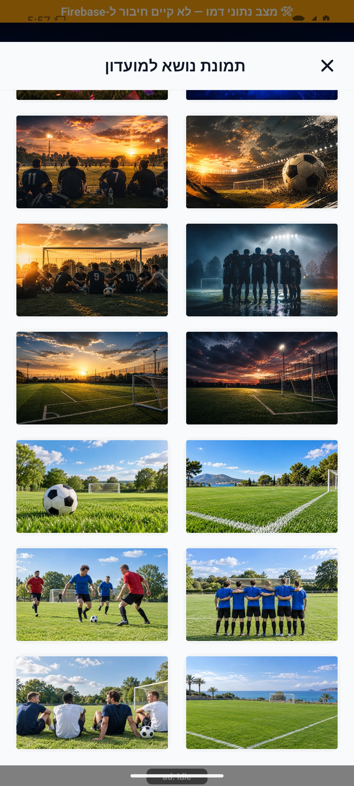

# רקעי מועדון והזמנות

[להסבר הקצר והפשוט](covers-and-invitations.simple.md)

עודכן: 07.10.2026; מקור: `8e8fde5`. כניסה: `CommunityDetails` → שינוי רקע/שיתוף/הזמנת חברים. אלה חלונות ופעולות בתוך מסך, לא נתיבי מסך עצמאיים.

הצילום לעיל נצפה ומסומן במניפסט כצילום אמולטור ממשימה קודמת, ללא קומיט מקור; אינו בדיקת בינארי החנות הנוכחי. הוא מראה את ששת רקעי היום בחלק התחתון, אך אינו מכסה את ראש הגלריה או מסלול ההעלאה.

## רקעים

גלריה של 16 רקעים: `c01` ברירת מחדל, `c02`–`c10` הרקעים המקוריים, ו־`c11`–`c16` שש תמונות יום חדשות של מגרש, כדור, קבוצה, משחק, חוף וחברים. תמונה שהועלתה גוברת על רקע מובנה, ולאחריהם ברירת מחדל. בחירה ברקע מובנה שומרת `coverImageId` ומנקה `coverPhotoUrl` כדי שהתמונה הישנה לא תמשיך לגבור.

| פעולה | מי ונתונים | מצבים |
|---|---|---|
| בחירה בגלריה | מנהל; מזהה רקע | שמירה מיידית, בחירה מסומנת, עסוק/שגיאה |
| העלאה מהמכשיר | מנהל; הרשאת ספרייה ותמונה | ביטול אינו שגיאה; הרשאה נדחית/העלאה נכשלת |
| הצגת רקע | כל מי שרואה מועדון | אותה קדימות בתצוגה ציבורית, כרטיסים ופרטים |

שינוי מטא־נתונים אחרי העלאה שנכשלה עלול להשאיר קובץ שאינו משויך; אין למחוק קבצי אחסון במסגרת מיפוי. מקור: `src/data/coverImages.ts`, שירות העלאת מדיה, `src/services/groupService.ts`, קוראי מועדון ומרכיבי הרקע. לוגו עצמאי המתואר בארכיון 087 לא אותר בקוד הנוכחי ולכן אינו יכולת קיימת מתועדת.

## שיתוף והזמנת חברים

קישור קצר מבוסס שירות ההזמנות, עם גיבוי לקישור ארוך. פרטי שם/תיאור ומזמין משמשים להצגת הקישור. פתיחת גיליון שיתוף אינה הוכחה שהמשתמש שלח הודעה ולא הרשאה לשלוח בשמו.

`inviteFriendsToGroup` מאמת חברות קיימת ומוציא כבר־חברים/ממתינים. השרת מגביל בחירה לפי מקום ומכסה, עד 500; ברירת מחדל 500 במועדון ללא מכסה. במועדון פתוח מוזמנים מצורפים לרשימת שחקנים, ובסגור לרשימת ממתינים בהתאם למימוש השרת. ההתראה נשלחת אחרי העדכון; תקלה במסירתה אינה בהכרח כשל חברות.

## בדיקות וראיות

קוד השיתוף ופונקציית `inviteFriendsToGroup` נקראו; לא הועלתה תמונה ולא נשלחה הזמנה. אין צילום עדכני של חלון הגלריה במקבץ המסכים הנוכחי; חומר השיחה וצילומים קודמים הם ראיה היסטורית בלבד. יש להשלים צילום הגלריה, הרשאה נדחית, בחירה ושיתוף קצר/גיבוי. יש לבדוק קישור על מכשיר ללא התקנה ובמכשיר מותקן לפני שינוי שיטת ההזמנה.

## הצעות בלבד

להוסיף תיאור נגיש לרקע ולסמן בחירה בלי להסתמך רק על צבע; להראות תצוגה מקדימה ביחס החיתוך האמיתי; להציג ספירת מוזמנים ומקום שנותר לפני אישור. שינוי הרקע יכול להתחלף בשקיפות קצרה לאחר שמירה, בלי להציג בחירה שלא נשמרה.

## פירוט טכני נוסף — זרימה, חישוב ונקודות שינוי

`handleSelectBuiltinCover` כותב `coverImageId` ובמקביל `coverPhotoUrl: ''`, כדי שהתמונה שהועלתה לא תמשיך לגבור על הבחירה. העלאה מהמכשיר קודמת לכתיבת הכתובת ב־`updateGroupMetadata`; בזמן העלאה `uploadingCover` מונע כניסה כפולה. כשל שמירת המטא־נתונים אחרי העלאה אינו מבטל בהכרח את קובץ האחסון.

`inviteFriendsToGroup` עובר דרך פונקציה נקראת בשרת, ושיתוף קישור אינו אישור אוטומטי במועדון סגור. שינוי נכס חייב לשמר מזהים של רקעים שכבר נבחרו, לוודא שהממיר קורא את השדות ולהבחין בין סירוב הרשאה, ביטול בורר, כשל העלאה וכשל שמירה. צילום הגלריה היסטורי לפי המניפסט, ואינו אימות העלאה נוכחית.

הפירוט מתאר את הקוד שנקרא, ולא בדיקת כתיבה או הרשאות בסביבת הייצור. יש לקרוא את הקוד הממוקד וההפרש מאז מקור המיפוי לפני תיקון; בדיקות המוזכרות כאן לא הורצו מחדש לצורך עריכת התיעוד.
