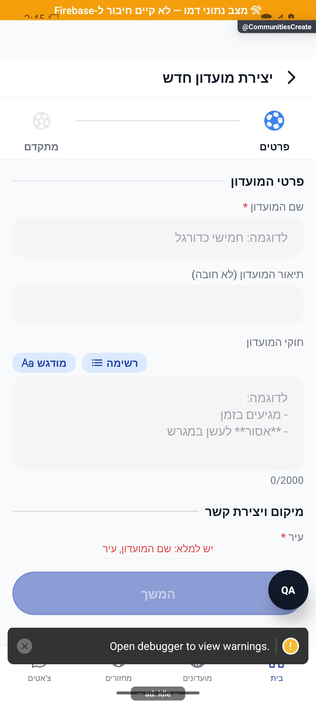
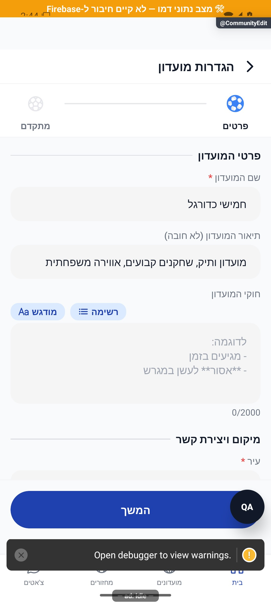

# יצירה ועריכת מועדון

[להסבר הקצר והפשוט](create-and-edit.simple.md)

עודכן: 07.10.2026; מקור: `8e8fde5`. מסכים: `src/screens/groups/CreateGroupScreen.tsx`, `src/screens/groups/GroupWizardForm.tsx`, `src/screens/communities/CommunityEditScreen.tsx`. מסלולים: `CommunitiesCreate`, `CommunityEdit` עם `groupId`.

## מבנה

אשף בן שני שלבים: זהות ופרטים בסיסיים, ולאחריהם הגדרות מתקדמות. שם ועיר חובה. תיאור, כללים ומספר קשר אופציונליים; מספר ישראלי נבדק אם הוזן. אין שדה בחירת מכסת חברים במסך הנוכחי. הגדרות עונות מתועדות ב[עונות](seasons.md); פעולותיהן נשלחות מיד ואינן חלק מטיוטת שמירת שם/תיאור.

| פעולה | נתונים | תנאי ותוצאה |
|---|---|---|
| מעבר לשלב הבא | שם ועיר | חסום כשחסרים פרטי חובה |
| יצירה כאורח | טיוטה מקומית | נשמרת לפני התחברות ומוחזרת להמשך |
| יצירת מועדון | פונקציה `createGroupCallable` | יוצר נוסף כמנהל וכשחקן; נוצרים מסמך פרטי וציבורי |
| עריכת פרטים | `updateGroupMetadata` | מנהל בלבד; רשימת שדות מותרת בלי מזהים/חברות |
| יציאה מטיוטה ששונתה | מצב מלוכלך | הגנה מפני אובדן שינויים |
| יצירת עונה ראשונה שנכשלה | מועדון כבר נוצר | לא ליצור מועדון נוסף; להתאושש באמצעות עריכה |

מגבלות שרת שנקראו: עד 5 יצירות ביום; שם 80 תווים, תיאור 500, כללים 2000, טלפון 40. בדיקה בצד הלקוח אינה מחליפה את בדיקות השרת. היוצר מקבל `joinedAt` ו־`adminSince` במצב שנכתב בשרת. שדה `maxMembers` היסטורי נשמר אם אינו נשלח; אין להחליפו אוטומטית בברירת מחדל של 40.

## מצבים והרשאות

### המראה הציבורית — תיקון הרשאה מאושר, 10.10.2026

יצירת `groupsPublic/{gid}` מוגבלת כעת בקובץ הכללים המקומי למנהל במקור הקנוני `groups/{gid}`. `adminIds` שנשלח במראה עצמה אינו מקנה סמכות. הבדיקה היא `getAfter` של המקור, ולכן יצירת המקור והמראה באותה אצווה או עסקה בלקוח יכולה להצליח אטומית: ההרשאה נבדקת מול המקור שאחרי הכתיבה, והכתיבה של המקור חייבת לעמוד בכללים שלה. מקור חסר, מזהה מראה אחר, שחקן שאינו מנהל, הסלמת מנהלים במקור של אחר או מונה ראשוני מעל 1 נדחים; כשל באחד המסמכים מבטל את כל הכתיבה.

הצעה ראשונית השתמשה ב־`isGroupAdminSafe` שקוראת את המצב לפני הכתיבה. בדיקות שחזור מול כל הכללים הוכיחו ששתי כתיבות נפרדות עוברות, אך אותן כתיבות תקינות באצווה ובעסקה נכשלות. לכן אושר תיקון `getAfter` ממוקד לתנאי יצירת המראה בלבד. אין שינוי בקריאת הגילוי או בהגנות העדכון האחרות. הלקוח הנוכחי יוצר דרך `createGroupCallable` עם ערכת מנהל השרת, העוקפת את כללי הלקוח; בדיקת האצווה אינה טענה שהפונקציה רצה במכשיר או שנוצר מועדון בייצור. פריסה מתועדת בנפרד, ויישום מקומי אינו הוכחת פריסה.

כל 303 בדיקות הכללים עברו על הקובץ הפעיל המלא ובסדר טורי, כולל 18 בדיקות חוזה חדשות. [דוח ההרשאות והגבולות](../../../artifacts/pre-release-2026-10-10/permissions-approved-validation.md) מפנה לכשל המשוחזר לפני `getAfter` ולהצלחה אחריו. לא בוצעה יצירת מועדון בחשבון אמיתי.

טופס ריק, טופס קיים, שגיאות שדה, עסוק, כישלון רשת, כישלון חלקי של הפעלת עונה, אורח לפני התחברות ומנהל עורֵך. מסך העריכה משתמש במועדון שבמאגר החברות ובבדיקת מנהל; אין לראות היעדר במאגר כהוכחה למחיקה בשרת. פרטי תזמון המחזור הקבוע מנוהלים במקום אחר; טופס הזהות אינו מחליף עריכת מחזור קבוע.

## מקור אמת ובדיקות

`src/services/groupService.ts`; `functions/src/index.ts` עבור פונקציית היצירה; `src/firebase/firestore.ts`; `src/components/community/NewClubSeasons.tsx`; `src/components/community/SeasonsSettings.tsx`. בדיקות: `tests/logic/newClubSeasons.test.ts`, `tests/logic/seasonActivation.test.ts`, `tests/logic/groupSeasonsReader.test.ts`. יצירה ושמירה לא בוצעו במסגרת המיפוי.

## ראיות והיסטוריה

צולמו רק השלב הראשון של יצירה ושל עריכה בנתוני דמה. אין צילום של שלב מתקדם, אימות שדות, יציאה מטיוטה, מנהל חסר או כישלון חלקי. מקור 087 מתאר הוספת לוגו; בקוד הנוכחי לא אותרו `logoUrl` או פונקציית העלאת לוגו. לכן לוגו אינו מתועד כיכולת קיימת.

## הצעות בלבד

להסביר אילו הגדרות נשמרות מיידית ואילו דורשות שמירה; להציג סיכום לפני יצירה; להנפיש מעבר בין שלבים בלי להזיז שדות במהלך הקלדה. להוסיף מצב התאוששות ברור אחרי יצירה מוצלחת והפעלת עונה שנכשלה.

## פירוט טכני נוסף — זרימה, חישוב ונקודות שינוי

`createGroup` שולח ל־`createGroupCallable`; אין לייצר שוב מועדון אם רק הפעלת העונה שאחריו נכשלה. `updateGroupMetadata` בודק מנהל, מעביר רשימת שדות מפורשת, מנרמל שם וכותב ב־`writeBatch` את `groups` ואת השדות הציבוריים המותרים ב־`groupsPublic`. הכתיבה החלקית עוקפת ממיר מלא כדי למנוע ערכי `undefined`; לאחר האישור נקרא המועדון מחדש.

מכסת חברים אינה ניתנת להפחתה מתחת לסגל הקיים: סגל 29 ומכסה 25 מעלים `GROUP_MAX_BELOW_CURRENT` עם `currentCount=29`. אין הוצאה אוטומטית של ארבעה חברים. שם ועיר חובה באשף המקורי; מסלול ההצטרפות המוטמע של שירות ההדרכה מאפשר עיר אופציונלית, ולכן שינוי תיקוף חייב לבדוק את שתי הכניסות. שדה חדש דורש רשימת שדות, היטל ציבורי כשמתאים, ממיר, טופס ובדיקות; אין להוסיף שדות חברות למסלול המטא־נתונים.

הפירוט מתאר את הקוד שנקרא, ולא בדיקת כתיבה או הרשאות בסביבת הייצור. יש לקרוא את הקוד הממוקד וההפרש מאז מקור המיפוי לפני תיקון; בדיקות המוזכרות כאן לא הורצו מחדש לצורך עריכת התיעוד.

## תיקוני עיצוב ונגישות — 10.10.2026

מקור: `a348b9f235f1e1433497600555303231512a0834` עם שינויים מקומיים. אין בסעיף זה הוכחת גרסת חנות.

`GroupWizardForm` מעבירה שם ומצב ל־`BallSwitch`. עטיפת מלל שאינה פעולה עצמאית אינה תחנה כפולה; כפתור ההסבר נשאר נגיש בנפרד. `InputField` המשותף מספק תווית לשדות מלאים וסמנטיקת כפתור לשדות בחירה. חוזי הכתיבה, הרשאות וולידציה נשמרו. נבדק רכיב הקלט ביחידה, ולא הוגש טופס מועדון במכשיר.

## אימות פריסת הרשאות — 10.10.2026

שני התיקונים הממוקדים נפרסו לאחר אישור הבעלים. `deployment-after.json` מאמת שכללי השרת תואמים לקובץ שנבדק ב־303 בדיקות על מלוא הכללים. לא נשלחו הודעות אמת או נוצרו מועדונים לצורך הבדיקה; בדיקת פריסה אינה מסע כתיבה במכשיר.
