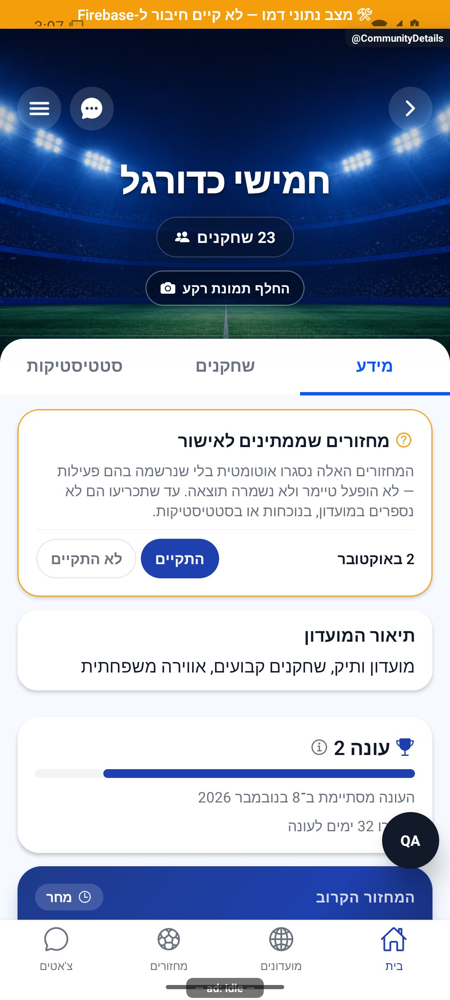
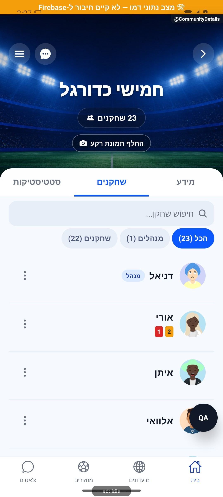
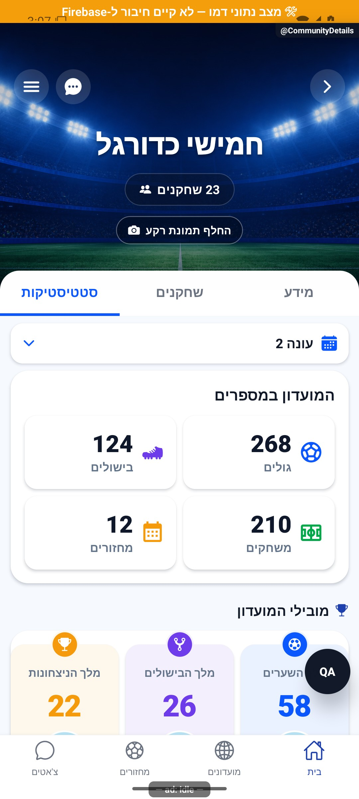
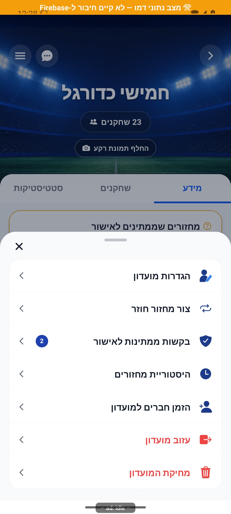

# פרטי מועדון ולשוניותיו

[להסבר הקצר והפשוט](details.simple.md)

עודכן: 07.10.2026; מקור: `8e8fde5`. מסך: `src/screens/communities/CommunityDetailsScreen.tsx`; מסלול: `CommunityDetails` עם `groupId` מתוך מועדונים, מחזור, קישור או צ׳אט.

שלוש לשוניות: מידע, שחקנים וסטטיסטיקה. התוכן נטען לפי צורך ונשמר לאחר פתיחת הלשונית, כדי לא לטעון מחדש ולמחוק גלילה בכל מעבר. המסכים העצמאיים של סגל וסטטיסטיקה עדיין קיימים ונרשמים בניווט; אינם אותו צילום של הלשונית המוטמעת.

## אזורים

רקע מועדון, שם, מספר חברים, בחירת תמונה למנהל, צ׳אט ותפריט. במידע: מצב מחזור חי או מחזור עבר שדורש אימות, כרטיס עונה, מחזור קרוב, תיאור וכללים, ציוד, הודעות על מחזור חדש, מידע קשר ושיתוף. בסטטיסטיקה המקוצרת: הישגי המועדון ומעבר לסטטיסטיקה המפורטת. בסגל: חיפוש, שבבי תפקיד ורשימת שחקנים עם כלי ניהול לפי הרשאה.

| פעולה | נתונים | מי רואה ותוצאה |
|---|---|---|
| פתיחת צ׳אט | `groupId` | חבר → `CommunityChat` |
| עריכת מועדון | פרטים/הגדרות | מנהל → `CommunityEdit` |
| בקשות הצטרפות | ממתינים | מנהל → `AdminApproval`; מונה בקשות |
| היסטוריה | מחזורים שהתקיימו | חבר → `CommunityHistory` |
| הזמנה | קוד/קישור מועדון | חבר → שיתוף/הזמנת חברים |
| יצירת/ניהול מחזור קבוע | תזמון המחזור | מנהל; מפורט בתחום המחזורים |
| קשר עם מנהל | טלפון קשר קיים | חבר שאינו מנהל |
| עזיבה | חבר ומנהלים נוכחיים | אישור; מנהל אחרון נחסם |
| מחיקה | זהות יוצר | יוצר בלבד; פעולה הרסנית שלא בוצעה |

צילום התפריט נצפה אך אין לו קומיט מקור במניפסט; הוא מציג מנהל/יוצר ופעולות עזיבה ומחיקה שלא הופעלו. זו ראיה לפריסה היסטורית, לא בדיקת פעולת גרירה או הרשאות בבינארי החדש.

## מקור אמת

`src/store/groupStore.ts`; `src/services/groupService.ts`; `src/services/gameService.ts`; `src/components/community/CommunityStadiumHero.tsx`; `CommunityStatsGrid.tsx`, `CommunityChampionship.tsx`, `CommunityNotifyToggle.tsx`, `CommunityShareInviteCta.tsx`, `SeasonsCard.tsx`; `src/utils/eveningPlayed.ts`. הסטטיסטיקה המקוצרת והארוכה צריכות לתת אותו מענה לאותו חלון נתונים. אין לגזור מחדש ״מחזור התקיים״ מזמן, שערים או סטטוס בלבד.

## ראיות ופערים

הצילום הראשי הוא מועדון בנתוני דמה ובו מחזור עבר שטרם אושר וכרטיס עונה. לא נלחצו ״התקיים״/״לא התקיים״ ולא בוצעו עזיבה/מחיקה/שינוי עונה. תמונות הלשוניות המוטמעות מצורפות אם נאספו; קישור חסר אינו הוכחת צפייה. קצה תחתון בצילומי פיתוח עלול להיות מכוסה בכלי בדיקה. שגיאת קבלת מועדון, מחיקה בזמן שהמסך פתוח וכניסה מקישור אחרי שחזור חשבון דורשות אימות ייעודי.

## הצעות בלבד

להפוך מצבים דחופים לאזור קצר ומובחן לפני התוכן הרגיל; להנפיש מעבר לשוניות באמצעות שינוי שקיפות קצר תוך שמירת גובה; לעדכן מונה סגל באנימציה קצרה אחרי הצטרפות מאושרת. לא להציג הצלחה לפני השרת ולא להוסיף תנועה לכרטיס שמבקש אישור מציאותי מהמנהלים.

## פירוט טכני נוסף — זרימה, חישוב ונקודות שינוי

`CommunityDetailsScreen` טוען מחדש במיקוד דרך מסלול משותף ושומר תוכן לשוניות שכבר נפתחו. `groupStore` מספק זהות וחברות, בעוד שירותי המחזורים מספקים מידע על הערב; אין להפוך מועדון שאינו במאגר המקומי להוכחה למחיקה.

הצגת מנהל נגזרת מ־`adminIds`, והצגת פעולת יוצר מ־`creatorId`; יש לשמור את ההבחנה גם כאשר היוצר מנהל. שינוי לשונית דורש בדיקת רישום המסך העצמאי, מצב מוטמע, חזרה מניווט, גלילה ושימור הטווח. אין כאן כתיבה סטטיסטית חדשה: פעולות עריכה, עונות ורקע מפנות למסלולי השירות המתועדים בנפרד.

הפירוט מתאר את הקוד שנקרא, ולא בדיקת כתיבה או הרשאות בסביבת הייצור. יש לקרוא את הקוד הממוקד וההפרש מאז מקור המיפוי לפני תיקון; בדיקות המוזכרות כאן לא הורצו מחדש לצורך עריכת התיעוד.

## תיקוני סבב הבאגים — 8.10.2026

B12: ChatStack רושמת את MatchDetails, CommunityHistory, CommunityEdit ו־AdminApproval יחד עם CommunityDetails. שמות ופרמטרים תואמים למחסניות האחרות. בדיקת רישום מסלולים אינה הוכחת כל מעבר חי.

[ראיות, בדיקות ומגבלות](../../changes/2026-10-08-audit-fixes.md).
