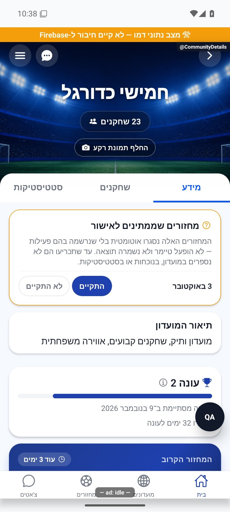
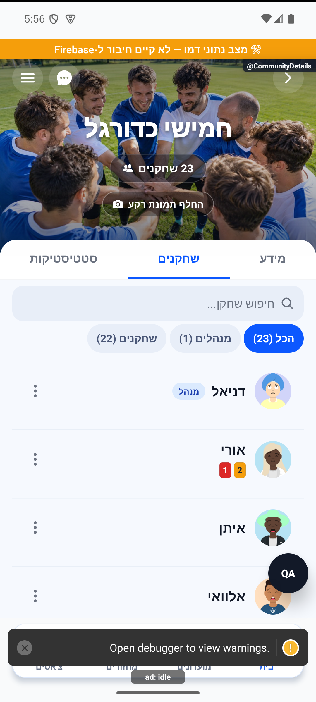

# פרטי מועדון ולשוניותיו

## תיקון גבולות הרקע — 8.10.2026

`CoverCrossfade` תוחם כעת את שתי שכבות התמונה לגודל הכותרת באמצעות רוחב וגובה של 100% ומשטח חיתוך. לפני התיקון, מידות הנכס המקומי נשארו בתוקף למרות ההיסטים המוחלטים; התמונה נמשכה מאחורי תוכן המועדון. שוחזר ותוקן באמולטור אנדרואיד בדמו. אין שינוי בנתונים, בתפקידים, במסלול הניווט או בחישובים. [גורם, בדיקות ומגבלות](../../changes/2026-10-08-cover-layout.md).

[להסבר הקצר והפשוט](details.simple.md)

עודכן: 07.10.2026; מקור: `8e8fde5`. מסך: `src/screens/communities/CommunityDetailsScreen.tsx`; מסלול: `CommunityDetails` עם `groupId` מתוך מועדונים, מחזור, קישור או צ׳אט.

שלוש לשוניות: מידע, שחקנים וסטטיסטיקה. התוכן נטען לפי צורך ונשמר לאחר פתיחת הלשונית, כדי לא לטעון מחדש ולמחוק גלילה בכל מעבר. המסכים העצמאיים של סגל וסטטיסטיקה עדיין קיימים ונרשמים בניווט; אינם אותו צילום של הלשונית המוטמעת.

## אזורים

רקע מועדון, שם, מספר חברים, בחירת תמונה למנהל, צ׳אט ותפריט. במידע: מצב מחזור חי או מחזור עבר שדורש אימות, כרטיס עונה, מחזור קרוב, תיאור וכללים, ציוד, הודעות על מחזור חדש, מידע קשר ושיתוף. בסטטיסטיקה המקוצרת: הישגי המועדון ומעבר לסטטיסטיקה המפורטת. בסגל: חיפוש, שבבי תפקיד ורשימת שחקנים עם כלי ניהול לפי הרשאה.

| פעולה | נתונים | מי רואה ותוצאה |
|---|---|---|
| פתיחת צ׳אט | `groupId` | חבר → `CommunityChat` |
| עריכת מועדון | פרטים/הגדרות | מנהל → `CommunityEdit` |
| בקשות הצטרפות | ממתינים | מנהל → `AdminApproval`; מונה בקשות |
| היסטוריה | מחזורים שהתקיימו | חבר → `CommunityHistory` |
| הזמנה | קוד/קישור מועדון | חבר → שיתוף/הזמנת חברים |
| יצירת/ניהול מחזור קבוע | תזמון המחזור | מנהל; מפורט בתחום המחזורים |
| קשר עם מנהל | טלפון קשר קיים | חבר שאינו מנהל |
| עזיבה | חבר ומנהלים נוכחיים | אישור; מנהל אחרון נחסם |
| מחיקה | זהות יוצר | יוצר בלבד; פעולה הרסנית שלא בוצעה |

צילום התפריט נצפה אך אין לו קומיט מקור במניפסט; הוא מציג מנהל/יוצר ופעולות עזיבה ומחיקה שלא הופעלו. זו ראיה לפריסה היסטורית, לא בדיקת פעולת גרירה או הרשאות בבינארי החדש.

## מקור אמת

`src/store/groupStore.ts`; `src/services/groupService.ts`; `src/services/gameService.ts`; `src/components/community/CommunityStadiumHero.tsx`; `CommunityStatsGrid.tsx`, `CommunityChampionship.tsx`, `CommunityNotifyToggle.tsx`, `CommunityShareInviteCta.tsx`, `SeasonsCard.tsx`; `src/utils/eveningPlayed.ts`. הסטטיסטיקה המקוצרת והארוכה צריכות לתת אותו מענה לאותו חלון נתונים. אין לגזור מחדש ״מחזור התקיים״ מזמן, שערים או סטטוס בלבד.

## ראיות ופערים

הצילום הראשי הוא מועדון בנתוני דמה ובו מחזור עבר שטרם אושר וכרטיס עונה. לא נלחצו ״התקיים״/״לא התקיים״ ולא בוצעו עזיבה/מחיקה/שינוי עונה. תמונות הלשוניות המוטמעות מצורפות אם נאספו; קישור חסר אינו הוכחת צפייה. קצה תחתון בצילומי פיתוח עלול להיות מכוסה בכלי בדיקה. שגיאת קבלת מועדון, מחיקה בזמן שהמסך פתוח וכניסה מקישור אחרי שחזור חשבון דורשות אימות ייעודי.

## הצעות בלבד

להפוך מצבים דחופים לאזור קצר ומובחן לפני התוכן הרגיל; להנפיש מעבר לשוניות באמצעות שינוי שקיפות קצר תוך שמירת גובה; לעדכן מונה סגל באנימציה קצרה אחרי הצטרפות מאושרת. לא להציג הצלחה לפני השרת ולא להוסיף תנועה לכרטיס שמבקש אישור מציאותי מהמנהלים.

## פירוט טכני נוסף — זרימה, חישוב ונקודות שינוי

`CommunityDetailsScreen` טוען מחדש במיקוד דרך מסלול משותף ושומר תוכן לשוניות שכבר נפתחו. `groupStore` מספק זהות וחברות, בעוד שירותי המחזורים מספקים מידע על הערב; אין להפוך מועדון שאינו במאגר המקומי להוכחה למחיקה.

הצגת מנהל נגזרת מ־`adminIds`, והצגת פעולת יוצר מ־`creatorId`; יש לשמור את ההבחנה גם כאשר היוצר מנהל. שינוי לשונית דורש בדיקת רישום המסך העצמאי, מצב מוטמע, חזרה מניווט, גלילה ושימור הטווח. אין כאן כתיבה סטטיסטית חדשה: פעולות עריכה, עונות ורקע מפנות למסלולי השירות המתועדים בנפרד.

הפירוט מתאר את הקוד שנקרא, ולא בדיקת כתיבה או הרשאות בסביבת הייצור. יש לקרוא את הקוד הממוקד וההפרש מאז מקור המיפוי לפני תיקון; בדיקות המוזכרות כאן לא הורצו מחדש לצורך עריכת התיעוד.

## תיקוני סבב הבאגים — 8.10.2026

B12: ChatStack רושמת את MatchDetails, CommunityHistory, CommunityEdit ו־AdminApproval יחד עם CommunityDetails. שמות ופרמטרים תואמים למחסניות האחרות. בדיקת רישום מסלולים אינה הוכחת כל מעבר חי.

[ראיות, בדיקות ומגבלות](../../changes/2026-10-08-audit-fixes.md).

## עבודת ציור וגלילה — 9.10.2026

מקור: שינויים מקומיים מעל `a348b9f`, טרם פורסמו. תשתית `ScrollSurface` מחוברת לפרטי מועדון, ללשוניות פרטי מחזור, לסטטיסטיקות מועדון ולסיכום האישי. היא מסמנת תחילת/סוף מחווה ותנופה בלבד; אין שינוי נתונים או עדכון מצב בכל פריים. `CountUp` ו־`StatDonut` מתייצבים לערך הסופי במהלך גלילה; שורות ללא שינוי מיקום אינן מתזמנות תנועה. אנימציות `LivingIcon` ו־`Breathing` נעצרות כשמסך המקור מאבד מיקוד, כשהיישום ברקע, בזמן גלילה ובהגדרת צמצום תנועה. תמונות פרופיל ורקע משתמשות ב־`resizeMethod=resize`, לצמצום פענוח באנדרואיד לפי גודל התצוגה.

אין שינוי בחישובים, במכנים, בשדות המסד או בהרשאות. [התנהגות, בדיקות ומגבלות](../shared/menus-and-motion.md) · [מדידות וראיות](../reviews/scroll-performance-2026-10-09.md). הבדיקה בדמו אינה אימות גרסת חנות במכשיר פיזי.

## לוח מנהל — 9.10.2026

לתפריט המועדון נוסף קישור ״לוח מנהל״ למנהלים בלבד. [הסבר פשוט](manager-dashboard.simple.md) · [נתונים, הרשאות ובדיקות](manager-dashboard.md). המסך זמין מכל מחסנית שמארחת פרטי מועדון; השינוי מקומי, ושירות התזכורות טרם נפרס.

## תיקוני עיצוב ונגישות — 10.10.2026

מקור: `a348b9f235f1e1433497600555303231512a0834` עם שינויים מקומיים. אין בסעיף זה הוכחת גרסת חנות.

`CommunityNotifyToggle` מגדירה שורת מתג יחידה לקורא מסך ומסתירה את `BallSwitch` הפנימי. אין שינוי בהעדפת ההתראות של המועדון או בנתוני המועדון. נבדק בקוד בלבד.

## התאמת לשוניות לגופן מוגדל — 10.10.2026

מקור: `a348b9f235f1e1433497600555303231512a0834` ושינויים מקומיים. `ClubTabs` הוא הרכיב המשותף למועדון ולמחזור. לכל לשונית `flexBasis: auto` וגדילה/כיווץ לפי המקום הזמין, כך שתווית ארוכה מקבלת את הרוחב שהיא צריכה לפני חלוקת השטח הנוסף. גובה 52 הוחלף בגובה מינימלי 52 ובריווח אנכי; הטקסט יכול לעטוף כשנדרש מקום נוסף. הוסרו מגבלת שורה יחידה והקטנת גופן אוטומטית. סדר ימין־לשמאל, תפקיד לשונית, המצב הנבחר, פעולת החלפה ולשונית נעולה נשמרו. אין שינוי במסלול נתונים או בחישובים.

באמולטור אנדרואיד נצפו ארבע לשוניות מחזור, מעבר ביניהן וגלילה בגופן 130%. בצילום הסופי כל ארבע התוויות מופיעות במלואן בשורה אחת. בדיקת הטיפוסים עברה. סביבת הבדיקה: APK פיתוח מקומי שנבנה מתלויות המערכת הנוכחיות, עם תווית מעטפת `1.1.33/1` ושרת דמו `8083`. אין הוכחה לבינארי החנות, לאייפון או לקורא מסך. הפעלת כל מצבי המועדון בגופן מוגדל טרם הושלמה.

## אימות חסימת לחיצות אחרי גלילה — 10.10.2026

מקור: שינויים מקומיים מעל `a348b9f235f1e1433497600555303231512a0834`; מעטפת פיתוח מקומית `1.1.33/1`, Android/Fabric, RN0.79.6, Screens4.11.1, Metro8083 עם דמו ונתיבי בדיקה. אין הוכחת גרסת חנות/מכשיר פיזי/אייפון.

`ScrollSurface` שומרת את ההגנה הקיימת של250ms בלי שינוי הסף. RN בודקת את זמן begin מול end ואת זמן פריים הגלילה האחרון בזמן בירור responder; רק begin שלא נסגר ויותר250ms ללא פריים משחרר את הנעילה. תנופה עם פריימים טריים נשארת מוגנת, והמקלדת ממשיכה לפעול לפי `keyboardShouldPersistTaps`.

בקרה רגילה: גלילה עמוקה במחזור ואז לחיצה יחידה על סטטיסטיקות הצליחה. בניסוי זמני בדמו בלבד הושמט end: בלי ההגנה שתי לחיצות במחזור ולחיצות לשונית/תפריט במועדון נשארו חסומות; עם ההגנה הלחיצה הראשונה החליפה לשונית. הוכחות כוללות פקודות מגע אמיתיות, XML עם selected, צילום ולוג begin/drop_end/recovered. זה אינו שחזור טבעי או הוכחת סיבת השורש של דיווחי הבעלים. אין לסגור דיווח רק על סמך ניסוי מוזרק.

פער נוסף: `CommunityPlayersScreen` השתמשה ב־FlatList עם ScrollView רגילה ולכן לא קיבלה את ההגנה. `renderRosterScroll` יציבה מחזירה `ScrollSurface` כ־`renderScrollComponent`, עם `keyboardShouldPersistTaps="handled"`. אין ScrollView חיצונית או קינון: VirtualizedList עדיין מנהלת cells, חלון, מדידות ו־ref באמצעות cloneElement. כל props ואירועי הגלילה עוברים דרך המשטח המשותף; השורות, המיון, השאילתות, ההרשאות והפעולות לא השתנו.

`tests/scrollStaleMomentum.test.ts` מפעילה את תנאי RN ואת capture handler המותקנים עצמם. נוספו מקרי גבול250/251ms, פריים חדש, begin חדש, end תקין, opt-in אפס/שלילי, לחיצת ילד ראשונה ושמירת התנהגות המקלדת. [ראיות מלאות, תוצאות ומגבלות](../../../artifacts/pre-release-2026-10-10/scroll-press/README.md).

