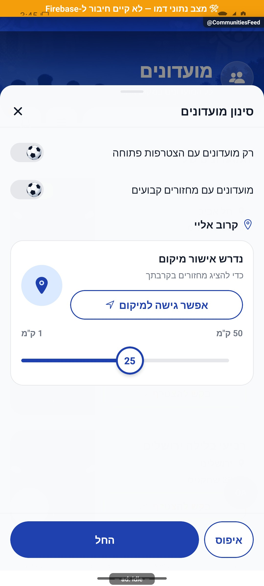

# גילוי מועדונים, חיפוש וסינון

[להסבר הקצר והפשוט](discovery.simple.md)

עודכן: 07.10.2026; מקור: `8e8fde5`. מסלול: לשונית מועדונים → `CommunitiesFeed`. מסך: `src/screens/communities/PublicGroupsFeedScreen.tsx`.

## מבנה ותפקידים

כותרת מועדונים, חיפוש, כפתור סינון ופעמון בקשות; אזור המועדונים שלי ואזור גילוי מועדונים ציבוריים. כרטיס מציג רקע, שם, עיר, כמות שחקנים, מצב פעילות והקשר החברות/הניהול. יצירה נפתחת מכפתור ההוספה. לאורח יש גילוי ציבורי; פעולות המחייבות חשבון עוברות לשער ההתחברות.

כפתור המפה והכנת נתוניו הוסרו ב־28.9. המסלול CommunitiesMap נותר רשום, אך אין כפתור פעיל אליו ברשימה הנוכחית. מסך המפה המשותף מתועד כקוד רשום עם כניסה מוסרת, ולא כפיצ׳ר גילוי נגיש דרך מסך זה.

הרשימה הפרטית נגזרת מחברות ומניהול ומלווה במנוי חי. גילוי ציבורי נקרא דרך `groupsPublic`, כדי לא לחשוף רשומות מועדון פרטיות. בחירה בכרטיס של חבר מפנה לפרטים הפרטיים; כרטיס שאינו שלו מפנה לתצוגה הציבורית. מועדונים עם בקשה ממתינה מקבלים יחס שונה ממועדונים שהמשתמש כבר חבר בהם.

| פעולה | נתונים | תנאי ותוצאה |
|---|---|---|
| חיפוש | שם/עיר, טקסט חיפוש | השהיה של 250 אלפיות שנייה לפני החיפוש |
| סינון | `CommunityFilterSheet`, מסנני פעילות/קביעות/קרבה | רשימה מסוננת וכמות תוצאות; לא שינוי במועדון |
| בקרבת מקום | מיקום, מרחק 1–50 ק״מ; ברירת מחדל 25 | בקשת הרשאה מפורשת; דחייה מכבה את הסינון ומאפשרת פתיחת הגדרות |
| גלילה בגילוי | חלון תוצאות מקומי של 8 | הרחבת התוצאות בצד הלקוח; אין להסיק שזה דפדוף שרת בלתי מוגבל |
| פעמון | בקשות חברים/מועדון/מחזור | מעבר ל־`Requests`; אינו רשימת כל ההתראות |
| יצירה | טיוטת מועדון | חשבון קיים או שמירת טיוטה והמשך לאחר התחברות |

## מצבים

טעינה ראשונה, חבר ללא מועדונים, אורח, חיפוש ללא תוצאות, גילוי ללא תוצאות, מסננים פעילים, בקשה ממתינה, מיקום נדחה או לא זמין ושגיאת קריאה. בשחזור חשבון או מנוי יש להיזהר: החזרת `[]` משגיאת סשן עלולה למחוק בחירה שנשמרה. `staleSession.ts` מספק הבחנה בין תקלה לבין רשימה ריקה אמיתית.

## מקור אמת ותלות

`src/services/groupService.ts`: `listForUser`, `subscribeForUser`, `listPendingForUser`, `getPublic`, חיפוש ציבורי. `src/store/groupStore.ts`; `src/components/community/CommunityCard.tsx`; `src/components/community/CommunitiesHero.tsx`; `src/components/CommunityFilterSheet.tsx`; `src/components/RequestsBell.tsx`; `src/firebase/firestore.ts`. הממירים צריכים לקרוא כל שדה חדש במפורש. נתוני מועדון ציבורי נגזרים בשרת; אין להוסיף לתצוגה שדה פרטי רק מפני שהוא זמין לחבר.

בדיקות ממוקדות: `tests/logic/discovery.test.ts`, `tests/logic/groupHydrate.test.ts`, ובדיקות כללי גישה הרלוונטיות. לא הורצו בדיקות חדשות במסגרת מיפוי זה.

## ראיות ופערים

הצילום מאמת את הפריסה הראשית בנתוני דמה. בהשלמת המיפוי נפתח גם חלון הסינון, עם שני מתגים כבויים ומצב שבו הרשאת המיקום טרם ניתנה. הרשאה נדחית, חיפוש ריק, עומס תוצאות ואורח במסך זה לא צולמו במיפוי זה. אין אימות רשת או חברות אמיתית. מסמכי ספטמבר המתארים אורח שנחסם אינם הוכחה להתנהגות הנוכחית; יש לבדוק את שער ההתחברות הנוכחי.

## הצעות בלבד

להוסיף שבב ברור לסינון הפעיל ולספירת התוצאות; לשמר גלילה בעת חזרה מכרטיס; להנפיש בעדינות הופעת תוצאות חדשות בלי להזיז את שדה החיפוש. יש לכבד העדפת הפחתת תנועה ולהבדיל בין טעינה לבין אפס תוצאות.

## פירוט טכני נוסף — זרימה, חישוב ונקודות שינוי

`PublicGroupsFeedScreen` מחבר חברות קיימת עם התצוגה הציבורית, בלי להציג מידע פרטי למי שאינו חבר. `listForUser` ו־`listPendingForUser` אינם אותה רשימה: חברות פעילה ובקשה ממתינה מובילות לפעולות שונות; `searchPublicGroups` ו־`listPublicGroups` קוראים את ההיטל הציבורי.

נקודת שינוי: שדה חיפוש חדש דורש בדיקה של נרמול השם, הממיר הציבורי והפקת ההיטל, לצד מסנן המסך. אין לפרש `StaleSessionError` כרשימה ריקה ולמחוק את הבחירה ב־`groupStore`; יש לשמר הבחנה בין שחזור חשבון, ריקנות וכשל. בדיקות `discovery.test.ts` ו־`groupHydrate.test.ts` אינן הוכחת הרשאות או חיפוש חי.

הפירוט מתאר את הקוד שנקרא, ולא בדיקת כתיבה או הרשאות בסביבת הייצור. יש לקרוא את הקוד הממוקד וההפרש מאז מקור המיפוי לפני תיקון; בדיקות המוזכרות כאן לא הורצו מחדש לצורך עריכת התיעוד.
