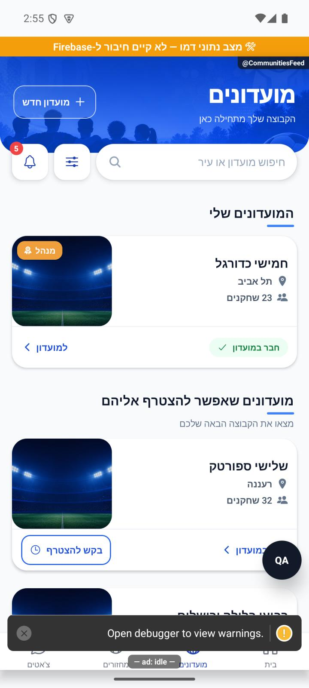
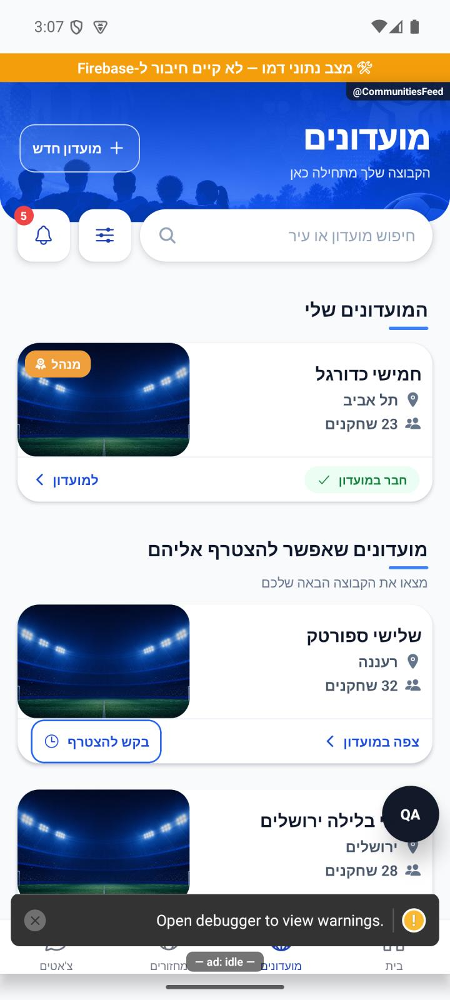
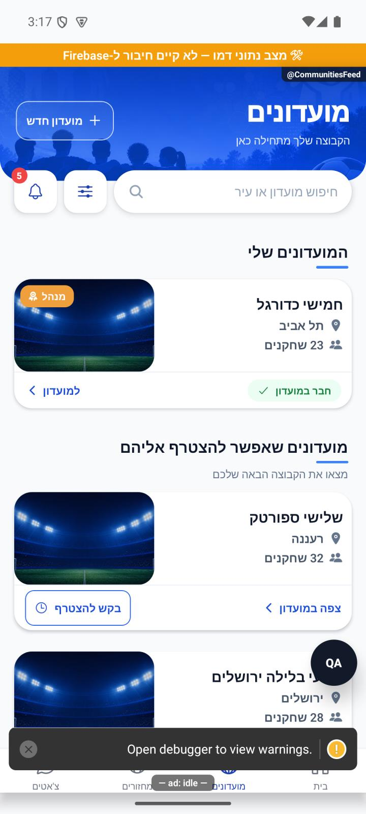
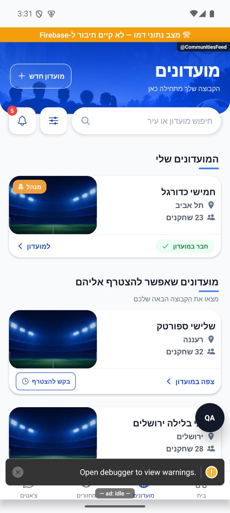

# מוצאים מועדון

כאן מוצאים את המועדונים שלכם ומחפשים מועדונים נוספים לפי שם או עיר. אפשר לסנן את הרשימה, לפתוח מועדון ולבדוק אם אפשר להצטרף אליו.

[לפירוט המעמיק](discovery.md)

## העיצוב המעודכן

המועדונים שלכם מופיעים ראשונים, ומתחתיהם מועדונים נוספים שאפשר להצטרף אליהם. אין צורך להחליף לשונית גם כשיש רק מועדון אחד. יצירת מועדון נמצאת בכותרת, והכרטיסים מציגים תמונה, עיר, מספר שחקנים, פעילות והמצב שלכם. החץ של ״צפה במועדון״ משמאל לטקסט ופונה שמאלה.

נצפה באימולטור אנדרואיד עם נתוני דמו. סימוני פיתוח והפס הכתום בצילום אינם חלק מההפצה. לא בוצעו פעולות הצטרפות או יצירה, קריאת מסד חי או בדיקת אייפון וגופן מוגדל. בדיקת הטיפוסים ו־2,801 הבדיקות ב־190 חבילות עברו; יומנים `artifacts/club-feed-redesign-tsc.log`, `artifacts/club-feed-redesign-jest.log`.

## פרופורציות הכרטיס — 8.10.2026

כרטיסי המועדונים נמוכים יותר, התמונה רחבה יותר והשם בולט מעל פרטי המועדון. כל הנתונים והפעולות נשמרו, והכרטיס יכול להתרחב כשיש יותר תוכן.

נצפה באנדרואיד עם נתוני דמו, ללא פעולות הצטרפות או כתיבה למסד. פעילות חסרה בנתוני הדמו ולכן אינה מופיעה בצילום. סימוני הפיתוח אינם חלק מההפצה; אייפון וגופן מוגדל לא נבדקו. בדיקת טיפוסים ו־2,801 בדיקות ב־190 חבילות עברו; יומנים artifacts/club-card-proportions-final-tsc.log ו־artifacts/club-card-proportions-final-jest.log.

## ריווח כפתור ההצטרפות — 8.10.2026

לכפתור בקש להצטרף יש עכשיו מעט רווח מעל ומתחת ומסגרת דקה יותר. כל הנתונים נשמרו.

נצפה באנדרואיד עם נתוני דמו, ללא פעולות הצטרפות או כתיבה למסד. פעילות חסרה בנתוני הדמו ולכן אינה מופיעה בצילום. סימוני הפיתוח אינם חלק מההפצה; אייפון וגופן מוגדל לא נבדקו. בדיקת טיפוסים ו־2,801 בדיקות ב־190 חבילות עברו; יומנים artifacts/club-cta-spacing-tsc.log ו־artifacts/club-cta-spacing-jest.log.

## הקטנת כפתור ההצטרפות — 8.10.2026

כפתור בקש להצטרף קטן ועדין יותר, עם טקסט ואייקון קטנים מעט ורווח סביב המסגרת. אזור הלחיצה מורחב מעבר למסגרת.

נצפה באנדרואיד עם נתוני דמו, ללא פעולות הצטרפות או כתיבה למסד. פעילות חסרה בנתוני הדמו ולכן אינה מופיעה בצילום. סימוני הפיתוח אינם חלק מההפצה; אייפון וגופן מוגדל לא נבדקו. בדיקת טיפוסים ו־2,801 בדיקות ב־190 חבילות עברו; יומנים artifacts/club-cta-compact-tsc.log ו־artifacts/club-cta-compact-jest.log.

## הפלוס בכפתור יצירה — 8.10.2026

הפלוס מופיע משמאל לטקסט בכפתור היצירה. אומת באימולטור אנדרואיד בנתוני דמו, ללא יצירת מועדון או מחזור. אייפון וגופן מוגדל לא נבדקו. בדיקת טיפוסים וכל 2,801 הבדיקות ב־190 חבילות עברו. יומנים artifacts/hero-plus-left-tsc.log ו־artifacts/hero-plus-left-jest.log.

## תיקוני דיווחים — 9.10.2026

תגית חברות מופיעה פעם אחת בתחתית הכרטיס. על התמונה נשארות רק תגיות מנהל או המלצה.

מקור: שינויים מקומיים מעל a348b9f; טרם נבנתה גרסה. [ראיות ומגבלות](../../changes/2026-10-09-pulse-round2.md).

## תיקוני עיצוב ונגישות — 10.10.2026

מקור: `a348b9f235f1e1433497600555303231512a0834` עם שינויים מקומיים. אין בסעיף זה הוכחת גרסת חנות.

אפשרויות הסינון מקבלות שם ומצב ברור בקורא מסך.
