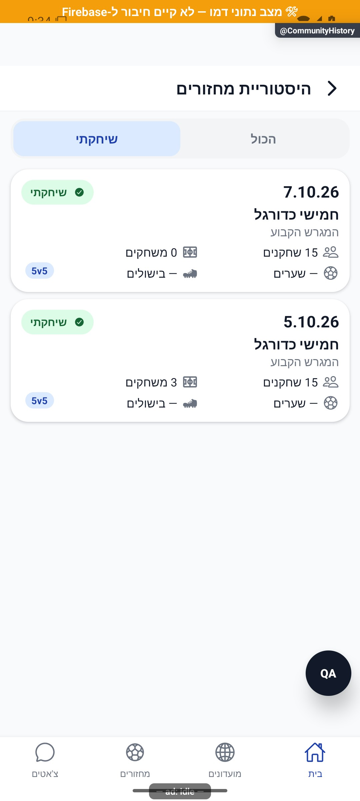
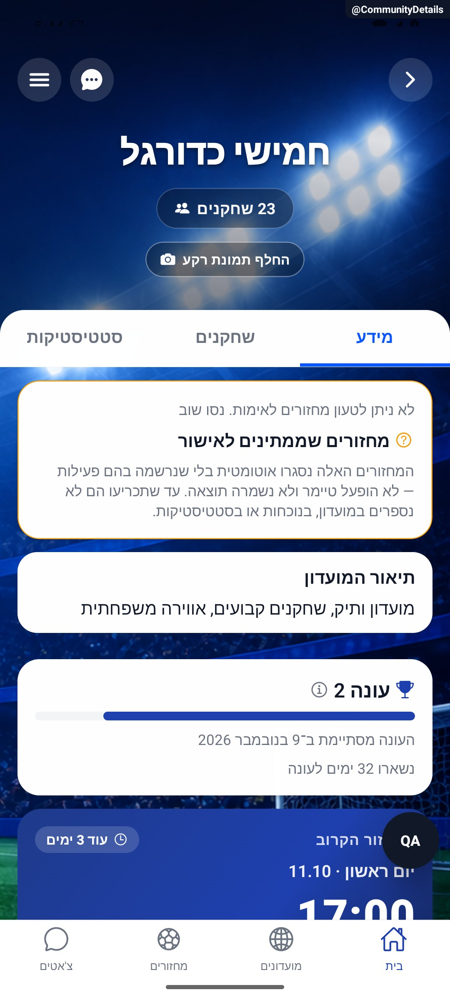

# היסטוריית מחזורי מועדון

[להסבר הקצר והפשוט](history.simple.md)

עודכן: 07.10.2026; מקור: `8e8fde5`. מסך: `src/screens/communities/CommunityHistoryScreen.tsx`; מסלול `CommunityHistory` עם `groupId`, מתפריט המועדון. רכיב שורה: `src/components/match/CommunityHistoryRow.tsx`.

## מבנה הכרטיס

תאריך, מצב אישי ״שיחקתי״/״לא שיחקתי״, כותרת המחזור, שם המגרש, פורמט אם קיים, ושתי שורות בעלות ארבעה נתונים: שחקנים, משחקונים, שערים ובישולים אישיים. האייקונים מימין לטקסט תחת כיווניות האפליקציה. הכרטיס שומר מבנה אחיד גם ללא השתתפות; אין מצב ״השתתפות לא תועדה״.

כותרת ופורמט נותרו בעיצוב המאושר האחרון המצורף בשיחה. בקשה מוקדמת להסירם אינה בסיס להכריז שהעיצוב הנוכחי שגוי. אפשר להציע צמצום כפילות כהצעה חדשה בלבד.

| מצב/פעולה | מקור ותנאי | תצוגה |
|---|---|---|
| כל המחזורים | מחזורים שהתקיימו | כולל כאלה שבהם המשתמש לא השתתף |
| שיחקתי | `viewerPlayed` | סינון לפי השתתפות בפועל, לא הרשמה בלבד |
| נתון אישי חסר | סטטיסטיקה אישית `null` | מקף; אינו אפס מדויק |
| לא השתתף | התוצאה האישית אינה שלו | אפס לפי מודל השורה, ללא כרטיס מרוקן |
| פתיחת מחזור | מזהה המחזור מהתוצאה | `MatchDetails`; לא מזהה שהוקלד מחדש |

## חישוב ומקור אמת

`src/utils/communityHistory.ts`; `src/utils/eveningPlayed.ts`; `src/utils/roundHistoryOrder.ts`; `src/services/gameService.ts`; `src/firebase/firestore.ts`. מונה משחקונים משתמש במידע מחויב, בנתונים שהושלמו או בגיבוי סבבים היסטורי בהתאם למודל, ולא מערבב מחזור ערב עם משחקון. ממתין, לא הגיע ובוטל אינם השתתפות בפועל. מחזור עתידי/פעיל או שלא אושר אינו היסטוריה שהתקיימה. אורח ששיחק נכלל במספר השחקנים בהתאם לרשומת ההשתתפות.

בדיקות: `tests/logic/communityHistory.test.ts`, `tests/logic/roundHistoryOrder.test.ts`, `tests/rules/roundHistoryAccess.test.mjs`. היסטוריה אישית היא מסך נפרד בתחום הפרופיל/מחזורים; לא להעתיק לתוכו חישוב חדש במקום להשתמש במודלים המשותפים.

## ראיות ופערים

בצילום הדמה נראות שורות שיחקתי ולא שיחקתי, נתון אישי חסר, אפס ומשחקונים שונים. תאריכי הדמה אינם ראיה שהמחזור התקיים בעולם האמיתי. ריק, תקלה עם ניסיון חוזר, סינון, אורח ששיחק ומחזור שהוסר לא צולמו. חישוב השתתפות בשרת לא אומת כאן.

## הצעות בלבד

סיכום קטן מעל הרשימה: כמה מחזורים שוחקו מתוך הטווח, עם הגדרה מפורשת של הטווח; אפשרות צמצום שם מחזור/פורמט אם מאשרים עיצוב חדש; מעבר סינון קצר ואחיד בלי גבהים משתנים ובלי אנימציה שמשנה את סדר הרשימה.

## פירוט טכני נוסף — זרימה, חישוב ונקודות שינוי

`communityHistoryFacets` משתמש ב־`isAttendedGame` להשתתפות, ולא בסטטוס בלבד. מספר השחקנים הוא מספר מזהים ייחודיים ללא `no_show`, ועוד האורחים הפעילים. מספר המשחקונים הוא המקסימום בין `committedRoundCount`, מספר המשחקונים המושלמים, ו־`max(0,(rotation.round ?? 1)-1)`.

לדוגמה: שלושה מזהים ייחודיים, אחד שלא הגיע ושני אורחים פעילים נותנים ארבעה שחקנים. מונה מחויב 3, סבב נוכחי 5 ושני משחקונים מושלמים נותנים ארבעה משחקונים, ולא סכום של תשעה. למי שלא השתתף שערים ובישולים אפס; למי שהשתתף ורשומת הנתונים שלו חסרה הערך `null`; ברשומה קיימת שדה שערים חסר הופך לאפס. `communityHistory.test.ts` בודק את ההבחנות; שינוי תווית או מונה צריך להישאר עקבי עם ההיסטוריה האישית.

הפירוט מתאר את הקוד שנקרא, ולא בדיקת כתיבה או הרשאות בסביבת הייצור. יש לקרוא את הקוד הממוקד וההפרש מאז מקור המיפוי לפני תיקון; בדיקות המוזכרות כאן לא הורצו מחדש לצורך עריכת התיעוד.

## עדכון 8.10.2026 — תנועה ותיקוני דיווחים

`ChangeMotion` מחובר ל־`playedOnly` סביב הרשימה, בלי להרכיב מחדש את המסך ובלי לשנות את תנאי `eveningPlayed`.

**ראיה ומגבלות:** המסך והסינון הורצו בדמו. אין כאן בדיקת היסטוריה של חשבון ייצור.

בדיקת הטיפוסים ו־183 חבילות הבדיקות עברו, 2,752 בדיקות. מצב המקור: `9ec0dfd` עם שינויים מקומיים; אין גרסה חדשה שפורסמה. [יומן השינוי וההקלטות](../../changes/2026-10-08-motion-and-pulse.md).

## תיקוני סבב הבאגים — 8.10.2026

B10: eveningVerifyService.listUnverified מפיצה שגיאה גם כשהשאילתה הראשית והחלופית נכשלו. UnverifiedEveningsCard מציגה loadFailed במקום להיעלם, משמרת רשימה קודמת באותו מועדון ומנקה רשימה בהחלפת מועדון. alive חוסם תשובה אחרי פירוק. לא בוצע אישור או דחיית מחזור אמיתי.

[ראיות, בדיקות ומגבלות](../../changes/2026-10-08-audit-fixes.md).

כשל קריאה יזום בשירות אימות המחזורים בדמו. כרטיס השגיאה נשאר גלוי. מצב צילום הפרסומת כובה זמנית במסך כדי להציג את תצוגת המוצר הרגילה; המקור וכל הזרקת הכשל הוחזרו במדויק.
