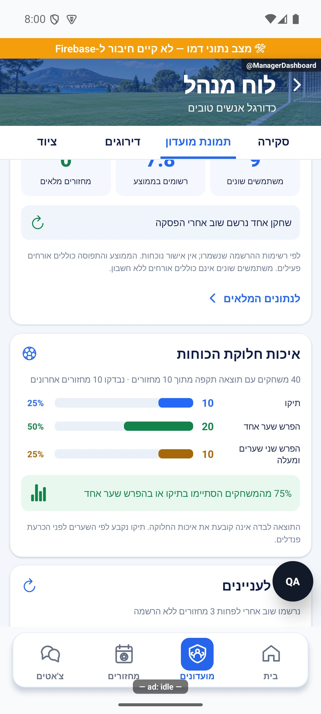
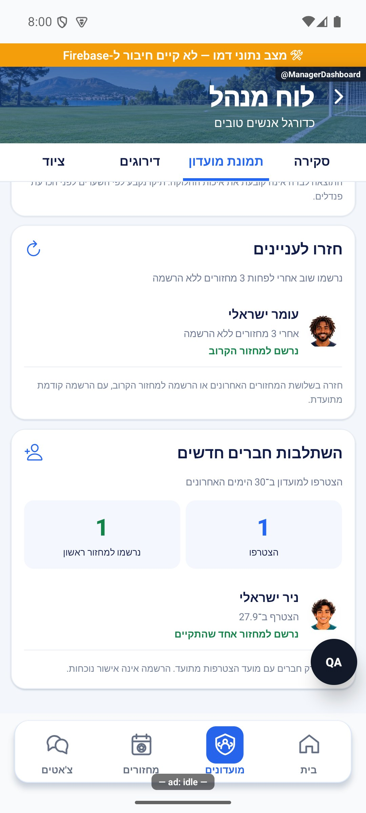
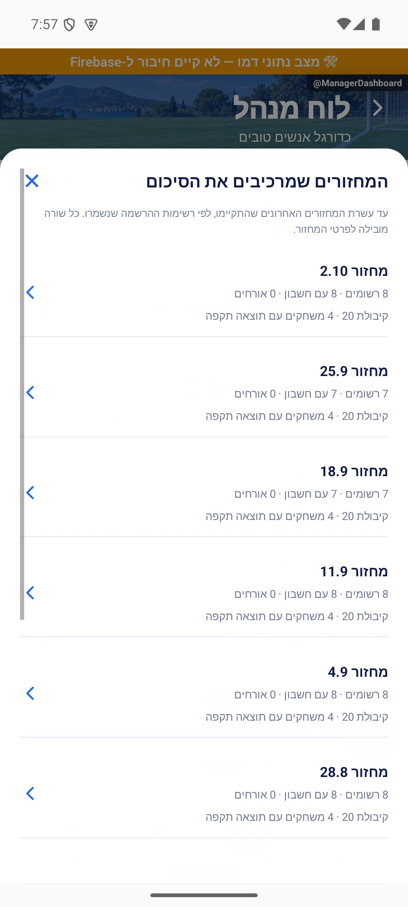
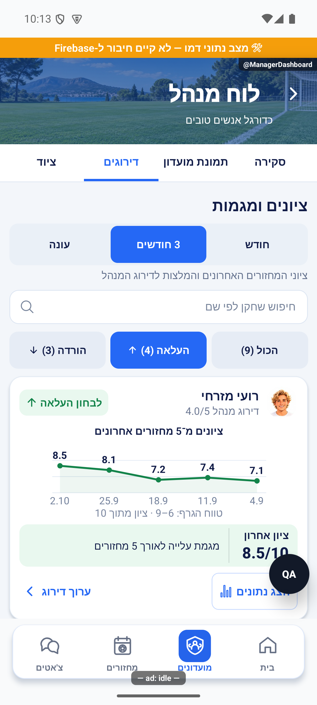

# לוח מנהל — נתונים, חישובים והרשאות

עדכון הפצה: השינויים המתועדים כאן נכללים בגרסה הפנימית 1.1.42 / 276, שאומתה בגוגל ב־9.10.2026. קביעות קודמות של ״טרם פורסם״ מתארות את מועד הפיתוח. [תיעוד ההפצה והבדיקות](../../changes/2026-10-09-internal-1.1.42.md).

עודכן 9.10.2026. [הסבר פשוט](manager-dashboard.simple.md). תיקון טעינת הלוח נכלל בגרסה הפנימית `1.1.40 / 274`; הסרת הפעולות, שינוי הקביעות והרחבת הצגת הציונים כאן הם שינויים מקומיים שטרם פורסמו. [פרטי השחרור הקודם](../../changes/2026-10-09-internal-1.1.40.md).

## כניסה, ניווט והרשאות

מסך `src/screens/communities/ManagerDashboardScreen.tsx`, נתיב `ManagerDashboard({groupId,initialTab?,initialFilter?})`. ארבע לשוניות: overview, club, ratings, equipment. קישור בתפריט `CommunityDetailsScreen` מופיע רק למנהל. רשום ב־`CommunitiesStack`, `ProfileStack`, `GameStack`, `ChatStack`, כי פרטי מועדון נגישים מכולם. חזרה במחסנית הקיימת. אין בלוח פעולת צ׳אט או תזכורת.

`loadManagerDashboard` ב־`src/services/managerDashboardService.ts` קורא מועדון קנוני ובודק ניהול וזהות לפני קריאת הנתונים. אחרי הקריאות בודק שוב זהות והרשאה. המסך מנקה נתונים בכניסה וברענון, מבטל תוצאות לאחר יציאה, מבודד לפי משתמש ומועדון ומאזין לשלילה דרך `watchManagerAccess`. שלילה או כשל האזנה מסתירים גם חלונות פתוחים. אין שינוי בכללי המסד.

## מסלול הנתונים וגבולות

- סגל: איחוד ייחודי של `adminIds` ו־`playerIds`; שמות ותמונות דרך `groupService.hydrateUsers`.
- מחזורים: `col.games()` ו־`gameDocConverter`, מועדון קנוני, ששת מצבי החיים התקפים, `startsAt DESC`, עד 201 לזיהוי חיתוך ושימוש ב־200. אינדקס קיים `(groupId,status,startsAt DESC)`. מחזורים עתידיים נכללים במכסה. חיתוך מוצג למנהל.
- ציונים: **כל המחזורים שהתקיימו בהיסטוריה שנטענה**, ללא מכסת 20 וללא תלות בהפעלת דירוג פנימי. `didEveningHappen` קובע התקיימות; `getGameEveningScores` מחזיר ציוני מחזור חתומים. עד ארבע קריאות במקביל באצווה, ללא מטמון גלובלי בין חשבונות. כשל אחד שומר הצלחות ומסמן `scoresIncomplete`.
- ציוד: `communityPlayerEvents`, מועדון, סוג כדור או גופיות, `at DESC`, עד 1,001 לזיהוי חיתוך ושימוש ב־1,000. המזהה נישא מהמסמך. כשל ציוד נפרד ואינו אפס.
- תקופה: 30 או 90 ימים; עונה רק כשהופעלה. מחזורים דרך `inSeason`, כולל כלל המסמכים ללא חותמת בעונה הראשונה. ציוד לפי פתיחת העונה כי אין בו חותמת עונה. בחירת התקופה משותפת ללשוניות ומשפיעה על ציונים, ביטולים וציוד בלבד.

תיקון הטעינה הקודם החליף `orderBy ASC + limitToLast` ב־`DESC + limit`, כי היפוך סדר השרת דרש אינדקס חסר. קריאה חיה ללא כתיבה שחזרה את הכשל ואימתה את השאילתה המתוקנת. `managerLoadErrorMessage` מבדילה שלילת הרשאה, החלפת חשבון וכשל כללי; שגיאת שאילתה אינה טענה לחוסר הרשאה. ראיות פרטיות ב־`artifacts/manager-dashboard` המוחרגת.

## ציונים והמלצות

הלוגיקה ב־`src/utils/managerDashboard.ts`. `ratingSeries` בוחרת לכל חבר עד חמשת ציוני המחזור האחרונים התקפים בתחום `[0,10]` בתקופה, רק ממחזורי המועדון שהתקיימו. חסר אינו אפס; אפילו ציון אחד מוצג. דירוג מנהל לא תקף מוחזר כ־`null` ואינו מסתיר ציוני ביצוע. גרף בן נקודה אחת נתמך ללא המצאת נקודות.

`ratingAdvice` משתמשת באותן סדרות אך דורשת דירוג פנימי פעיל, דירוג מנהל בתחום `(0,5]` וחמישה ציונים. `delta = average(last 2) - average(first 2)`. נדרשים הפרש מוחלט של נקודה לפחות ושניים מארבעת המעברים בכיוונו. כל אחד משני הציונים האחרונים חייב להיות לפחות חצי נקודה מעבר לממוצע שני הראשונים באותו כיוון. כך מישור ותיקון קטן אינם פוסלים שינוי מתמשך, וחריג בודד אינו מספיק. דירוג 5 אינו מקבל המלצת העלאה. המלצות ממוינות לפי גודל ההפרש ומזהה יציב.

זו המלצה לבחינה ולא המרה מציון 10 ליכולת 5. אין ערבוב ביטולים או ציוד ביכולת, ואין שקלול חוזר של שערים וניצחונות שכבר נכנסו לציון. כשל חלקי מונע המלצות עד רענון אבל **אינו מסתיר ציונים שכבר נטענו**. כשהדירוג הפנימי כבוי, הציונים נשארים ללא המלצה או עריכה.

מסנן הכול כולל כל בעל ציונים, והעלאה/הורדה כוללים המלצות בלבד. בעלי המלצה מוצגים תחילה. כרטיס ללא המלצה כחול, העלאה ירוקה והורדה ענברית. מוצגים דירוג מנהל או ״טרם נקבע״, מספר מחזורים בגרף, ציון אחרון והסבר. אין מצב ריק רק בגלל היעדר המלצה.

`ManagerTrend` משתמשת ב־`react-native-svg`. הזמן מהישן מימין לחדש משמאל, עם תאריכים וציונים. הטווח האנכי המעוגל כתוב ואינו מוצג כאילו התחיל באפס. חלון ״הצג נתונים״ מציג ציונים ותאריכים וקישור מכל מחזור ל־`MatchDetails`. `AdminRatingSheet` ו־`groupService.setAdminRating` עורכים ידנית בלבד, עם חסימת שמירה כפולה ורענון לאחר הצלחה. עריכה אינה מוחקת מגמת עבר.

## הרשמה וקביעות

`managerOverview` משתמשת במחזורים שהתקיימו לפני עכשיו לפי `eveningPlayState`. מחזור לפני `group.joinedAt[uid]` אינו זכאי. בלי מועד הצטרפות מתחילים ברישום או ביטול ראשון ידוע; בלי מעורבות ידועה אין הסקת היעדרות.

`REGULAR_WINDOW = 10`, `REGULAR_MINIMUM = 7`: קבוע נרשם לפחות ל־7 מתוך **10 המחזורים האחרונים הזכאים**. פחות מעשרה פירושו היסטוריה לא מספקת, לא מזדמן. ליד הקבוע החסר מוצגים `count / sample` בחלון זה ובמפורש ״המחזורים האחרונים״. `totalRegistered / totalSample` נשמרים בתוצאת החישוב אך אינם הספירה המוצגת בשורה זו.

המחזור הקרוב הוא העתידי הראשון במצב open/scheduled/locked. רשומים = מזהי `players` ייחודיים ואורחים פעילים; אורח בהמתנה לא תופס מקום. בשורת המדדים מוצגים רק קבועים ואורחים וחיצוניים. סך חברי המועדון הרשומים מופיע בנפרד וכולל גם חברים שאינם קבועים או שאין להם עשרה מחזורים זכאים. newCount ו־occasionalCount נשמרים בחישוב הפנימי ואינם מוצגים; המדדים הגלויים אינם פירוק מלא של סך הרשומים. המתנה ואישור מנהל אינם הרשמה. בר תפוסה מוגבל ל־100%, המכנה לפחות 1; המספר לא נחתך אם הקיבולת הופחתה.

`registrationState` מבדילה רשום, המתנה, ממתין לאישור, נדחה, ביטל וטרם נרשם. כל קבוע שאינו רשום מוצג עם מצבו. היעדרות היא רצף מאז הרשמה אחרונה: מוצגת לאחר שלושה מחזורים, או שניים אם היה קבוע בעשרת המחזורים שלפני הרצף. כך קבוע שנעדר אינו נעלם רק כי חלון חדש אינו מסווגו כקבוע. אלה נתוני הרשמה ולא אישור נוכחות.

## ביטולים וציוד

ביטולים מתוך `Game.cancellations`, למחזור שהתקיים בתקופה. הסרה בידי מנהל ומחזור שבוטל אינם ביטול שחקן. נשמר ביטול אחרון בלבד והוא מוסר בהרשמה מחדש; אין טענה להיסטוריית פעולות מלאה או אחוז מכל הרשמות. המגבלה כתובה במסך. חישוב ביטול מאוחר נשאר בלוגיקה ואינו מוצג. הסכום בשורה קומפקטית אדמדמה.

`equipmentCounts` סופרת ball/jerseys בתקופה לחברי הסגל הנוכחי. החזרה, ביטול רישום, מועדון אחר וזמן עתידי אינם נספרים. `gameId + uid + type` נספר פעם; אירוע ידני ללא מחזור לפי מזההו. לקיחות כדור בכחול וגופיות בירוק. טבלה של עד עשר שורות ופתיחת כל הסגל מעבר לכך; רוחב ורווחי עמודות זהים לכותרות ולשורות. שיאנים בשוויון יחד. אפס אומר שאין רישום לקיחה בתקופה שנטענה; כשל מסתיר טבלה, ספירות ואפסים עם ניסיון חוזר.

## הסרת הפעולות

לבקשת הבעלים הוסרו תזכורות, צ׳אט, שורת ההסבר, חותמות התזכורות וקריאות הלקוח ל־`getClubReminderStatus` ול־`sendClubRegistrationReminder`. טעינת הלוח אינה תלויה בשירות תזכורת. קוד שרת קודם נשאר בלתי מחובר למסך ואינו נפרס בסבב זה.

## מצבים ובדיקות

| מצב | תוצאה |
|---|---|
| טעינה או שינוי חשבון | ניקוי מידע קודם |
| שלילת ניהול או כשל האזנה | הסתרת נתונים וסגירת חלונות |
| כשל חלק מהציונים | הצלחות גלויות, אזהרה וניסיון חוזר, ללא המלצות |
| ציון אחד עד ארבעה | כרטיס וגרף, ללא המלצה |
| חמישה ציונים ללא מגמה | נתוני ביצוע, ללא המלצה |
| דירוג מנהל חסר או דירוג פנימי כבוי | ציונים גלויים, ללא המלצה |
| אין ציונים בתקופה | הסבר שאין ציוני מחזור בתקופה |
| אין מחזור עתידי | הסבר במקום כרטיס הרשמה |
| כשל ציוד | הסבר וניסיון חוזר, ללא אפסים מטעים |

`tests/logic/managerDashboard.test.ts`: מגמות, חריג בודד, מישור, כמה המלצות, סדרות קצרות ובלי דירוג, גבולות מועדון ומחזור, 7/10 לעומת 6/10, זמן הצטרפות, עצירת רצף היעדרות, מכני תפוסה, ציוד כפול והחזרות. `tests/managerDashboardService.test.ts`: שער מנהל וזהות, שאילתה, כשל שאינו רשימה ריקה, ציונים ללא דירוג פנימי, 21 מחזורים ללא המכסה הישנה ושמירת הצלחות בכשל חלקי.

ראיות במניפסט: חמשת צילומי `manager-refined-*-2026-10-09.jpg`, ובהם שלוש הלשוניות, גלילה, עשרת המחזורים, היעדר פעולות, ציונים ללא המלצה וסדרה בת שני ציונים, יישור טבלה וצבעים. תחת `forceRTL` הטקסט קודם לאייקון בסדר מקור רגיל והאייקון משמאלו, ללא `row-reverse`; אווטאר מימין. ההרצה באנדרואיד עם `USE_MOCK_DATA`, `__DEV__`, `QA_ROUTES`, פס הדגמה ומחוון בדיקה. אין זו בדיקת מסד או הרשאות משתמש נייד אמיתי. לא נשלחה הודעה ולא נשמר דירוג. אייפון, התקנה חדשה מהחנות ושמירה בייצור לא נבדקו. נתוני הקריאה החיה הפרטיים לא הועתקו לתיעוד. [רישום שינוי ובדיקות](../../changes/2026-10-09-manager-dashboard-refinement.md).

## תיקוני דיווחים — 9.10.2026

playerSearch מסננת את ratingSeries לפי שם המשתמש, trim ו-toLocaleLowerCase, יחד עם התקופה וכיוון ההמלצה. אין שינוי דירוג או בקשת מסד בכל הקלדה. חיפוש מתאפס בשינוי חשבון או מועדון. שדה Android TextInput משתמש ב-textAlign:right ו-writingDirection:rtl, כפי שנדרש ל-EditText; האייקון משמאל. תוצאת חיפוש ריקה מוצגת במפורש. הבהרת החישוב הקיים: managerOverview סופרת רצף שמתחיל במחזור האחרון שהתקיים ועוצר בהרשמה האחרונה, מתוך ההיסטוריה הזכאית מאז ההצטרפות שנטענה (עד 200). רצף ההיעדרות אינו מוגבל לעשרה; עשרת המחזורים הם חלון זיהוי קבוע בלבד. סף רגיל 3; wasRegular עם 7/10 לפני הרצף נותן סף 2. מחזור עתידי או שבוטל אינו נספר. זה נתון הרשמה ולא הוכחת הגעה.

מקור: שינויים מקומיים מעל a348b9f; טרם נבנתה גרסה. [ראיות ומגבלות](../../changes/2026-10-09-pulse-round2.md).

## עדכון סף ותצוגת סקירה — 9.10.2026

הסף העדכני הוא שבע הרשמות מתוך עשרה מחזורים זכאים, גם לקבוע נוכחי וגם לזיהוי קבוע לפני היעדרות. המדדים מזדמנים ופחות מעשרה מחזורים הוסרו מהתצוגה. נבדקו גבול 7 לעומת 6 והיעדרות של קבוע קודם באותו סף.

## תמונת מועדון — 9.10.2026

לשונית חדשה `club` בין סקירה לדירוגים. `ManagerClubInsights` מציגה שישה סקשנים. אין מסך חדש או שינוי הרשאות. קישור בדיקה `footy://qa/ManagerClubInsights` מיועד לפיתוח בלבד. השינויים מקומיים מעל `a348b9f`; טרם נבנתה או פורסמה גרסה.

### סיכום וחלון נתונים מלאים

`clubHistory` מסננת לפי מזהה מועדון, זמן עבר ו־`eveningPlayState === happened`, מייחדת לפי מזהה מחזור וממיינת מהחדש לישן. `managerClubInsights` משתמשת בעשרה האחרונים, ובהם גם מחזורים מעונות קודמות. פחות מעשרה מוצגים עם מספר המחזורים בפועל. החלון אינו תלוי בבורר התקופה של הלשוניות האחרות.

שחקנים שונים = גודל איחוד מזהי החשבונות הרשומים במחזורים. כפילות מזהה ומזהה עם ביטול פעיל אינם נספרים. המתנה ואישור מנהל אינם הרשמה; אורחים ללא חשבון אינם נכללים בספירת משתמשים ייחודיים. תפוסת מחזור = מספר חשבונות רשומים ייחודיים + `activeGuestCount`, ללא אורחי המתנה. ממוצע = סכום תפוסות חלקי מספר המחזורים שנטענו, עיגול לעשירית בתצוגה בלבד. מחזור מלא = קיבולת חיובית ותפוסה גדולה או שווה לקיבולת שנשמרה. אלה רשימות ההרשמה הנוכחיות במסמכי ההיסטוריה, ולא אישורי הגעה או צילום מצב מדויק במועד פתיחת ההרשמה.

השוואת ממוצע לעשרת הקודמים מופיעה רק כשיש שני חלונות מלאים של עשרה. אין השוואת חלון קצר לארוך. הסיכום מוסיף תובנת חזרה רק כשיש חוזרים. ללא מחזורים מוצג הסבר במקום מספרי אפס לסיכום ולאיכות החלוקה.

״לנתונים המלאים״ פותח חלון מוגן משולי המערכת ובו עד עשרה מחזורים, תאריך, תפוסה, חשבונות, אורחים, קיבולת ומספר משחקים עם תוצאה תקפה. חסר/כשל תוצאות מוצגים ככאלה. סגירה ברקע, בכפתור או בחזרה מערכתית. לחיצה על שורה סוגרת את החלון ומנווטת ל־`MatchDetails({gameId})` עם המזהה מהנתונים, ללא כתיבה. מעבר לשונית או יציאה מסיר את הרכיב והחלון.

### איכות חלוקת הכוחות

`loadManagerClubResults` נטענת רק בהרכבת הלשונית, ללא מטמון בין חשבונות. מאמתת חשבון ומועדון מנהל לפני ואחרי הקריאות. קוראת `games/{gameId}/roundHistory` דרך ממשק המסד ומנגנון חידוש אימות קיים; עד עשרה מחזורים וארבע קריאות במקביל. הקריאה מחזירה עד 501 מסמכים לזיהוי חיתוך; מנתחת 500 ומציגה אזהרה כשנחתך. אין שימוש ב־`gameService.getRoundHistory`, שמסתירה כשל כרשימה ריקה. אין שינוי בממיר המחזור: התוצאות נקראות מתת־האוסף, מזההן מהתשובה. ציונים חסרים נשארים לא תקפים ואינם הופכים ל־0:0.

`clubBalance` מייחדת תוצאות לפי מזהה בתוך כל מחזור ומקבלת רק שערים שלמים, סופיים ולא שליליים. `gap = abs(scoreA-scoreB)`: אפס לתיקו, אחד להפרש שער אחד, ושניים ומעלה לפער גדול. המכנה הוא כלל המשחקים עם תוצאה תקפה שנטענו; כשל וחוסר אינם אפס משחקים. אחוז משחקים צמודים = עיגול `(draws+oneGoal)/total*100`. אחוזי שורות מעוגלים עצמאית ולכן ייתכן סכום 99 או 101. לדוגמה: 10 תיקו, 20 בהפרש אחד ו־10 בפער גדול נותנים 75% משחקים צמודים. תיקו נקבע לפני הכרעת פנדלים; אין הסקת שערים מהזוכה. מוצגים מספר המחזורים שנסרקו, מספרם עם תיעוד תקף, כשל/חיתוך, מחזורים ללא תוצאה תקפה ותוצאות שנפסלו. קריאה חוזרת זמינה בכשל. בלי תוצאות אין גרף או אחוז מומצא. התוצאה לבדה אינה הוכחה לאיכות דירוג או חלוקה, ואין כאן שינוי דירוגים.

### חוזרים וחברים חדשים

״חזרו לעניינים״ מוצג רק כש־`returned.length > 0`. חבר סגל נוכחי שנרשם שוב בשלושת המחזורים האחרונים הזכאים או למחזור הקרוב, לאחר לפחות שלושה מחזורים רצופים ללא הרשמה ועם הרשמה מוקדמת יותר מתועדת. ללא הרשמה מוקדמת זו עשויה להיות הרשמה ראשונה ולא חזרה. תאריך הצטרפות ידוע מוציא מחזורים לפני ההצטרפות. ממוינים לפי מועד החזרה ומזהה. מחזור קרוב הוא העתידי הראשון במצב פתוח/מתוכנן/נעול. אין הבטחה להראות חזרה ישנה מעבר למכסת 200 מחזורים שנטענו.

״השתלבות חברים חדשים״ מוצג רק כש־`newcomers.length > 0`. חבר סגל עם `group.joinedAt[uid]` סופי בין עכשיו פחות 30 ימים לעכשיו. מועד חסר/לא תקף אינו מוסק מתאריך יצירת החשבון. מחזורים שהתקיימו מאז ההצטרפות נספרים להרשמה. בנוסף בודקים הרשמה לכל מחזור עתידי תקף או פעיל של אותו מועדון, ולא רק הראשון. כך הרשמה למחזור מאוחר יותר אינה מוצגת כ״טרם נרשם״. הסיכום מראה מספר מצטרפים וכמה מהם נרשמו לפחות פעם אחת; שורה מציגה תאריך הצטרפות, הרשמות שהתקיימו והרשמה למחזור נוסף אם קיימת. אין אישור נוכחות, תזכורות או הודעות.

### בדיקות וראיות

`tests/logic/managerClubInsights.test.ts` מכסה חלונות שווים, מחזור מבוטל/לא מאומת/זר, כפילויות, אורחים בהמתנה, ביטולים, חזרה אחרי שלושה מול פחות, חזרה ישנה, הצטרפות, תאריך חסר, הרשמה למחזור מאוחר ולמחזור פעיל, שערים לא תקפים, חוסר, כשל וחיתוך. `tests/managerClubResultsService.test.ts` מכסה שער מנהל, שלילת הרשאה אחרי הקריאות, החלפת חשבון, עשרת מחזורים בלבד, כשל חלקי, שער חסר וחיתוך. בדיקת טיפוסים וכל 3,080 הבדיקות ב־216 חבילות עברו.

ארבעת צילומי `manager-club-*-2026-10-09.jpg` מציגים את הלשונית, גרף, כרטיסים מותנים וחלון הפירוט באנדרואיד עם נתוני הדגמה. נבדקו יישור ימין לשמאל, אייקונים משמאל לטקסט, אווטאר מימין, פתיחה וסגירה של החלון. הגדרות המחזורים של הלוח הן נתוני הדגמה מקומיים; מסלול פרטי מחזור אמיתי לא נבדק בקריאת ייצור בסבב הזה. מקרי כשל, חיתוך והסתרה במצב ריק כוסו בבדיקות לוגיקה, לא בצילומי מצב מערכת. אייפון והרשאות משתמש אמיתי לא נבדקו. לא בוצעה פריסה או בנייה.

## מספר המשחקים ונושאים לטיפול — 9.10.2026

`ManagerClubExtras.tsx` מוסיף שני רכיבים בתוך `ManagerClubInsights`: טיפול לפני הסיכום, ומספר המשחקים אחריו. הם משתמשים בנתוני `ManagerData` ובתוצאות שכבר נטענו ללשונית; ללא מסך, הרשאה או אוסף חדשים. מספר המשחקים אינו תלוי בבורר התקופה, אלא באותו חלון של עד עשרת המחזורים האחרונים שהתקיימו.

`clubRoundNumbers` מקבלת את המחזורים המסוננים ואת `ClubResults`. `committedRoundCount` שלם בטוח ולא שלילי משמש מספר סגור; ממיר המסד הקיים כבר קורא אותו. מספר מסמכי היסטוריה ייחודיים לפי מזהה הוא מקור חלופי, ללא תלות בתקפות השערים. כששניהם זמינים נלקח המרב. בהיסטוריה חתוכה ומספר סגור שאינו גדול ממספר הרשומות שנקראו, המספר נשאר לא ידוע. מספר סגור גדול מהמדגם החתוך נשמר. כשל קריאה אינו מבטל מספר סגור תקף. בלי מספר סגור, היסטוריה ריקה או חתוכה אינה הוכחת אפס; אפס מפורש במספר הסגור הוא נתון תקף.

הממוצע הוא סכום מספרי המשחקים הידועים חלקי מספר המחזורים שמספרם ידוע. מוצגים המכנה וכמות המידע החסר; בלי מכנה אין ממוצע או שיא. כל השותפים לשיא מקבלים קישור לפרטי המחזור באמצעות המזהה מהנתונים. גרף עמודות מציג את הישן מימין והחדש משמאל, מספרי מחזורים ומספרי משחקים; נתון חסר מסומן בקו. מחזור הוא ערב, משחק הוא יחידה בתוך הערב. אין ערבוב עם ספירת הרשמות או אורחים.

`managerNeedsAttention` סופרת בקשות ייחודיות מ־`pendingPlayerIds`, אחרי הוצאת מי שכבר חבר או מנהל; מחזורים ייחודיים של אותו מועדון ב־90 הימים האחרונים לפי `needsPlayVerification`; וחברי סגל ללא דירוג מספרי סופי בטווח הגדול מאפס ועד חמש, רק כאשר `internalRating` מופעל. הכותרת סופרת קטגוריות פתוחות, לא סכום פריטים. הספירה מוגבלת לנתוני הלוח שנטענו, עד 200 מחזורים; אזהרת חיתוך ההיסטוריה של הלוח נשארת רלוונטית. נושא עם אפס פריטים מוסתר. בהיעדר כל הנושאים מוצג מצב הכול מטופל.

בקשות פותחות `AdminApproval`, תור האישורים הקיים לכל המועדונים שבניהול המשתמש; ההסבר מציין זאת במפורש אף שהמספר הוא למועדון הנוכחי. אימות מרחיב את `UnverifiedEveningsCard` הקיים, עם שער מנהל ומסלול השמירה הקנוני של `eveningVerifyService`. השירות מגביל את כרטיס האימות לעשרים פריטים ומבצע שאילתה מוגבלת; הספירה בלוח אינה הבטחה שכל הפריטים יופיעו יחד בכרטיס. לאחר טיפול `onResolved` מרענן את הלוח. דירוג פותח חלון רשימת חברים ואז את `AdminRatingSheet` הקיים באמצעות `setRatingTarget`; משתמש שפרטיו לא נטענו אינו ניתן לבחירה. שמירה משתמשת ב־`saveRating` הקיים ומרעננת. כל המסלולים רשומים במחסניות שמארחות את הלוח.

בדיקות `managerClubInsights.test.ts` מכסות מספר סגור, אפס, כפילויות בהיסטוריה, כשל, חוסר, חיתוך, שיא משותף, מכנה ממוצע; בקשות כפולות וחברים שכבר אושרו, סינון מועדון/תאריך/אימות, דירוג חסר או פסול, דירוג פנימי כבוי ומצב הכול מטופל. בדיקת טיפוסים וכל 3,084 הבדיקות ב־216 חבילות עברו לאחר השינוי האחרון.

צילומי `manager-extras-*` מתעדים תצוגה באנדרואיד עם נתוני הדגמה, כולל פתיחת רשימת חסרי הדירוג. נבדקו יישור ואייקונים משמאל. בדוגמה מספרי המשחקים הם 84 בסך הכול, ממוצע 8.4 ושיא 12. נתוני ההדגמה אינם נתוני ייצור. לא נשמר דירוג, לא אושר מחזור, לא נבדקו הרשאות חשבון אמיתי או אייפון. מקרי קצה נבדקו בלוגיקה, ולא כולם הורצו חזותית. אין פריסה, בנייה או פרסום.

פתיחת נושא האימות נבדקה גם חזותית: הכרטיס הקיים נפתח והציג את מחזור ההדגמה. לא נלחצו כפתורי ההכרעה. [צילום האימות](../screenshots/manager-extras-verify-2026-10-09.jpg).

עדכון מלל 9.10.2026: שם המדד בסיכום שונה ל״שחקנים שונים״, כולל ההבהרה על אורחים ללא חשבון. החישוב נשאר איחוד מזהי החשבונות הרשומים.

## תיקוני עיצוב ונגישות — 10.10.2026

מקור: `a348b9f235f1e1433497600555303231512a0834` עם שינויים מקומיים. אין בסעיף זה הוכחת גרסת חנות.

ב־`ManagerDashboardScreen` מלל משני והסברי גרף בגודל 13, פעולות בגודל 14. יעדי חזרה, מסננים, לשוניות ופעולות מרכזיות לפחות בגובה 48; כפתור החזרה 48×48. כותרת הרקע לפחות בגובה 112 ובריווח 12. למצב מושבת יש גם סמנטיקת נגישות. הגרף מציג את חמש הנקודות והתאריכים. לא השתנו נוסחאות המדדים, ספי הקבועים, חלון עשרת המחזורים או הרשאות. צילום לשונית הדירוגים נצפה; כלי הבדיקה מסתיר חלק מכפתור הנתונים. ניסיון גופן 130% במעטפת הפיתוח לא הניב מסך תקין, ולכן אין הוכחת גופן מוגדל.

הצילום: אנדרואיד בדמו במעטפת פיתוח `1.1.33/1`, ללא שמירה חיה; אין הוכחת אייפון או קורא מסך.
