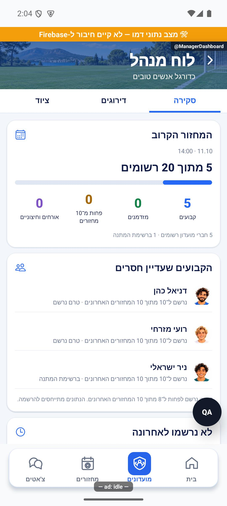
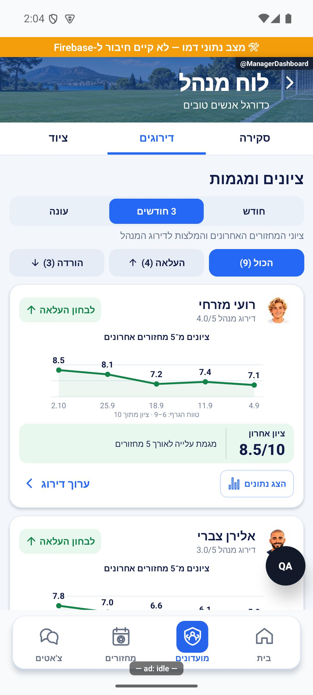
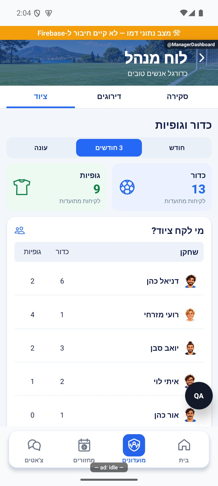
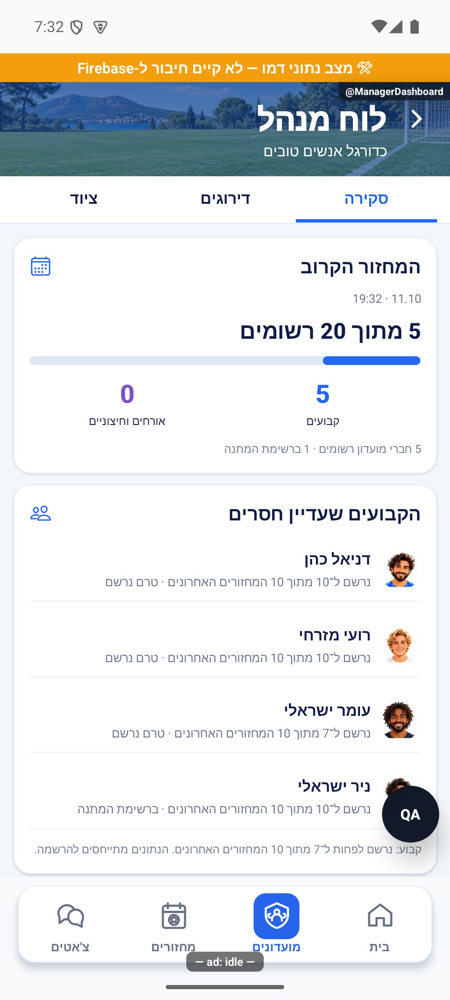
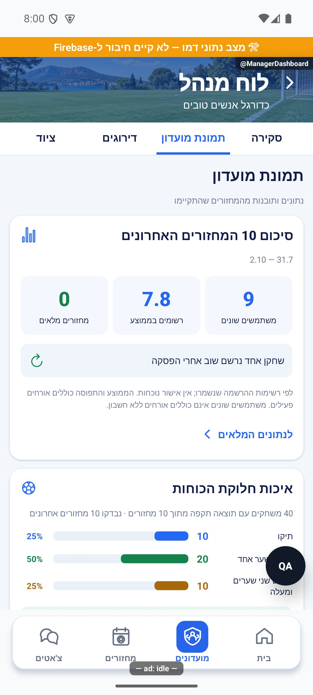
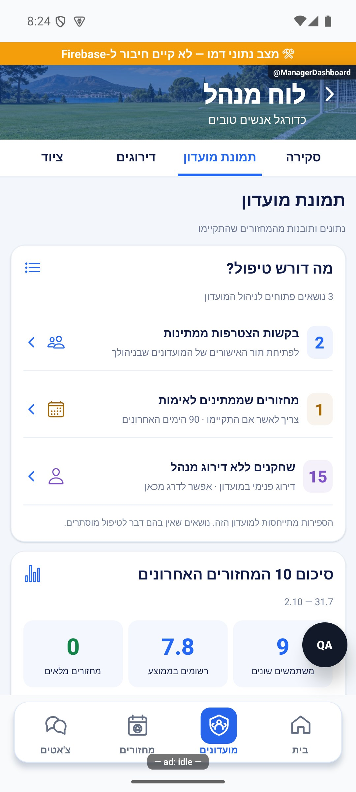
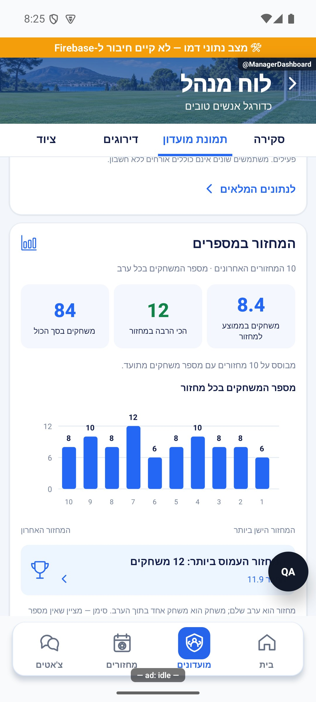

# לוח מנהל

עדכון הפצה: השינויים המתועדים כאן נכללים בגרסה הפנימית 1.1.42 / 276, שאומתה בגוגל ב־9.10.2026. קביעות קודמות של ״טרם פורסם״ מתארות את מועד הפיתוח. [תיעוד ההפצה והבדיקות](../../changes/2026-10-09-internal-1.1.42.md).

לוח פרטי למנהלי המועדון, שנפתח מתפריט המועדון ומחולק לארבע לשוניות:

- **סקירה:** הרשמה למחזור הקרוב, קבועים שעדיין חסרים, רצף מחזורים ללא הרשמה וביטולים. קבוע הוא מי שנרשם לפחות ל־7 מתוך 10 המחזורים האחרונים. ליד השחקן כתוב מתוך כמה מחזורים חושב הנתון. הרשמה אינה אישור הגעה.
- **תמונת מועדון:** סיכום עשרת המחזורים האחרונים וניתוח פערי התוצאות במשחקים. כרטיסי ״חזרו לעניינים״ ו״השתלבות חברים חדשים״ מופיעים רק כשיש שחקנים רלוונטיים.
- **דירוגים:** ציונים וגרף לכל שחקן שיש לו נתונים, גם בלי המלצה לשינוי דירוג וגם עם פחות מחמישה ציונים. המלצות נבחנות מחמישה ציונים ובנפרד מהצגת הנתונים. אפשר לפתוח את המחזורים ולערוך דירוג מנהל ידנית; אין שינוי אוטומטי.
- **ציוד:** לקיחות כדור וגופיות מתועדות לכל שחקן, שיאנים ושחקנים ללא לקיחות בתקופה. החזרות ורישומים כפולים אינם לקיחה נוספת.

אפשר לבחור חודש, שלושה חודשים או עונה פעילה לציונים, ביטולים וציוד. קביעות תמיד מתייחסת לעשרת המחזורים האחרונים הזכאים.

התזכורות, פתיחת הצ׳אט וכל שורת ההסבר עליהן הוסרו מהלוח לבקשת הבעלים. כשל טעינה מוצג עם ניסיון חוזר; נתון שלא נטען אינו מוצג כאפס.

עודכן 9.10.2026. השינוי מקומי וטרם פורסם. שלוש הלשוניות נבדקו באימולטור אנדרואיד עם נתוני הדגמה; אייפון לא נבדק בסבב הזה.

[מאחורי הקלעים](manager-dashboard.md)

## תיקוני דיווחים — 9.10.2026

בלשונית הדירוגים אפשר לחפש שחקן לפי שם יחד עם סינון העלאה או הורדה. שחקן שלא נרשם מופיע לאחר שלושה מחזורים אחרונים ברצף, או שניים אם היה קבוע לפני ההיעדרות. קבוע הוא מי שנרשם לפחות לשבעה מתוך עשרה מחזורים.

מקור: שינויים מקומיים מעל a348b9f; טרם נבנתה גרסה. [ראיות ומגבלות](../../changes/2026-10-09-pulse-round2.md).

בשורת הסיכום מוצגים קבועים ואורחים וחיצוניים בלבד. המדדים מזדמנים ופחות מעשרה מחזורים הוסרו. ההגדרה העדכנית לקבוע היא שבע הרשמות לפחות מתוך עשרת המחזורים האחרונים הזכאים.

## תמונת מועדון

הלשונית החדשה מרכזת סיכום של עד עשרת המחזורים האחרונים: שחקנים שונים, ממוצע רשומים ומחזורים מלאים. ״לנתונים המלאים״ מציג את המחזורים שמרכיבים את החישוב, עם נתוני כל מחזור וקישור לפרטיו.

באיכות חלוקת הכוחות רואים כמה משחקים הסתיימו בתיקו, בהפרש שער אחד או בפער גדול יותר. הניתוח משתמש רק בתוצאות מתועדות; כשחסר מידע זה מצוין.

״חזרו לעניינים״ מופיע רק כשיש חזרה לאחר לפחות שלושה מחזורים ללא הרשמה. ״השתלבות חברים חדשים״ מופיע רק כשיש מצטרפים עם תאריך הצטרפות מתועד ב־30 הימים האחרונים. שני הכרטיסים מוסתרים כשאין בהם נתונים. אין שינוי בהגדרת קבוע: שבע הרשמות מתוך עשרה.

נבדק באנדרואיד עם נתוני הדגמה, טרם פורסם. אייפון לא נבדק.

## המחזור במספרים ומה דורש טיפול — 9.10.2026

בלשונית ״תמונת מועדון״ נוספו שני כרטיסים:

- **המחזור במספרים:** מספר המשחקים בעשרת המחזורים האחרונים, ממוצע למחזור, שיא וגרף. אפשר לפתוח את המחזור שבו שוחקו הכי הרבה משחקים. מידע חסר מסומן ואינו מוצג כאפס.
- **מה דורש טיפול:** בקשות הצטרפות ממתינות, מחזורים שצריך לאמת אם התקיימו ושחקנים ללא דירוג מנהל כאשר הדירוג הפנימי מופעל. כל שורה פותחת את הפעולה המתאימה. נושא בלי פריטים מוסתר; כשאין נושאים פתוחים מוצג ״הכול מטופל כרגע״.

תור האישורים מרכז את כל המועדונים שבניהולך; הספירה בכרטיס מתייחסת למועדון הנוכחי. האימות מתייחס ל־90 הימים האחרונים. אין שליחת תזכורות או שינוי אוטומטי של דירוג.

נבדק באימולטור אנדרואיד עם נתוני הדגמה; לא נשמר דירוג ולא בוצע אימות מחזור. אייפון ופעולות שמירה בייצור לא נבדקו. השינוי טרם פורסם.

## תיקוני עיצוב ונגישות — 10.10.2026

מקור: `a348b9f235f1e1433497600555303231512a0834` עם שינויים מקומיים. אין בסעיף זה הוכחת גרסת חנות.

המלל המשני והסברי הגרפים גדולים יותר. פעולות, מסננים ולשוניות מקבלים שטח לחיצה מרווח יותר.
