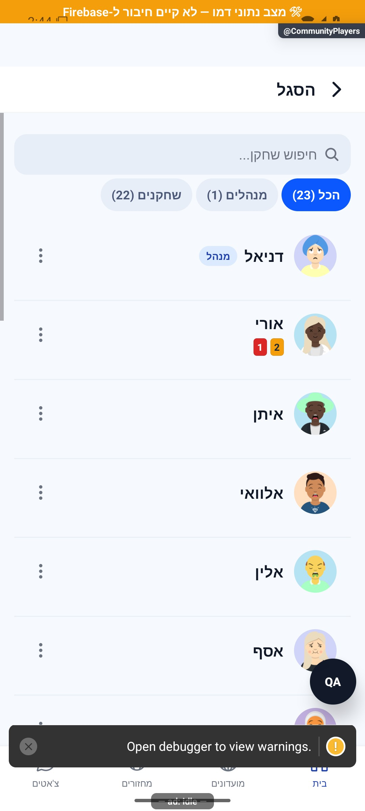
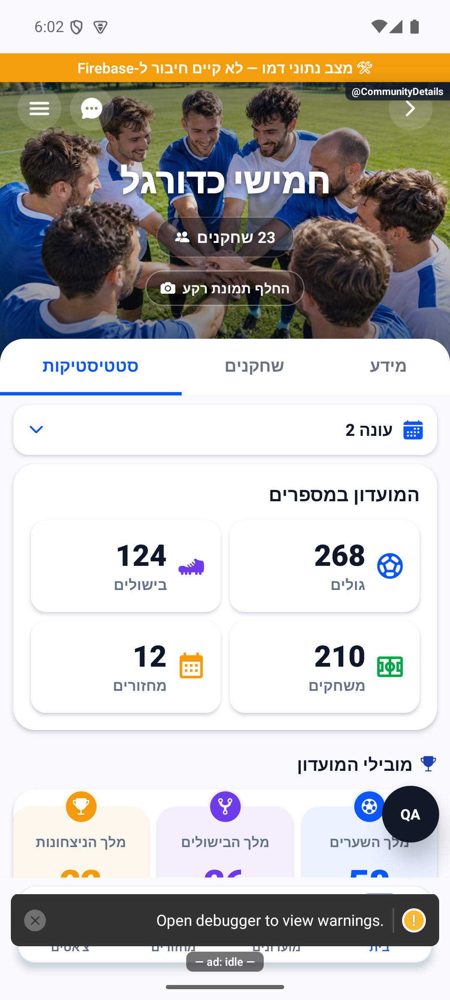

# השחקנים והמנהלים

פריסת כפתורי עורך הדירוג הפנימי הותאמה לכיווניות העברית.

כאן רואים מי חבר במועדון ומחפשים שחקן ברשימה. מנהלים יכולים לפתוח את כלי ניהול השחקנים, והיוצר יכול לשנות את תפקידי הניהול.

[לפירוט המעמיק](members-and-administration.md)

## בדיקת לחיצות אחרי גלילה — 10.10.2026

בדקנו לחיצות לאחר עצירת גלילה בפרטי מחזור ובפרטי מועדון. בניסוי דמו שדימה אירוע סיום גלילה חסר, הגנת הגלילה הקיימת אפשרה כבר את הלחיצה הראשונה. נוספה אותה הגנה גם לרשימת השחקנים במועדון. הנתונים, סדר השחקנים והחישובים לא השתנו.

התקלה לא שוחזרה באופן טבעי באמולטור. הניסוי מוכיח מסלול כשל מסוים, ואינו מוכיח שזו הסיבה בטלפון המדווח; שני הדיווחים נשארים פתוחים לאימות. [ראיות ומגבלות](../../../artifacts/pre-release-2026-10-10/scroll-press/README.md).

