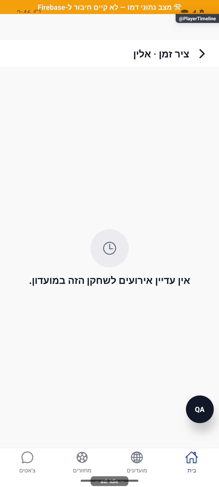

# כלי ניהול שחקנים

## עדכון מקומי — 10.10.2026

שינוי סימון כדור או גופיות של שחקן נשמר בלי למחוק שינוי שמנהל אחר ביצע בינתיים אצל שחקן אחר. אירוע ציוד נרשם רק לסימון שהשתנה בפועל.

התנהגות הכשל נבדקה בקוד מבודד; לא הורצה במכשיר מול הנתונים האמיתיים.

כפתורי עורך הדירוג הפנימי מותאמים לפריסה העברית של האפליקציה.

מנהלים יכולים לתת כרטיס, לשייך ציוד ולעדכן דירוג פנימי לשחקן. ציר האירועים מציג את הפעולות שנעשו ואת הכרטיסים שבוטלו.

[לפירוט המעמיק](player-management.md)

## תיקוני עיצוב ונגישות — 10.10.2026

מקור: `a348b9f235f1e1433497600555303231512a0834` עם שינויים מקומיים. אין בסעיף זה הוכחת גרסת חנות.

מחוון דירוג המנהל מקריא את שם השחקן ואת הדירוג וניתן לשינוי גם ללא גרירה. בזמן שמירה אין שינוי נוסף במחוון.
