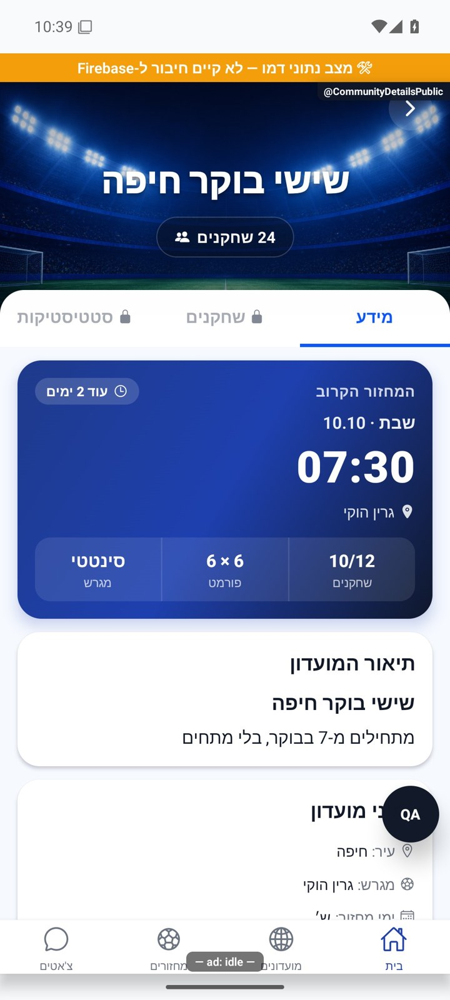

# תצוגה ציבורית והצטרפות למועדון

## גבולות תמונת הכותרת — 8.10.2026

התצוגה הציבורית משתמשת באותו `CommunityStadiumHero` וב־`CoverCrossfade`; גם בה שתי התמונות תחומות כעת לגודל הכותרת ולא למידות הנכס המקוריות. מדיניות הצטרפות, מידע ציבורי וכתיבות לא השתנו. התצוגה נצפתה באמולטור אנדרואיד בדמו, ללא בקשת הצטרפות. [פירוט התיקון](../../changes/2026-10-08-cover-layout.md).

[להסבר הקצר והפשוט](public-preview-and-join.simple.md)

עודכן: 07.10.2026; מקור: `8e8fde5`. מסלול: גילוי/קישור הזמנה → `CommunityDetailsPublic` עם `groupId`. מסך: `src/screens/communities/CommunityDetailsPublicScreen.tsx`.

## אזורי המסך

רקע וכותרת, מספר שחקנים, לשוניות מידע/שחקנים/סטטיסטיקה, פרטים ציבוריים, תיאור, עיר ומגרש, מחזור קרוב ופעולת הצטרפות. אזורי שחקנים וסטטיסטיקה נעולים למי שאינו חבר ומסבירים את הסיבה בלחיצה. המחזור הקרוב הוא תקציר לקריאה בלבד; אין להסיק ממנו הרשאה לפתיחת פרטי מחזור או לשינוי הרשמה.

| פעולה או מצב | מקור נתונים | תנאי ותוצאה |
|---|---|---|
| פתיחת תצוגה | `groupsPublic` | בלי קריאה ישירה לרשומת מועדון פרטית |
| המשתמש כבר חבר | רשימת החברות | מעבר לפרטי המועדון הפרטיים |
| הצטרפות למועדון פתוח | `requestJoinById` | הצטרפות ישירה בכפוף לבדיקות השרת |
| מועדון סגור | בקשת הצטרפות | הוספה לממתינים והצגת מצב ממתין |
| אורח מבקש להצטרף | פעולה ממתינה | התחברות והמשך הפעולה אחרי שחזור החשבון |
| ביטול בקשה | `cancelJoinById` | הסרה מהממתינים; רשומת ביקורת אינה נמחקת |
| מועדון מלא/חברות קיימת | תשובת שרת | הודעה ייעודית; לא הודעת הצלחה כללית |

כפתור הפעולה עסוק במהלך בקשה כדי למנוע כפילות. טעינה, חסר/מחוק, שגיאה, אורח, חבר, מבקש, פתוח וסגור הם מצבים נפרדים. פירוט מספרי החברות יכול להשתנות בין הקריאה לבין פעולת ההצטרפות; השרת הוא ההכרעה.

## קבצים ושירותים

`src/services/groupService.ts`; `src/firebase/firestore.ts`; `src/components/community/CommunityStadiumHero.tsx`; שער ההתחברות והפעולה הממתינה; קריאת מחזורים ציבוריים. יצירת בקשת ההצטרפות ועדכון החברות כפופים לכללים/פונקציות בשרת. הכללים המקומיים נקראו, אך פריסתם לא נבדקה במסגרת המיפוי.

## ראיות וגבולות

הצילום מציג מועדון ציבורי בנתוני דמה עם לשוניות נעולות ומחזור קרוב הכולל תאריך, שעה וכמות נרשמים. לא בוצעה הצטרפות אמיתית, ביטול בקשה או שינוי הרשאה. מסמכי 071/086/090 מתעדים שינויים היסטוריים בתקציר הציבורי; הקוד הנוכחי הוא מקור המבנה המחייב.

בדיקות עתידיות: חזרה מהתחברות לפעולה המדויקת, בקשה כפולה, מועדון שהפך סגור בזמן הבקשה, חבר המופיע גם בממתינים, קישור למועדון שהוסר, הרשאות מידע ציבורי. השתמש בחשבון הבדיקה המאושר, לא בחשבון הבעלים.

## הצעות בלבד

להבהיר לפני לחיצה אם נדרשת הסכמת מנהל; להציג מעבר עדין למצב ממתין עם סמל אישור, בלי חגיגת הצטרפות לפני אישור; לאחר הצטרפות אמיתית להנפיש הופעת אווטאר המשתמש בסגל. אין להציג ציפייה לזמן אישור שאין לו מקור נתונים.

## פירוט טכני נוסף — זרימה, חישוב ונקודות שינוי

`requestJoinById` ו־`requestJoinByCode` מגיעים למסלול ההצטרפות המשותף; `writeJoin` מפריד לפי `isOpen`. פתוח: `arrayUnion(userId)` אל `groups.playerIds`, ללא מסמך בקשה. סגור: חיפוש בקשה ממתינה קיימת, יצירת `joinRequests` רק אם אינה קיימת והוספת המשתמש אל `pendingPlayerIds` באותה אצוות כתיבה.

דחייה קודמת נבדקת למועדון סגור ומעלה `GroupJoinRejectedError`; כשל בשאילתת בדיקת הדחייה מאפשר ניסיון כתיבה, והשרת עדיין קובע אם מותר. ההצטרפות הפתוחה אינה מעדכנת כאן `groupsPublic.memberCount`, ולכן ספירה ציבורית עשויה להתעכב. שינוי מסלול פתוח/סגור צריך לבדוק בקשה חוזרת, קיבולת, חשבון משוחזר והיטל ציבורי; אין לתקן פער מספרי באמצעות כתיבה בלתי מורשית מצד החבר.

הפירוט מתאר את הקוד שנקרא, ולא בדיקת כתיבה או הרשאות בסביבת הייצור. יש לקרוא את הקוד הממוקד וההפרש מאז מקור המיפוי לפני תיקון; בדיקות המוזכרות כאן לא הורצו מחדש לצורך עריכת התיעוד.

## תיקוני ההזמנה וההיכרות — 8.10.2026

`public/c/index.html` ו־`functions/templates/community.html` מפיקים מזהה מ־`/team/` וגם `/c/`. `inviteSuffix` נושא מזמין ומטא־נתוני מקור בכל קישור פתיחה, כולל כוונת אנדרואיד. קישורי החנות מפיקים יעד מועדון מפורש; מקור מקוצר `b` מפוענח לפני מטען ההתקנה. כל עוגני ההורדה משתמשים באותו יעד חנות, ובאייפון עוברים דרך המתנה להעתקה וטיפול בכשל. אין ניסיון אוטומטי לפתוח סכימה באייפון ללא ידיעה שהיישום מותקן; כפתור פתיחה מפורש נשאר. הרשאות התצוגה הציבורית, ההצטרפות ומסמכי המועדון לא השתנו. בדיקות הרצת התבניות מאמתות מועדון, מזמין וקמפיין; דף מועדון חי והתקנה באייפון לא הורצו.

מקור: `a348b9f` עם תיקונים מקומיים. ראיות ובדיקות: [דוח התיקון](../reviews/onboarding-fixes-2026-10-08.md).
