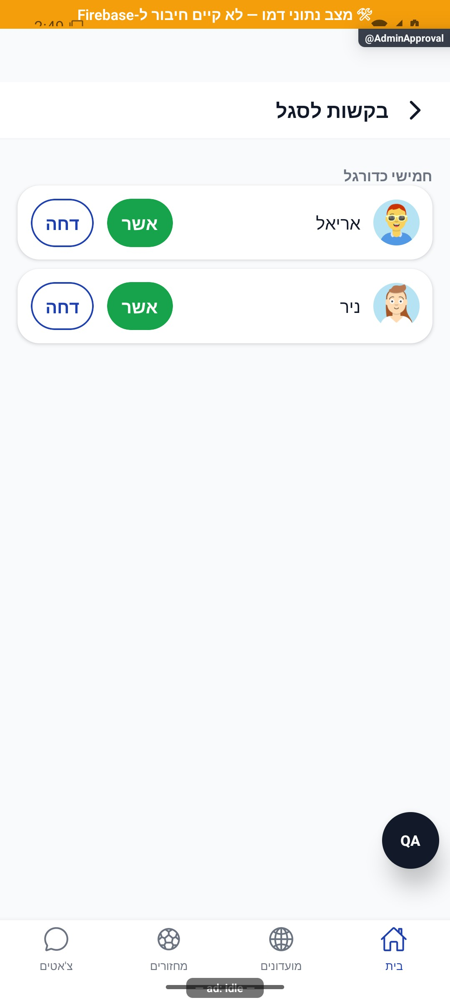

# בקשות ואישורים

עודכן: 07.10.2026; מקור: `8e8fde5`. מסכים: `src/screens/RequestsScreen.tsx`, `src/screens/groups/AdminApprovalScreen.tsx`; מסלולים `Requests`, `AdminApproval`.

## שני הקשרים

`Requests` הוא תיבת בקשות: חברים, בקשות למועדונים שהמשתמש מנהל ובקשות למחזור שהוא מארגן. הוא אינו תיבת כל הודעות המערכת. `AdminApproval` מרכז בקשות למועדונים שהמשתמש מנהל; אינו מוגבל בהכרח למועדון שממנו הגיע. הפרטים והשמות נטענים באצווה כדי להימנע מקריאה נפרדת לכל שורה.

| פעולה | הרשאה ונתונים | תוצאה |
|---|---|---|
| אישור חבר | בקשת חברות אל המשתמש | עדכון הקשר לפי שירות החברים |
| אישור מועדון | מנהל, משתמש ממתין | עסקה שמעדכנת חברות ומסירה המתנה; רשומת ביקורת |
| דחיית מועדון | מנהל, משתמש ממתין | הסרת המתנה וסטטוס ביקורת |
| אישור מחזור | מארגן בעל הרשאה | תנאי מקום/הרשמה בתחום המחזורים |
| אישור קבוצתי | קבוצה קיימת; אישור לפני פעולה | עלולות להיות הצלחות חלקיות; לא הצלחה כללית עיוורת |
| רענון | חזרה למסך/משיכה | קריאה מחדש, בלי מחיקת נתונים בגלל תקלה זמנית |

מצב עסוק מונע אישור כפול. טעינה, תיבה ריקה, הרשאה שנעלמה, בקשה שכבר אושרה בידי מנהל אחר, כשל חלקי ותקלה ברענון הם מצבים נפרדים. מונה הפעמון צריך להצטמצם בעקבות שינוי מאומת; אינו מונה התראות דחיפה שנשלחו.

## תלות

`src/components/RequestsBell.tsx`; `src/services/groupService.ts` — `approveMember`, `rejectMember`, `getMemberApprover`; שירותי חברים ומחזורים; `src/firebase/firestore.ts`. אישור חבר מועדון קיים חייב להיות בטוח לחזרה; אין לשנות מזהי מסמכים בהעתקה ידנית. מקור השם והפרופיל צריך להיות הידרציה עדכנית ולא שם שנכתב לצורך צילום.

## הוכחות ופערים

הצילומים מציגים שתי בקשות מועדון ושלוש בקשות מחזור בנתוני דמה, וכפתורי אישור/דחייה. לא נלחצו פעולות. בקשת חברות, הצלחה חלקית, הרשאה שנשללה, אישור כפול ותיבה ריקה לא צולמו. אין בכך בדיקה של כתיבות אמיתיות.

## הצעות בלבד

להציג תוצאת פעולה בשורה לפני הסרתה, כך שהמשתמש יבין מה אושר; לאחר אישור קבוצתי להציג מספר הצלחות וכשלונות עם אפשרות ניסיון חוזר רק לנכשלים; להנפיש הקטנת מונה בלי להזיז כפתור שהמשתמש עומד ללחוץ עליו.
