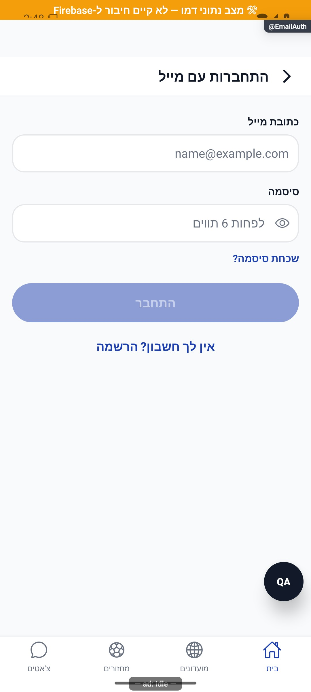

# התחברות וחלון הרשמה בהקשר הפעולה

עודכן: 07.10.2026; קוד `8e8fde5`, `1.1.35` בבנייה. תפקידים: אורח, חשבון מלא, בעל חשבון קיים. מיפוי בלבד.

## מסכים וניווט

`src/screens/auth/SignInScreen.tsx` הוא מסך הכניסה המלא. `src/components/auth/ContextualAuthSheet.tsx` מופיע מעל המסך שבו אורח ביקש פעולה שמצריכה חשבון. `src/screens/auth/EmailAuthScreen.tsx` הוא מסלול `EmailAuth`, הרשום גם בערימות הכניסה וגם בערימות המארחות את ההורים. יש לבדוק את הרישום בכל הערימות לפני שינוי ניווט מתוך חלון משותף.

החלון מציג ידית, כותרת והסבר מותאמים: הצטרפות למחזור, הצטרפות למועדון, מועמדות להשלמה, יצירת מועדון, יצירת מחזור, שמירת זמינות או פתיחת חשבון. קיימים כפתורי Google ומייל; Apple תלוי מערכת וזמינות. בטיוטה מוצגת גם הבטחה שהעבודה נשמרה. ביטול סוגר את החלון ומשאיר את האורח והטיוטה.

זהו צילום חלון אמיתי המורכב בכלי הבדיקה מעל בית של חשבון דמו מלא. הוא מוכיח מראה ונוסח בלבד, לא הרשמה אנונימית או הצלחה מול ספק. פס הדמו, מזהה המסלול ובועת הבדיקה אינם חלק מעיצוב גרסת החנות.

## טבלת מצבים

| תנאי | פעולה ומעבר | כתיבה או שינוי זהות | ראיה |
|---|---|---|---|
| אורח, פעולה עסקית | שמירת פעולה או טיוטה ואז חלון | אחסון מקומי בלבד עד התחברות | קוד `useAuthenticatedAction` |
| Google או Apple, אישורים חדשים | קישור האישורים לזהות האנונימית | שימור אותו מזהה; יצירת פרופיל מלא | קוד `authUpgrade` |
| האישורים שייכים לחשבון קיים | שימוש באותם אישורים להתחברות לחשבון הקיים | החלפת זהות; אין מיזוג נתוני אורח | קוד |
| ביטול ספק | החלון נסגר או חוזר ללא ביצוע העסקה | נשאר אורח | קוד; לא אומת ספק חי |
| פעולה בתהליך או כשל | חסימת לחיצה כפולה; הודעת כשל | אין הצלחה מדומה | קוד |
| מייל, הרשמה | אימות שדות ויצירת משתמש | `createUserWithEmailAndPassword` יוצר מזהה חדש | קוד `firebase/auth.ts` |
| מייל, התחברות | מייל וסיסמה; הצלחה חוזרת לשערי השורש | מעבר למזהה החשבון | קוד; צילום טופס בלבד |
| איפוס סיסמה | שליחת בקשת איפוס לפי מייל | ספק ההזדהות | קוד; לא בוצעה שליחה |

הבדל חשוב: האפשרות `upgradeAnonymous(email)` אינה מסלול ההרשמה הפעיל במסך המייל. אין לתעד שמירת מזהה אורח במייל כאילו זהה לקישור Google/Apple. הטיוטה המקומית והכוונה יכולות לשרוד החלפת מזהה, אך אינן מיזוג מסמכי מסד.

## טופס מייל, שירותים וממיר

הטופס כולל מייל, סיסמה, אישור סיסמה בהרשמה, הצגה/הסתרה, מעבר בין כניסה להרשמה וקישור שכחת סיסמה. כפתור מושבת כשהשדות אינם תקינים. שגיאות מייל בשימוש, סיסמה חלשה/שגויה, הגבלת ניסיונות, רשת וספק אחר מקבלות טיפול ייעודי. בהצלחה `goBack` אינו סוף הזרימה: `RootNavigator` בודק היכרות ופרופיל.

מקורות: `src/services/authUpgrade.ts`, `src/hooks/useAuthenticatedAction.tsx`, `src/firebase/auth.ts`, `src/services/userService.ts`, `src/store/userStore.ts`, `src/components/auth/ContextualAuthSheet.tsx`. פרופיל מלא נקרא דרך ממיר המשתמש ב־`src/firebase/firestore.ts`; אורח אינו מקבל מסמך `users` עסקי. זיהוי במעקב צד שלישי צריך להחליף/לקשר זהות בסדר הקיים ולא להקדים לכתיבת החשבון.

בדיקות: `tests/authUpgradeUpdatesStore.test.ts`, `tests/guestAuthEntryPoints.test.ts`, `tests/logic/authUpgrade.test.ts`, `tests/logic/authRaceRetry.test.ts`. לא הופעל ספק חי במיפוי.

## שחזור וסיכונים

לבדוק בחשבון הבדיקה: ביטול ספק, הרשמה חדשה, התנגשות עם חשבון קיים, מייל מול ספק אחר, חזרה לאחר השלמת פרופיל והפעלה מחדש כשהטיוטה קיימת. כל התמונות בטבלה מכסות נוסחים בהרכבת דמו בלבד. מסמך 004 שטען שאין כלל קישור אישורים אינו מקור אמת לזרימת האורח הנוכחית; אין מכך הוכחה שכל התנגשות בין שני חשבונות מלאים נפתרה.

| הקשר החלון | צילום תצוגה שנפתח | נוסח מרכזי שנצפה |
|---|---|---|
| הצטרפות למחזור | [צילום](../screenshots/auth-join-game.jpg) | עוד רגע אתה בהרכב |
| הצטרפות למועדון | [צילום](../screenshots/auth-join-club.jpg) | עוד רגע אתה בסגל |
| מועמדות להשלמה | [צילום](../screenshots/auth-apply-filler.jpg) | מגישים מועמדות למחזור |
| יצירת מועדון | [צילום](../screenshots/auth-create-club.jpg) | שומרים את המועדון; מה שמילאת נשמר |
| יצירת מחזור | [צילום](../screenshots/auth-create-game.jpg) | שומרים את המשחק; מה שמילאת נשמר |
| שמירת זמינות | [צילום](../screenshots/auth-save-availability.jpg) | שומרים את הזמינות; מה שמילאת נשמר |
| חשבון | [צילום](../screenshots/auth-account-upgrade.jpg) | פותחים לך חשבון |
