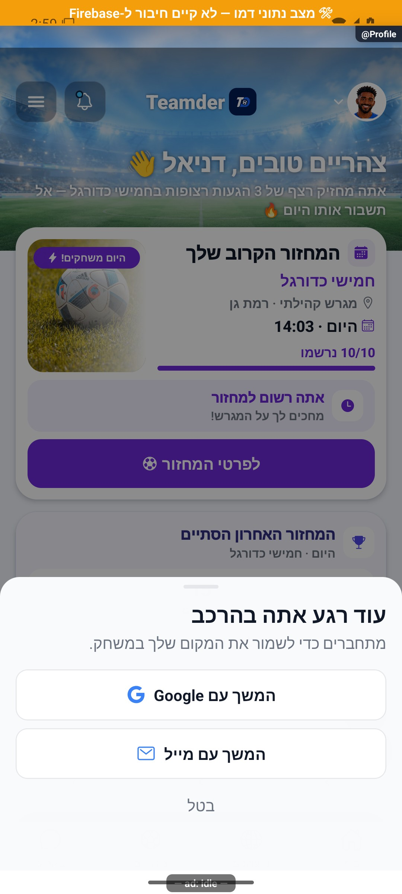

# התחברות וחלון הרשמה בהקשר הפעולה — הסבר קצר

אפשר לעיין באפליקציה לפני פתיחת חשבון, ולהתחבר כשמבקשים להצטרף או לשמור פעולה. בוחרים דרך התחברות, ואפשר לבטל ולהמשיך לגלוש.

[לפירוט הטכני](authentication.md)

הצילום מדגים את המראה בסביבת בדיקה, ולא מוכיח פעולה מול הנתונים האמיתיים.
