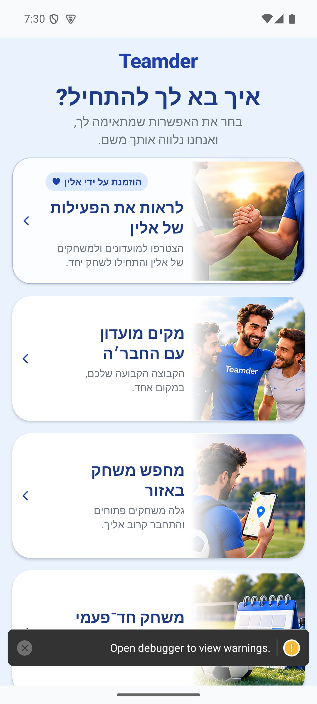

# פתיחת האפליקציה ובחירת כוונה — הסבר קצר

## עדכון מקומי — 10.10.2026

אם החשבון שוחזר אבל הפרופיל לא נטען, האפליקציה שומרת על החשבון ומציגה ניסיון חוזר. היא אינה מחליפה אותו בחשבון אורח בגלל תקלה זמנית.

התנהגות הכשל נבדקה בקוד מבודד; לא הורצה במכשיר מול הנתונים האמיתיים.

9.10.2026: קישורי פרסום קצרים שנוצרים בפולס משתמשים בכתובת `/play/…`. הם פותחים דף הורדה ושומרים את מקור הפרסום גם במעבר לחנות ולאפליקציה. נמצאה הגדרת אתר חסרה שגרמה לשגיאת 404; היא הוחזרה בקוד ונוספה בדיקה למניעת הסרתה בפריסה הבאה. מצב הפריסה והאימות מופיעים ב־[דוח התקלה](../reviews/campaign-link-routing-2026-10-09.md).

מצב עדכני: תיקונים מקומיים, 10.10.2026; סעיף העדכון בראש המסמך מתאר את השינוי האחרון. תיאורי המיפוי והבדיקות מ־7–8.10 בהמשך הם היסטוריים; הסיכום האחרון במסמך קובע את חוזה המימוש הנוכחי.

8.10.2026: לאחר התחברות לחשבון קיים, האפליקציה מעדכנת את זהות המשתמש וממשיכה לפי הפרופיל שלו. התיקון מקומי; מסלול אפל טרם נבדק באייפון.

בפתיחה הראשונה בוחרים מה רוצים לעשות: למצוא מחזור, לפתוח מועדון או לארגן מחזור חד־פעמי. אם הגעתם מהזמנה, אפשר לבחור גם בה או לבחור דרך אחרת.

[לפירוט הטכני](boot-and-intent.md)

צילום עדכני של מסך הבחירה עם הזמנת דמו מופיע בהמשך.

## בדיקת תהליך הכניסה — 8.10.2026

נמצא מצב שבו הזמנה שמגיעה אחרי טעינת מסך הבחירה נשמרת אך הכרטיס אינו מתעדכן. נבדקו גם קישורי החנות, דפי המועדון, התחברות ואישור הפרופיל. הדוח המקורי נשמר כראיה; הממצאים תוקנו בקוד המקומי בהמשך אותה משימה. עברו 415 בדיקות קיימות וחמש בדיקות אבחון שיחזרו תקלות. התקנה נקייה מהחנות ואייפון לא נבדקו. [הממצאים, הראיות והצעות התיקון](../reviews/onboarding-audit-2026-10-08.md).

## תיקוני ההזמנה וההיכרות — 8.10.2026

ההזמנה מתעדכנת גם אם פרטיה מגיעים מעט אחרי הפתיחה. בחירה שכבר ביצעתם נשמרת, ושם המזמין אינו נשאר מהזמנה קודמת.

## אימות ותיקונים מקומיים — 9.10.2026

ההזמנה מתעדכנת גם כשהיא מגיעה באיחור. הבחירה שלכם נשמרת: אם בחרתם לפתוח מועדון או לחפש מחזור, הזמנה ישנה לא תחליף את הבחירה אחרי ההתחברות. פתיחה שנכשלה זמנית מקבלת כמה ניסיונות נוספים; החלפת חשבון מבטלת את הניסיון הישן.

התיקונים נבדקו מקומית. עדיין לא בוצעה הוכחת התקנה מהחנות או אימות באייפון פיזי; התמונות הקודמות הן תצוגות בדיקה ולא מסע התקנה. [דוח שמונת הסוכנים, התיקונים וגבולות האימות](../reviews/onboarding-expanded-fixes-2026-10-09.md).

### השלמת שחזור אחרי ספק — 10.10.2026

גם אחרי שספק ההתחברות אישר כניסה, קריאת פרופיל שנכשלה פותחת ניסיון חוזר ושומרת את החשבון. הפעולה שרציתם לעשות ממתינה עד לטעינת הפרופיל, ולא ממשיכה כאילו נשארתם אורחים.

## תיעוד פעולות ההצטרפות — 10.10.2026

הפעולות הנתמכות בתהליך מגיעות להיסטוריה ולהתראות בפולס, כולל זמן, ביקור וספירת לחיצות. לא מועבר תוכן שדות מוקלדים. נדרשים פריסת השרת ולקוח חדש; [הכיסוי, החישובים ומגבלות האימות](../shared/onboarding-activity.md).

## אימות חי — 10.10.2026

שתי הפונקציות `recordOnboardingActivity` ו־`onOnboardingActivity` נפרסו באישור מפורש, כולל ניסיונות חוזרים. באמולטור בדיקות נפרד מול הייצור נשמר רצף פתיחה ובחירת הקמת מועדון. שירות ההתראות אישר שליחה לחמישה מכשירים בכל אחת משתי אבני הדרך; זו קבלת בקשת השליחה, לא אישור צפייה בטלפון. פעולות הצפייה וההמשך נשמרו כהיסטוריה בלבד.

נמצא ותוקן מקומית מרוץ: אירוע מקור הכניסה נשלח לפני שחזור זהות המשתמש, ולכן אורח סומן כחבר ולא קיבל התראת כניסה. מעתה מקור הכניסה מתפרסם לניווט מיד, אך האירוע ממתין לזהות משוחזרת דרך `entryGuestAfterHydration`. אחרי התיקון נצפה `is_guest: true` ושליחה מוצלחת. נוספו שתי בדיקות נסיגה; בדיקת הטיפוסים נקייה וכל 3,258 הבדיקות ב־231 חבילות עברו.

האימות בוצע עם קוד מקומי עדכני בתוך מעטפת פיתוח, ולא עם גרסה שהועלתה לחנות. בדיקות הזמנה למועדון ולמחזור, מעבר מחנות להתקנה והתחברות באפל טרם הושלמו בסבב החי הזה.

## המשך הבדיקה החיה — 10.10.2026

נבדקו בפועל הזמנת מועדון והזמנת מחזור דרך Chrome באמולטור נפרד: דף נחיתה, לחיצה על הכפתור הראשי, פתיחת האפליקציה במצב נקי והצגת אפשרות עם שם המזמין. במועדון נפתח היעד הנכון ונדרשה התחברות לבקשת הצטרפות. במחזור סגור נשמר היעד אך אורח נחסם לסגל בלבד. נבדקה גם הזמנה כללית בעת שהאפליקציה פעילה. מקור הכניסה נשמר עם היעד ועם זיהוי אורח; שירות השליחה אישר מסירה לחמישה מכשירים, בלי אישור הצגה בטלפון.

הבדיקה השתמשה בקוד מקומי במעטפת פיתוח ואינה הוכחת התקנה מהחנות. התחברות באפל ובגוגל, מעבר מהחנות לאחר התקנה והשלמת הצטרפות אחרי אישור מנהל לא אומתו. הממצאים, הצילומים וגבולות הכיסוי מפורטים ב־[דוח הבדיקה החיה](../../changes/2026-10-10-onboarding-live-qa.md).
