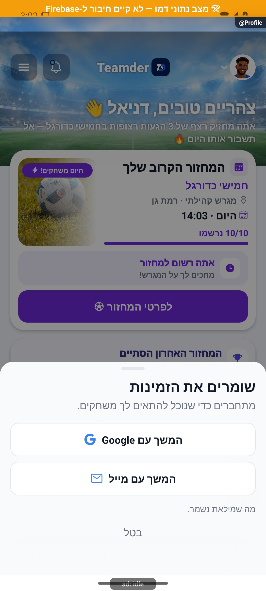

# פעולה ממתינה וטיוטה שחוזרת לאחר הרשמה — הסבר קצר

אם נדרש חשבון באמצע פעולה, האפליקציה שומרת את מה שביקשתם ואת הפרטים שכבר מילאתם. לאחר ההתחברות היא ממשיכה במקום המתאים ובודקת מחדש אם אפשר לבצע את הפעולה.

[לפירוט הטכני](pending-actions.md)

הצילום מדגים את המראה בסביבת בדיקה, ולא מוכיח פעולה מול הנתונים האמיתיים.
