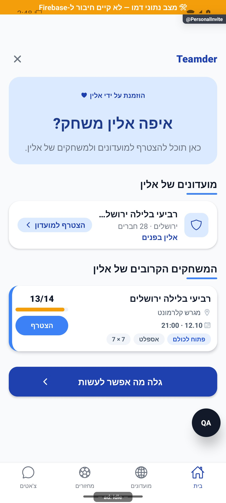

# הזמנה אישית — איפה המזמין משחק — הסבר קצר

## עדכון מקומי — 10.10.2026

כשהפעילות של המזמין לא נטענת מוצגת תקלה עם ניסיון חוזר. אם רק פרטי חלק מהמועדונים נכשלו, המחזורים שכן נטענו נשארים מוצגים ואין הודעה מטעה שאין פעילות.

התנהגות הכשל נבדקה בקוד מבודד; לא הורצה במכשיר מול הנתונים האמיתיים.

מצב עדכני: תיקונים מקומיים, 10.10.2026; סעיף העדכון בראש המסמך מתאר את השינוי האחרון. תיאורי המיפוי והבדיקות מ־7–8.10 בהמשך הם היסטוריים; הסיכום האחרון במסמך קובע את חוזה המימוש הנוכחי.

הזמנה אישית מראה מי הזמין אתכם ובאילו מחזורים ציבוריים הוא משחק. אפשר לפתוח מחזור או מועדון מהמסך, או להמשיך לגלות מחזורים אחרים.

[לפירוט הטכני](personal-invite.md)

הצילום מדגים את המראה בסביבת בדיקה, ולא מוכיח פעולה מול הנתונים האמיתיים.

## תיקוני ההזמנה וההיכרות — 8.10.2026

פרטי המזמין נשמרים במעבר דרך דף ההורדה. באייפון ייתכן שתידרש הרשאת הדבקה; אם השחזור לא הצליח, אפשר לפתוח שוב את הקישור המקורי לאחר ההתקנה.

## אימות ותיקונים מקומיים — 9.10.2026

הזמנה אישית נפתחת רק כשידוע מי המזמין. היא אינה חוזרת שוב לאחר שכבר הוצגה, והחלפת הזמנה או חשבון מבטלת ניסיון ישן. באנדרואיד פרטי ההזמנה מועברים דרך מקור ההתקנה; באייפון השחזור נעזר בלוח ועשוי לדרוש הרשאה. אם אינו מצליח, פותחים שוב את הקישור המקורי אחרי ההתקנה.

התיקונים נבדקו מקומית. עדיין לא בוצעה הוכחת התקנה מהחנות או אימות באייפון פיזי; התמונות הקודמות הן תצוגות בדיקה ולא מסע התקנה. [דוח שמונת הסוכנים, התיקונים וגבולות האימות](../reviews/onboarding-expanded-fixes-2026-10-09.md).
