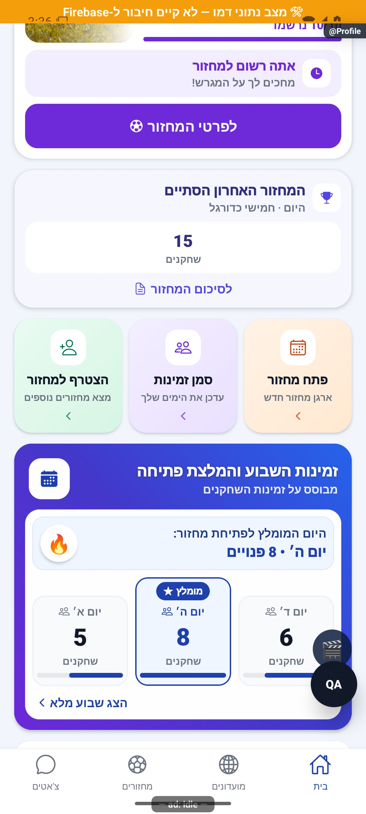
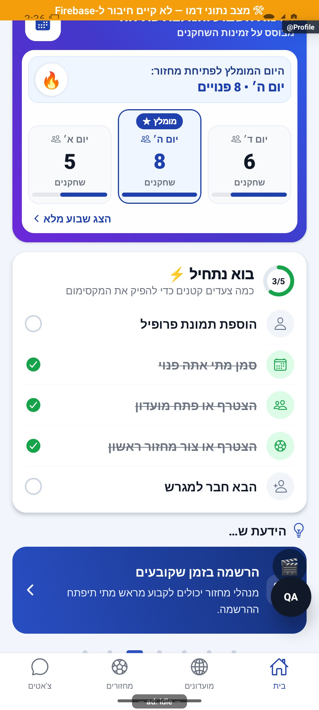
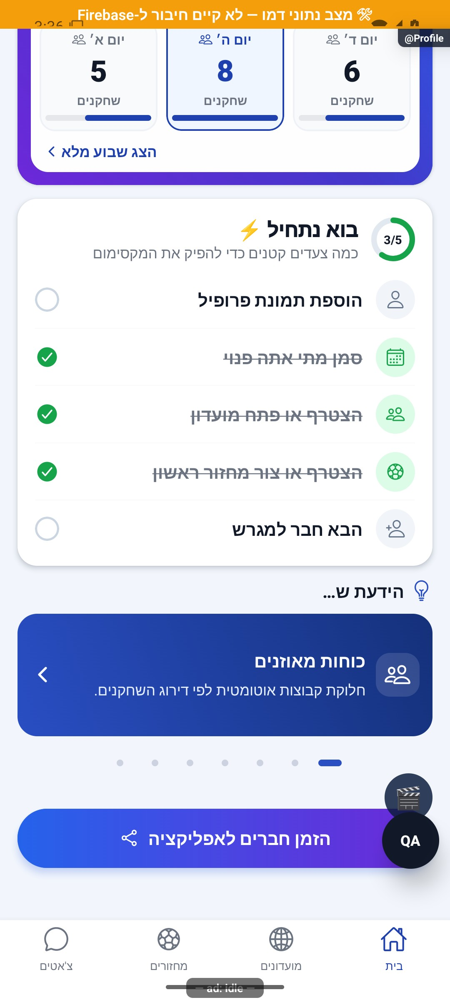

# בית של משתמש מלא

עודכן: 07.10.2026; מקור `8e8fde5`, גרסה `1.1.35` בבנייה. המסך הוא `src/screens/tabs/ProfileScreen.tsx`, מסלול `Profile` בלשונית הבית. השם הטכני אינו אומר שזה כרטיס הפרופיל האישי. תפקידים: שחקן ומארגן; אורח מקבל בית אחר.

## אזורים וניווט

החלק העליון כולל רקע מגרש, מיתוג, ברכת שעה, משפט מאמן המבוסס על נתונים, תמונת משתמש, תפריט ופעמון. האווטאר פותח `ProfileEdit`; הפעמון פותח `Requests` ולא תיבת כל ההתראות. במרכז מוצג מחזור קרוב, לעתים מחזור שהסתיים לצדו, ולאחריהם פעולות יצירת מחזור, זמינות וגילוי מחזורים. בהמשך לוח פנויים, רשימת צעדי התחלה, קרוסלת הידעת, הזמנת חברים ואזורי תמיכה בהתאם לתנאים.

בצילום נראה דניאל, מחזור רשום 10/10 וכרטיס שהסתיים עם 15 שחקנים. אין זו בדיקה של אותו חשבון בייצור. בגלילה נוספת צולמו אזור הזמינות, רשימת ההתחלה, הקרוסלה והזמנת חברים. הנתונים והצבע הסגול של המחזור הם של הדמו; סמלי המעבדה והבדיקה אינם כפתורי גרסת החנות.

## מצבים ושינויים

| תנאי | תוצאה | כתיבה | ראיה |
|---|---|---|---|
| נתונים טרם נטענו | רכיבי טעינה; לא קביעה שאין מחזור | קריאות בלבד | קוד |
| מחזור פעיל/קרוב מתאים | כרטיס לפי סדר העדיפויות | אין עד לפעולה | דמו וקוד |
| מחזור שהתקיים בתוך חלון הסיכום | כרטיס סיכום בהתאם להשתתפות | אין | קוד |
| בקשות למנהל קיימות | ספירת בקשות וקיצור אישורים | אין בפתיחה | קוד; `Requests` צולם בדמו |
| סיכום עונה חדש בטווח 48 שעות | פס כניסה ל־`SeasonSummary` | עצם פתיחה אינה סימון נקרא | קוד |
| יצירת מחזור | ניווט ל־`GameTab`/`GamesList` עם בקשת יצירה | יצירה רק באשף | קוד |
| כל צעדי ההפעלה הושלמו ונתונים מוכנים | הסתרת רשימת ההתחלה | אין | קוד |
| מצב פיתוח | כפתור מעבדת אנימציה וחלון כלי בדיקה | כלי מקומי | קוד |

ברכת המאמן נבחרת ממקורות נתונים ולא מתחלפת סתם בכל רינדור; מנגנון הבחירה מחזיק את הבחירה לאורך הרכבת המסך. נתוני מחזורים, מועדונים, הגדרות בית והתראות נטענים מראש או מתחדשים במיקוד. שינוי צריך לשמור על סנכרון הנתונים ולא ליצור מספר נוסף עם הגדרה שונה.

## קוד, בדיקות וסיכונים

מקורות: `src/components/home/HomeHero.tsx`, `HomeDashboardParts.tsx`, `HomeRoundCards.tsx`, `HomeAvailabilityPanel.tsx`, `OnboardingChecklist.tsx`, `DidYouKnowCard.tsx`, `src/services/homeConfigService.ts`, `src/store/userStore.ts`, `src/store/groupStore.ts`. קריאות משתמש/מחזור/מועדון עוברות דרך השירותים וממירי `src/firebase/firestore.ts`; יש לבדוק גם מסלול אמיתי כי דמו אינו בודק ממיר.

בדיקות: `tests/logic/homeRouting.test.ts`, `tests/logic/homeHero.test.ts`, `tests/logic/homeRoundState.test.ts`, `tests/logic/homeAvailabilityView.test.ts`. המיפוי לא הריץ בדיקות ולא אישר כתיבה מהבית.

רשימת ההתחלה בודקת תמונה לפי `photoUrl` בלבד; בחירת אווטאר אינה משלימה כיום את צעד התמונה. יתר הצעדים: זמינות, מועדון, רישום/השתתפות במחזור, ומשתמש שהצטרף דרך ייחוס ההזמנה — לחיצה על שיתוף בלבד אינה השלמה. זהו פער הגדרה אפשרי, לא תיקון שבוצע.

לפני שינוי עיין גם ב־[כרטיסי מחזור](round-cards.md), [פנויים](availability-preview.md), [קרוסלה](tips-carousel.md), [תפריט](home-menu.md), [בית אורח](guest-home.md). שחזור עתידי: ללא מחזור, מחזור ממתין, מלא, היום, חי, הסתיים, עונה חדשה, מארגן עם בקשות, ונתונים איטיים. לא לבצע סיום/מחיקה בחשבון הייצור לצורך יצירת המצב.
