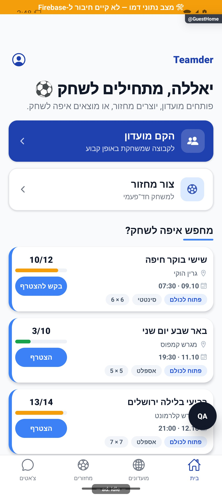

# בית אורח וגילוי ראשוני

עודכן: 07.10.2026; מקור `8e8fde5`, `1.1.35` בבנייה. `src/screens/home/GuestHomeScreen.tsx`, מסלול `GuestHome`. תפקיד מיועד: אורח אנונימי; ניתן להרכיב את המסך בדמו גם כשזהות הדמו מלאה.

## אזורים ונתיבי פעולה

בראש מיתוג, כניסה לחשבון וכותרת להתחלת משחק. שני כרטיסים מציעים הקמת מועדון קבוע ומחזור חד־פעמי. מתחת רשימת מחזורים ציבוריים קרובים, פעולה לצפייה בכל המחזורים וקיצורי זמינות לפי התנאים. המשתמש יכול לראות מידע לפני הרשמה; בקשת כתיבה נעצרת בחלון הרשמה בהקשר הפעולה.

בצילום נצפו כרטיס הקמת מועדון כחול, כרטיס מחזור לבן ושלושה מחזורים עם תפוסות 10/12, 3/10, 13/14. זהו אימות תצוגה בלבד; פתיחת `GuestHome` אינה משנה את זהות ההזדהות ולא מוכיחה גישה אנונימית למסד.

## מצבים ומעברים

| תנאי/פעולה | תגובה | כתיבה | ראיה |
|---|---|---|---|
| קריאת מחזורים בטעינה | תצוגת טעינה | אין | קוד |
| קריאה נכשלה | כשל וניסיון חוזר | אין | קוד |
| אין מחזורים ציבוריים מתאימים | הזמנה ליצור מחזור, ללא רשימה מומצאת | אין | קוד |
| יש מחזורים | רשימה מוגבלת לפי קבוע הגילוי | אין | דמו וקוד |
| הקמת מועדון/מחזור חד־פעמי | פתיחת האשף; שימור טיוטה לפני הרשמה | יצירה רק לאחר חשבון ואימות | קוד |
| הצטרפות למחזור | פרטי יעד ושער פעולה | פעולה ממתינה ואחר כך עסקת הצטרפות | קוד |
| התחברות/ביטול | חלון חשבון; ביטול משאיר יכולת גלישה | זהות ספק, לא עסקה אוטומטית | קוד |
| חזרה במיקוד עם טיוטה | שחזור יצירת מועדון קודם למחזור לפי המתאם | אחסון מקומי עד אישור | קוד |

## שירותים ובדיקות

המסך קורא מחזורים פתוחים דרך `gameService.getOpenGames` ומגביל את הרשימה בצד התצוגה. `src/hooks/useAuthenticatedAction.tsx`, `src/services/draftStore.ts`, `src/services/actionResumers.ts` ו־`src/store/entryStore.ts` אחראים לחזרת הטיוטה; תוקף שבעה ימים אינו הרשאה לביצוע. ממיר המחזור ב־`src/firebase/firestore.ts` עדיין נדרש בקריאה אמיתית. אין להחליף שגיאת קריאה ברשימה ריקה.

בדיקות: `tests/guestHomeWiring.test.ts`, `tests/guestAuthEntryPoints.test.ts`, `tests/logic/draftStore.test.ts`. [התחברות](../entry/authentication.md) ו־[פעולה ממתינה](../entry/pending-actions.md) מכסות את ההמשך.

## מגבלות ושחזור

מסך הבית הישן של אורח באודיט 004 אינו העיצוב הנוכחי. בדיקה עתידית צריכה לזהות אורח אמיתי, פתיחה אורגנית אחרי בחירת כוונה, חזרה מטיוטה, כשל מחזורים, ביטול הרשמה וחזרה מרשימת כל המחזורים. לא נבדקו כאן חשבון אורגני, הרשאות קריאה אנונימיות מול השרת או ביצוע יצירה. אין לייצר חשבון נוסף לצורך הבדיקה בלי חשבון הבדיקה המאושר.
