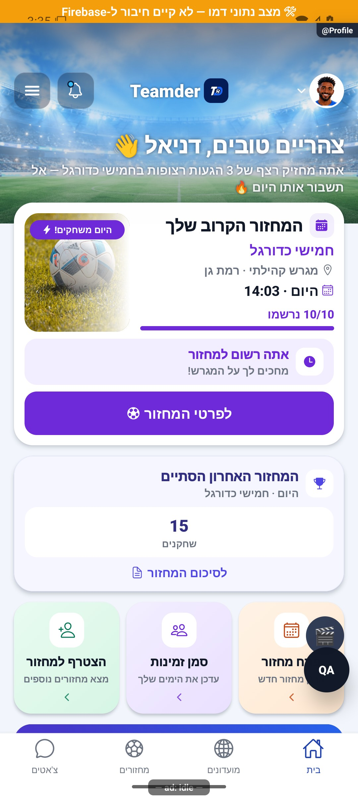

# כרטיסי המחזור הקרוב והמחזור שהסתיים — הסבר קצר

כרטיס המחזור מראה אם אתם רשומים, ממתינים, צריכים אישור או יכולים להצטרף. אחרי מחזור ששיחקתם בו אפשר לפתוח ממנו את הנתונים.

[לפירוט הטכני](round-cards.md)

הצילום מדגים את המראה בסביבת בדיקה, ולא מוכיח פעולה מול הנתונים האמיתיים.

## השלמת הנפשות — 8.10.2026

כרטיס ההמתנה נפתח בעדינות לשורת המקום בתור. הכפתור והמידע נשארים זמינים בלי לחכות לסיום התנועה.

[פרטי האימות והמגבלות](../../changes/2026-10-08-motion-completion.md). מקור: `9ec0dfd` עם שינויים מקומיים; טרם פורסמה גרסה.
