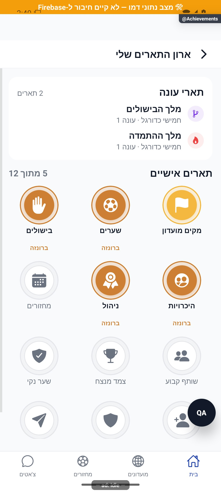
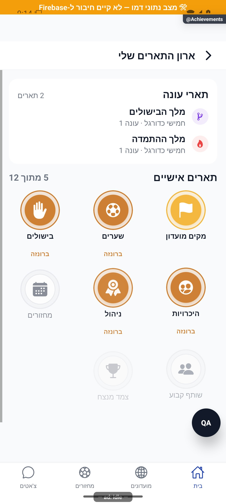

# ארון התארים וההישגים האישיים

[לקריאה קצרה ופשוטה](achievements.simple.md)

עודכן: 07.10.2026; מקור `8e8fde5`, `1.1.35` בבנייה. `src/screens/profile/AchievementsScreen.tsx`, מסלול `Achievements`. תפקיד: משתמש מלא רואה את אוסף עצמו.

## אזורים

מדף תארי עונה בראש; מתחת רשת הישגים אישיים עם ספירת פתוחים מתוך כלל ההישגים, אייקון, שם ודרגה. לחיצה פותחת הסבר, התקדמות, דרגה הבאה או מקסימום ותאריך פתיחה לפי הנתון. הישג הוא אבן דרך מצטברת; תואר עונה הוא זכייה תחרותית סגורה במועדון מסוים. אין לאחד את מקורותיהם.

הצילום מכסה את חלקו העליון של המסך, לא את כל המודאלים והדרגות. אין מכאן הוכחה לכתיבת פתיחה חדשה.

| מצב | התנהגות | כתיבה | ראיה |
|---|---|---|---|
| טעינה | המתנה לנתון/גזירה; לא החלפה מיידית באפס | קריאות | קוד |
| גזירה מצליחה | מונים ממקורות פעילות | ייתכן שימור פתיחות חדשות | קוד |
| גזירה נכשלת | נתון שמור כחלופה | לפי מנגנון השירות | קוד |
| הישג נעול/פתוח/דרגה מתקדמת | עיצוב מתאים ומודאל מידע | אין מהלחיצה בלבד | קוד ודמו לרשת |
| הישג חדש | שימור פתיחה וחגיגה | `persistDerivedUnlocks` | קוד; לא הופעל חי |
| אין תארי עונה | המדף מחזיר ללא תצוגה | אין | קוד |

## מקור אמת, שירותים וממיר

`src/services/achievementsService.ts` גוזר מונים ממועדונים, חברים, מחזורים, שערים, בישולים ושערים נקיים. הוא משתמש במטמון ובחלופה שמורה; הישג שכבר נפתח אינו ננעל מחדש רק מפני שהקשר נעלם. `src/data/achievements.ts`, `src/components/AchievementBadge.tsx`, `AchievementCelebration.tsx`, `src/components/profile/SeasonTitlesShelf.tsx` קובעים את הנראות והחגיגה. נתוני משתמש שמורים תלויים בממיר `src/firebase/firestore.ts`; תארי העונה נקראים בתת־אוסף נפרד.

פתיחת מסך ההישגים יכולה לכתוב פתיחות נגזרות ולהציג חגיגה. לכן אין לסווג אותה תמיד כקריאה טהורה בייצור; סוכן המיפוי ראה דמו ולא הפעיל פתיחה מול החשבון האמיתי. בדיקות לוגיקת מחזורים, שערים נקיים ועונות אינן הוכחה לכל מודאל ודרגה.

## שחזור וסיכונים

לבדוק מצב נעול, דרגה ראשונה, מעבר דרגה, מקסימום, פתיחה חדשה, מקור נגזר שנכשל, תואר עונה לצד תג ואפס תארים. להשתמש בחשבון הבדיקה; לא להעלות מונים/להעניק הישגים בייצור כדי להשיג צילום. שגיאת נתון עשויה להיות במקור הפעילות או בממיר ולא ברשת האייקונים. [תארי עונה](season-titles.md) מפרט מקור תחרותי נפרד.

## פירוט מימוש ונקודות שינוי — העמקה 07.10.2026

המסך מריץ בנפרד `getUserById` ו־`deriveCounters`; כשל רענון משתמש משאיר עותק חנות, וכשל נגזרת מגדיר `deriveFailed` ומאפשר fallback למונים השמורים. הוא אינו מציג תחילה מונים ישנים ואחר כך מחליף אותם כל עוד הנגזרת לא הוכרעה, כדי למנוע הבהוב תארים לא נכון.

אחרי נגזרת, `persistDerivedUnlocks` כותב דרגות חדשות ומחזיר תור לחגיגה; לכן **פתיחת המסך יכולה לכתוב** ואינה בדיקת ייצור לקריאה בלבד. `listFromCounters` שומר רשימת הישגים שכבר נפתחה; המיון הוא פתוחים תחילה ואז זהב/כסף/ארד, ונעולים לפי הגדרה. שינוי סף שייך להגדרות ולשירות, שינוי חגיגה לתור ולרכיב, ותארי עונה למדף הנפרד. יש לבדוק כשל נגזרת בלי שלילת הישג, עדכון קבוצות והחלפת משתמש; צילום הגריד אינו מאמת כתיבת דרגה.

הבדיקות, מצבי המסך והראיות שכבר פורטו במסמך נשמרו. ההעמקה מבוססת על קריאת מקור ולא על הרצת פעולות נוספות; שינוי עתידי יצריך עדכון של שני המסמכים ובחינת המצבים הממוקדים.

## עדכון 8.10.2026 — תנועה ותיקוני דיווחים

`CelebrationCard` קורא `useReducedMotion`; במצב מופחת קנה המידה, הטקסט והאטימות מקבלים ערכים סופיים וקונפטי אינו מורכב. הלולאות של הקרניים, הזוהר, הגלים והניצוצות מוגבלות למחזור אחד; פירוק מבטל את כל הערכים המונפשים והטיימרים. תור ההישגים ומנגנון רישום הישג חדש נשארו ללא שינוי.

**ראיה ומגבלות:** רשימת ההישגים הורצה. לא נוצר הישג חדש בבדיקה ולכן חגיגת ההישג ומצב התנועה המופחתת שלה לא אומתו חזותית.

בדיקת הטיפוסים ו־183 חבילות הבדיקות עברו, 2,752 בדיקות. מצב המקור: `9ec0dfd` עם שינויים מקומיים; אין גרסה חדשה שפורסמה. [יומן השינוי וההקלטות](../../changes/2026-10-08-motion-and-pulse.md).
