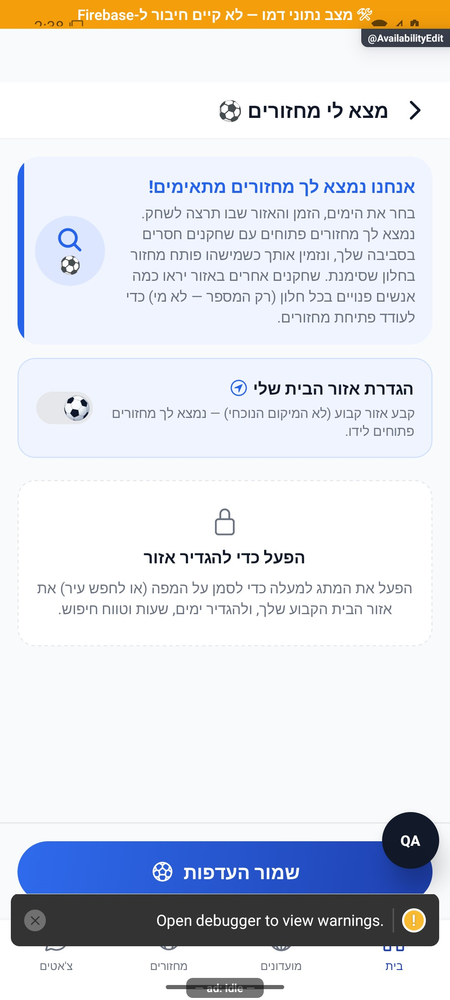

# עריכת זמינות, מקום ורדיוס — הסבר קצר

מסמנים מתי פנויים לשחק, בוחרים מקום וכמה רחוק מוכנים להגיע. אפשר לבחור כל חלון בנפרד ולהחליט אם לקבל הודעות על מחזורים מתאימים.

[לפירוט הטכני](availability-edit.md)

הצילום מדגים את המראה בסביבת בדיקה, ולא מוכיח פעולה מול הנתונים האמיתיים.

## עדכון 8.10.2026 — תנועה ותיקוני דיווחים

בחירת חלון פנוי מקבלת פעימה קצרה בסמל. הסימון עדיין נשמר רק בלחיצה על שמירת העדפות.

## תיקוני עיצוב ונגישות — 10.10.2026

מקור: `a348b9f235f1e1433497600555303231512a0834` עם שינויים מקומיים. אין בסעיף זה הוכחת גרסת חנות.

אפשרויות הזמינות ומרחק החיפוש מקבלות שם ברור בקורא מסך. אפשר לשנות מרחק גם ללא גרירה.
