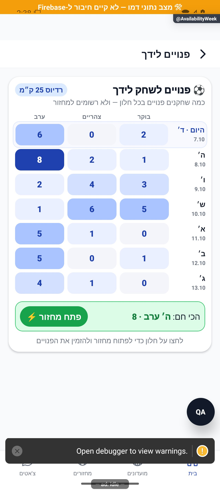

# שבוע הפנויים

[לקריאה קצרה ופשוטה](availability-week.simple.md)

עודכן: 07.10.2026; מקור `8e8fde5`, `1.1.35` בבנייה. `src/screens/home/AvailabilityWeekScreen.tsx`, מסלול `AvailabilityWeek`; כניסה מהבית. תפקידים: שחקן ומארגן.

## תצוגה וניווט

לוח שבעה ימים עם בוקר/צהריים/ערב, מספר פנויים לפי תא, חלון מומלץ, רדיוס ומקום רלוונטיים, קיצור עריכת זמינות ופתיחת יצירת מחזור מתוך חלון. זהו ביקוש של שחקנים זמינים ולא רשימת אנשים שכבר נרשמו למחזור.

המספרים הם דמו. צילום אינו מוכיח שהשחקנים באזור נכונים או שהכותב קיבל רדיוס חדש.

| תנאי/פעולה | תגובה | כתיבה | ראיה |
|---|---|---|---|
| טעינת נתונים | תצוגת טעינה ללא הצגת אפס מוקדם | אין | קוד |
| לוח זמין | 7×3 עם כמות וחלון מודגש | אין | דמו וקוד |
| עריכת זמינות | `AvailabilityEdit` | רק בעת שמירת העורך | קוד |
| יצירת מחזור מתא | מילוי תאריך, חלון, עיר והזמנת זמינים | יצירה באשף | קוד |
| מקור ניווט לא נמסר | המעקב מקבל לעתים `direct` | אירוע בלבד | קוד |

## נתונים ובדיקות

מקורות: `src/services/availabilityFeedService.ts`, `src/utils/homeAvailabilityView.ts`, `src/screens/home/AvailabilityWeekScreen.tsx`, `src/services/availabilitySave.ts`. יש להתאים את פירוש הלוח לממיר הזמינות שבממיר `User` ב־`src/firebase/firestore.ts`. שינוי לתא צריך להיבדק גם בבית ובמסכי הזמנת זמינים, לא רק כאן.

בדיקות לוח והצגת בית: `tests/logic/availabilityGrid.test.ts`, `tests/logic/homeAvailabilityView.test.ts`; אין במיפוי זה בדיקת עסקת יצירת מחזור. חיבור הבית אינו תמיד מוסר `source` למרות הערות המעקב, ולכן אין להסיק מכל אירוע `direct` שהמשתמש הגיע מקישור ישיר.

## שחזור

לבחון חלון ללא פנויים, חלון מומלץ באמצע השבוע, ימים עם מספר חלונות, שינוי מקום/רדיוס, חזרה מעורך ושינוי שמחייב רענון, ויצירה מתא שאינו הראשון. אסור ליצור מחזור ייצור לצורך צילום. אם משתנה פורמט תאריך, יש לבדוק גבול שבוע ושעת המקומית מול תאריך האשף.

## פירוט מימוש ונקודות שינוי — העמקה 07.10.2026

`AvailabilityWeekScreen` הוא מעטפת ל־`AvailabilityCalendarCard`, ולא שאילתת זמינות נוספת עצמאית. `source` נקרא מפרמטר מסלול או מקבל `direct`, ואירוע הפתיחה נרשם פעם בהרכבה. אין להסיק שכל כניסה מבית מזוהה במדידה כמקור בית אם הקורא לא מסר פרמטר.

`onCreateGame` מתעד `AvailabilityDayPicked` עם `source: 'week_screen'`, ומנווט ל־`GameTab`/`GameCreate` עם `quick: true`, `prefillDateMs`, `prefillWindow`, `prefillCity` ו־`inviteAvailable: true`. `onSetAvailability` נפתח בערימה ל־`AvailabilityEdit`. שינוי תא או ברירת שעה צריך לבדוק את המיפוי באשף המחזור, משום שלחיצה זו ממלאת כוונה וטופס ואינה יוצרת משחק. כשל ספירה, הרשאת מיקום והסתרת אפס נשלטים ברכיב הלוח ובשירות ולא במעטפת.

הבדיקות, מצבי המסך והראיות שכבר פורטו במסמך נשמרו. ההעמקה מבוססת על קריאת מקור ולא על הרצת פעולות נוספות; שינוי עתידי יצריך עדכון של שני המסמכים ובחינת המצבים הממוקדים.
