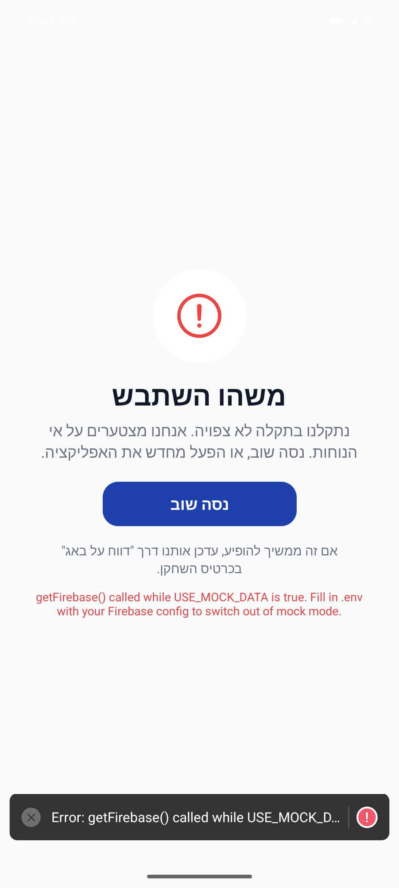
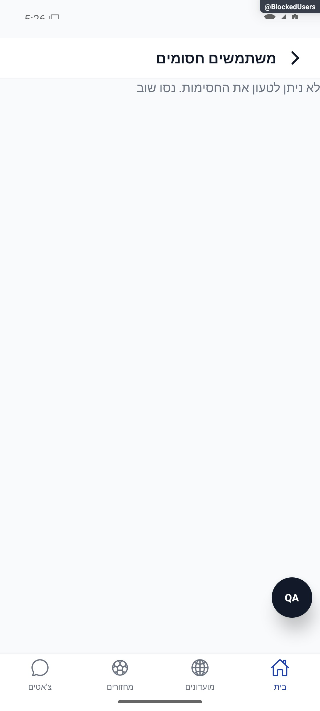

# משתמשים חסומים

## עדכון מקומי — 10.10.2026

נוסח `he.blockedIntro` תוקן לתיאור חסימה חד־צדדית: הודעות החסום מוסתרות אצל החוסם והתראות ממנו אינן נשלחות; ההודעות שלכם בשיחות משותפות נשארות גלויות לו. אין שינוי ב־`users/{uid}/blocked`, בהרשאות, במנוי או בשליחת הודעות. התיקון הוא לנוסח המבטיח את ההתנהגות הקיימת, ולא הוספת הסתרה הדדית. צילום קודם אינו ראיה לנוסח החדש.

**מצב האימות:** תיקון מקומי, 10.10.2026. ראיות השירותים ופונקציות המקור ב־`tests/logic/clientAuditRecovery.test.ts`; הריצה הממוקדת המתועדת עברה 417 בדיקות ב־8 חבילות; השלמת שחזור מאוחר תועדה בדוח התיקון. [דוח התיקון והגבולות](../../../artifacts/pre-release-2026-10-10/client-fixes.md). לא הורצו כאן פעולות מול מסד אמיתי ולא צולמו מצבי כשל רשת חדשים; התמונות ההיסטוריות אינן הוכחה לתיקון זה.

[לקריאה קצרה ופשוטה](blocked-users.simple.md)

עודכן: 07.10.2026; מקור `8e8fde5`, `1.1.35` בבנייה. `src/screens/profile/BlockedUsersScreen.tsx`, מסלול `BlockedUsers`, מתפריט הבית. תפקיד: חשבון מלא מנהל את החסימות שלו.

## מבנה ותהליך

כותרת, רשימת חסימות עם זהויות ופעולת הסרת חסימה לאחר אישור. `chatService.subscribeBlocked` מאזין ל־`users/{uid}/blocked`; טעינת שמות נפרדת מעצם רשימת המזהים. אין למפות רשימת חסימות מתוך שדה חברים או מצב בקשת חברות.

בבדיקה המסך קרא `getFirebase()` כאשר `USE_MOCK_DATA` מופעל, ונראה גבול שגיאה ולאחריו מסך שגיאה של פיתוח. הצילום מוכיח כשל מסלול בדמו בלבד. אין מכאן טענה שהמסך נכשל בחשבון אמיתי או שאין למשתמש חסומים.

| תנאי | תגובה | כתיבה | ראיה |
|---|---|---|---|
| המאזין טרם מסר נתון | טעינה | אין | קוד |
| חסימות זמינות | פתרון זהויות ותצוגה | אין | קוד בלבד |
| זהות לא נמצאה | תווית חלופית לפי הקוד | אין | קוד |
| אין חסימות | מצב ריק | אין | קוד בלבד |
| עיכוב שש שניות | כשל וניסיון חוזר; רשימה מאושרת נשמרת | אין | תיקון 8.10; צילום דמו מוגבל |
| הסרת חסימה | חלון אישור ואז מחיקה | `deleteDoc` של חסימה | קוד; לא בוצע |
| מצב דמו | קריאת שירות אמיתי גורמת לכשל | אין שינוי ייצור | נצפה בפועל בדמו |

## מקורות וסיכונים

`src/services/chatService.ts:subscribeBlocked`, שירות קריאת משתמשים ונתיבי מסד ב־`src/firebase/firestore.ts`. קריאת זהות עשויה להשתמש בממיר משתמש; אוסף החסימות נפרד. שגיאת הסרה מוצגת כיום בטקסט גולמי; יש לבדוק נוסח, שמירת הרשימה וניסיון חוזר לפני שינוי.

אין טענה לכיסוי בדיקה ייעודית של המסך או להצלחת המאזין האמיתי. נדרש לשפר את יכולת הבדיקה לפני צילום כל המצבים בדמו, אך המיפוי אינו תיקון. לבדיקה אמיתית להשתמש בחשבון הבדיקה המאושר, חסימה קיימת, כשל רשת, זהות חסרה וביטול חלון הסרה. לא להסיר חסימה של הבעלים לצורך המיפוי.

## פירוט מימוש ונקודות שינוי — העמקה 07.10.2026

אפקט המסך מפעיל `chatService.subscribeBlocked(me.id)`, ממיר Set לרשימת מזהים ומבקש `hydratePlayers` עבור זהויות. אירוע פתיחה נרשם רק בפליטה הראשונה. cleanup מנתק מנוי ומנקה טיימר; ללא פליטה אחרי 6,000 אלפיות שנייה מוצג כשל וניסיון חוזר; אין המרה לרשימה ריקה מאושרת.

`onUnblock` מבקש אישור, מגדיר `busy[uid]`, מפעיל `unblockUser` ומציג הצלחה; הסרת השורה באה מהמנוי ולא ממחיקה אופטימית. בכשל נרשמים לוג/אירוע ומוצג כיום message גולמי בטוסט — נקודת שיפור בנוסח, לא שינוי שבוצע. שם לא פתור משתמש בשם כללי גם באישור, בלי שלוש נקודות. שינוי תמיכת דמו צריך להתחיל במנוי השירות שזורק דרך getFirebase, ולא להסתיר את ErrorBoundary. צילום הכשל מוכיח מגבלת סביבת דמו בלבד.

הבדיקות, מצבי המסך והראיות שכבר פורטו במסמך נשמרו. ההעמקה מבוססת על קריאת מקור ולא על הרצת פעולות נוספות; שינוי עתידי יצריך עדכון של שני המסמכים ובחינת המצבים הממוקדים.

## תיקוני סבב הבאגים — 8.10.2026

B11: chatService.subscribeBlocked שומרת את הרשימה האחרונה ומדווחת onError; גם כשל סינכרוני בהקמת המנוי מטופל. BlockedUsersScreen מציגה שגיאה אם לא התקבלה תשובה במשך שש שניות; תשובה מוצלחת מונעת את שגיאת הזמן. שינוי חשבון מנקה את הרשימה המקומית. צילום דמו בודק כשל הקמת מנוי בלבד, ולא הרשאות ייצור.

[ראיות, בדיקות ומגבלות](../../changes/2026-10-08-audit-fixes.md).

כשל הקמת מנוי בדמו; אין בדיקת חסימות ייצור. נצפתה הודעת ניסיון חוזר במקום רשימה ריקה.
