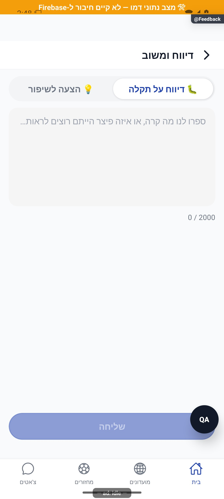

# דיווח תקלה והצעת שיפור — הסבר קצר

אפשר לשלוח לצוות תיאור קצר של תקלה או הצעה לשיפור. כותבים את ההודעה ושולחים; אם השליחה נכשלת, הטקסט נשאר כדי לנסות שוב.

[לפירוט הטכני](feedback.md)

הצילום מדגים את המראה בסביבת בדיקה, ולא מוכיח פעולה מול הנתונים האמיתיים.

לאחר התיקון: דיווח מהאפליקציה יופיע רק בדיווחים בפולס, בלי עותק אוטומטי ברשימת הבאגים והמשימות. התיקון הופעל בשרת באישור הבעלים. עותקים שנוצרו לפני התיקון עדיין קיימים.

## התאמה למסך — 8.10.2026

נוספה התאמה שמרחיקה תוכן משורות המערכת של הטלפון. [פירוט ומגבלות הבדיקה](../shared/menus-and-motion.md#התאמה-לשטח-הבטוח--8102026).
