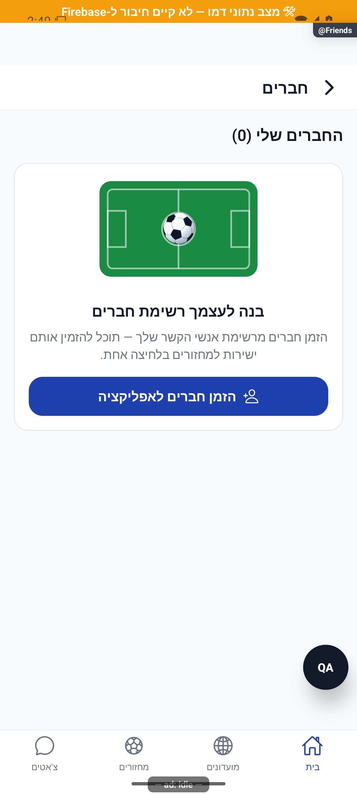

# חברים ובקשות חברות

[לקריאה קצרה ופשוטה](friends.simple.md)

עודכן: 07.10.2026; מקור `8e8fde5`, `1.1.35` בבנייה. `src/screens/profile/FriendsScreen.tsx`, מסלול `Friends`; תפריט הבית לפי שער, כרטיסי שחקנים. תפקיד: חשבון מלא.

## אזורים

חברים קיימים, בקשות נכנסות ויוצאות, פעולות אישור/דחייה/ביטול, קישור לכרטיס השחקן ושיתוף הזמנה. בהיעדר קשרים מוצגים איור מגרש וכפתור הזמנת חברים. שיתוף הזמנה לא מוסיף חבר אוטומטית.

המסך המצולם כולל אפס חברים וקיצור שיתוף. לא נבדקו בתמונה תורים לא ריקים או עסקאות אישור.

| מצב/פעולה | מעבר ומשוב | כתיבה | ראיה |
|---|---|---|---|
| מיקוד/משיכה לרענון | טעינת חברים ושני תורים במקביל | אין | קוד |
| אין חברים | מצב ריק ושיתוף | אין עד פעולה | דמו |
| בקשה נכנסת | אישור/דחייה בנעילה לפי משתמש | פונקציית חברות שרתית | קוד |
| בקשה יוצאת | ביטול הבקשה | שירות חברות | קוד |
| חבר קיים | הסרה לאחר אישור | עדכון חברות דו־צדדית | קוד; לא בוצעה הסרה |
| כרטיס שחקן | `PlayerCard` ללא כפיית מועדון | אין | קוד |

## שירותים, ממיר וסיכונים

`src/services/friendsService.ts` משתמש ב־`friendRequests/{from__to}` ובסטטוסים מאושר/נדחה, ובשדה `users.friends`. האישור משמר הדדיות בצד השרת; הערת שירות ישנה שלפיה המודל עדיין אינו מוכן אינה מתארת את הקוד הפעיל. `src/components/profile/FriendActionButton.tsx` מציג עצמי/ללא קשר/נכנסת/יוצאת/חברים/נדחתה ותלוי באותה מערכת.

כשל קריאת מצב ב־`FriendActionButton` עלול להיראות כמצב ללא קשר. אין להסיק מכפתור הוספה שהשרת אישר שאין קשר. הוספת שדה חברות צריכה לעדכן ממיר משתמש ב־`src/firebase/firestore.ts` וכל קריאת מצב. לא נבדקה כאן פעולה חיה ולא נטענו בכוונה קשרי הבעלים.

לבדיקה עתידית: בקשה נכנסת ויוצאת לאותו יעד לפי המצב, אישור משני מכשירים, ביטול שלאחר החלטה, כשל קריאה, הסרה עם ביטול חלון וחזרה מכרטיס. בדיקות רוחביות מכסות ניווט אורח; אין טענה לכיסוי בדיקה ייעודית לכל מצבי החברות. הפעולות שרתיות אינן מותרות לחשבון אורח רק משום שהכפתור הוצג בדמו.

## פירוט מימוש ונקודות שינוי — העמקה 07.10.2026

**תיאור היסטורי שהוחלף בתיקון 8.10.2026:** `load` קורא חברים, בקשות נכנסות ויוצאות במקביל באמצעות `Promise.all` ומעדכן את שלוש הרשימות רק לאחר הצלחה. `handleAccept` מוסיף את המבקש לחברים ומסיר מהנכנסות לפני הקריאה השרתיּת; אחר כך מרענן. בכשל מוצגת הודעה, אך אין שחזור מפורש של השינוי האופטימי באותו catch — פער לבדיקה, לא תוצאה שרתית שאושרה.

`handleCancelOutgoing` ו־`handleRemove` מסירים מקומית רק אחרי הצלחת השירות ואז מרעננים; הסרת חבר דורשת חלון אישור. `busyId` עוקב אחר משתמש אחד. שגיאת load שומרת את מה שכבר הוצג ונרשמת בלוג, ללא מסך כשל ייעודי. שינוי חברות צריך לתאם `FriendActionButton` ואת המסמך `friendRequests/{from__to}` מול המערכים שנכתבים בפונקציה השרתיּת. יש לבדוק קריאה מיד אחרי כתיבה ותגובה מאוחרת, לא רק מצב ריק בדמו.

הבדיקות, מצבי המסך והראיות שכבר פורטו במסמך נשמרו. ההעמקה מבוססת על קריאת מקור ולא על הרצת פעולות נוספות; שינוי עתידי יצריך עדכון של שני המסמכים ובחינת המצבים הממוקדים.

## תיקוני סבב הבאגים — 8.10.2026

B14: handleAccept לוכדת את הבקשה ומצב החברות לפני עדכון אופטימי. catch מסירה רק חבר שנוסף באותה פעולה ומחזירה בקשה חסרה בעדכון פונקציונלי, בלי לדרוס שינויים אחרים. בדיקה יזומה מחזירה אפס חברים ובקשה אחת אחרי דחיית השירות.

[ראיות, בדיקות ומגבלות](../../changes/2026-10-08-audit-fixes.md).
