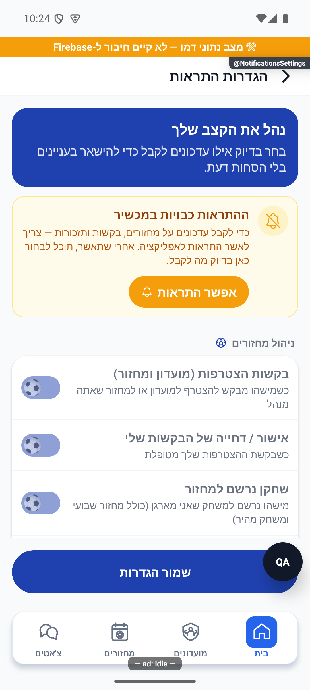
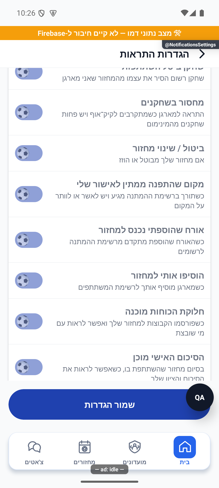

# הגדרות התראות והרשאת מכשיר

[לקריאה קצרה ופשוטה](notification-settings.simple.md)

עודכן: 10.10.2026; מקור `a348b9f235f1e1433497600555303231512a0834` עם שינויים מקומיים. מסך `src/screens/profile/NotificationsSettingsScreen.tsx`, מסלול `NotificationsSettings` מתפריט הבית; משתמש מחובר. אין כאן הוכחת גרסת חנות או משלוח חי.

## אזורים וכיסוי

כרטיס הסבר, שער הרשאת מערכת, חמש קטגוריות, שמירת העדפות והעדפת מעקב עצמאית. יש 29 מתגים: 28 העדפות מכסות את 30 סוגי השרת, ועוד מתג שיווק. `approvedRejected` משותף לאישור ולדחייה; `friendRequest` משותף לבקשת חברות ולאישורה. צ׳אט, הסכמת זמינות והשתקת שיחה נשארים במסלולים שלהם.

| קטגוריה | מספר מתגים | תוכן |
|---|---:|---|
| מחזורים | 12 | בקשות, אישור/דחייה, הרשמה, ביטול, מחסור, שינוי, הצעת מקום, קידום אורח, הוספה, חלוקה, סיכום וחג |
| מועדון וחברים | 9 | מחזור חדש, מקום פתוח, מילוי, הזמנה למחזור, מחיקת מועדון, הזמנה למועדון, סיכום עונה, הפיכת מחזור למועדון וחברות |
| תזכורות | 4 | מחזור קרוב, תזכורת הרשמה, דירוג וצמיחה |
| מילוי מקומות | 3 | הזדמנות להצטרף, התעניינות שהתקבלה וללא מועמדים |
| שיווק | 1 | הודעות במסלול השיווק של ערכת המעקב |

לכל שורה שם והסבר ממוקד. הרשימה נמצאת ב־`src/utils/notificationPreferenceCatalog.ts`; תוספות המלל ב־`src/i18n/notificationPreferences.ts`, והמלל הקודם במילון הראשי. `NotificationPrefs` וברירות המחדל ב־`src/types/index.ts`. 11 השדות החדשים אופציונליים כדי לשמור תאימות למשתמשים ישנים; ברירתם `true`, בהתאם להתנהגות השליחה הקודמת.

הצילומים הם אנדרואיד בדמו, במעטפת פיתוח `1.1.33/1` עם קוד מעודכן. הם מוכיחים רק את השורות והמצב הנראים. לא ניתנה הרשאה, לא נשמרה העדפה ולא נשלח פוש. השכבה הצפה של כלי הבדיקה מסתירה חלק קטן מהמסך.

## מצבים ומסלול נתונים

| מצב/פעולה | תגובה | כתיבה | ראיה |
|---|---|---|---|
| טעינת העדפות | `prefsReady=false`; שינוי ושמירה חסומים | אין | קוד |
| כשל טעינה | הודעה; אין שמירת ברירות מחדל בטעות | אין | קוד |
| הרשאה לא זמינה | מצב `null`; אין טענה שהמערכת חסמה | אין | קוד |
| הרשאה חסומה | כרטיס הסבר; שורה מושבתת גם באירוע נגיש | רק הרשאת מערכת בפעולה מפורשת | צילום וקוד |
| חזרה מהגדרות הטלפון | `AppState=active` מרענן מצב הרשאה | אין | קוד |
| שינוי מתג | טיוטה מקומית; חסום בטעינה/שמירה/הרשאה חסומה | בשמירה בלבד | בדיקות וקוד |
| שמירה | שירות שומר ואז מעדכן בסיס בחנות וחוזר | `users/{uid}/private/push.notificationPrefs` | קוד; לא הורץ חי |
| החלפת חשבון | תוצאת טעינה ישנה נזרקת; שמירה אינה מחזירה חשבון ישן לחנות | לפי החשבון שהתחיל את השמירה | קוד |
| חזרה עם שינוי | הגנת שינויים שלא נשמרו | לפי בחירה | קוד |
| שינוי מעקב צד שלישי | החלפה מיידית מחוץ לטיוטה | ערכת המעקב בלבד | קוד |

`mergeNotificationPreferences` בונה אובייקט חדש מברירות מחדל, העדפות ישנות בשורש ולאחריהן מסמך פרטי. רק שדות מוכרים ובוליאניים מתקבלים. `false` מפורש נשמר; שדה חסר אינו מבטל ערך ישן. ערך פרטי מפורש גובר. לדוגמה: ישן `gameReminder=false` ופרטי `{rateReminder:false}` משאירים את שניהם כבויים. מפת `edited` משמרת שינוי מקומי אם תגובת טעינה מגיעה אחריו.

`notificationsService.loadPreferences` מפיצה כשל קריאה. `savePreferences` משתמשת במסמך הפרטי; אין כתיבה לשורש המשתמש. הממיר ב־`src/firebase/firestore.ts` סורק את מפת ברירות המחדל ולכן קורא גם את השדות החדשים. במנגנון השרת `functions/src/index.ts`, הביטוי `prefKey` קובע את ההעדפה לכל סוג. שינוי `marketingPush` מעדכן בנפרד את ערוץ השיווק בערכת המעקב; השרת העצמי אינו משתמש בו. הפעולה אינה עסקה משותפת עם מסמך ההעדפות.

## נגישות ועיצוב

השורה השלמה היא תחנה יחידה עם תפקיד מתג, שם, הסבר ומצב מסומן/מושבת. `BallSwitch` הפנימי מוסתר מקורא המסך כדי למנוע כפילות. מנגנון `disabled` מלווה בחסימת `toggle` עצמו, ולכן אינו תלוי רק במגע. מתג מעקב עצמאי נגיש מחוץ לשער הרשאת הפוש. טקסט כפתור ההרשאה קודם לאייקון במקור, ולכן האייקון משמאל תחת הכיווניות הכפויה.

לא מורידים שקיפות להורה של כרטיס בעל הצללה באנדרואיד: השילוב הציג מסגרת אפורה עבה. הכרטיס נשאר אטום, והמלל והמתג מציגים בנפרד מצב מושבת. התוצאה נצפתה בצילומים המעודכנים.

## בדיקות ושחזור

`tests/logic/notificationPreferenceCoverage.test.ts` קוראת את איחוד 30 סוגי השרת האמיתי, בודקת שכל סוג מגיע למתג יחיד, שכל העדפה מוצגת עם ברירת מחדל והסבר, וכל `false` נשמר בהידרציה ובסבב JSON. נבדקים מסמך פרטי חלקי, קדימות וערכים פגומים. בדיקות רלוונטיות נוספות: `tests/notificationPermissionWiring.test.ts`, `tests/rules/notificationSender.test.mjs`, `tests/hooksAfterEarlyReturn.test.ts`, `tests/logic/copyDirectionality.test.ts`.

טרם הורצו במכשיר: קורא מסך, אייפון, קבלת הרשאה וחזרה מהגדרות, רשת מנותקת ושמירת העדפות בחשבון בדיקות. בדיקת כיסוי אינה הוכחת אספקה או חסימת פוש מקצה לקצה.

## היסטוריה

[ביקורת 7.10.2026](../reviews/notification-coverage-2026-10-07.md) תיעדה 14 סוגי שרת ללא מתג. הפער נסגר ב־10.10 באמצעות 13 מתגים נוספים, משום ששני סוגי חברות חולקים העדפה. תיקוני טעינה וזהות מ־8.10 נשמרים; [הראיות ההיסטוריות](../../changes/2026-10-08-audit-fixes.md) אינן ראיה לצילומי הסבב החדש.
