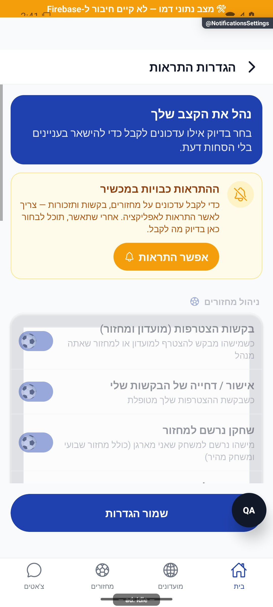
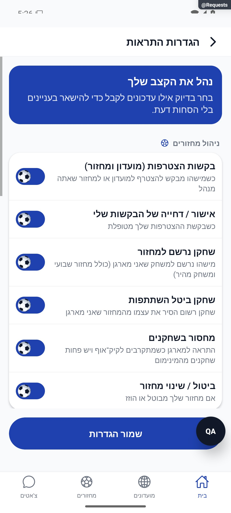

# הגדרות התראות והרשאת מכשיר

[לקריאה קצרה ופשוטה](notification-settings.simple.md)

עודכן: 07.10.2026; מקור `8e8fde5`, `1.1.35` בבנייה. `src/screens/profile/NotificationsSettingsScreen.tsx`, מסלול `NotificationsSettings`, תפריט בית. תפקיד: חשבון מלא.

## אזורים

כרטיס הסבר, שער הרשאת מערכת, מתגי כדור בקבוצות ושמירת העדפות. 16 סוגים: שש התראות מחזור/הרשמה, חמש מועדון, ארבע תזכורות וסוג שיווקי אחד. הקבוצות כוללות אישור/דחייה, הצטרפות שחקנים, ביטול/עדכון, מחזור חדש, מקום פנוי, הזמנה, מחיקת מועדון, תזכורות הגעה/דירוג וצמיחה. יש לקרוא את הרשימה בקוד לפני הוספת סוג כדי לא ליצור מתג שאינו מחובר לשליחה.

הצילום חלקי; שלושת המתגים העליונים נראים, לא כל 16. אין מכאן הצלחת הרשאת מערכת או משלוח הודעה.

| מצב/פעולה | תגובה | כתיבה | ראיה |
|---|---|---|---|
| הרשאה לא ידועה | שער לפי המצב; לא בקשה אוטומטית באתחול | אין | קוד |
| הרשאה חסומה | הסבר ופעולה לאישור/הגדרות; מתגים מעומעמים | מערכת הפעלה בעת פעולה | דמו וקוד |
| הרשאה קיימת | מתגים פעילים | טיוטה עד שמירה | קוד |
| שינוי מתג רגיל | טיוטת העדפות | בשמירה | קוד |
| שינוי מעקב צד שלישי | עדכון ערכת המעקב מיידית | נפרד משמירת המסד | קוד |
| שמירה | העדפות והתאמת שיווק לפי שינוי | `users/{uid}/private/push` | קוד; לא בוצע חי |
| חזרה עם שינוי | הגנת שינויים שלא נשמרו | לפי הבחירה | קוד |
| כשל | הודעה, כיום יכולה לכלול `String(error)` | אין הצלחה מדומה | קוד |

## מקור אמת ושירותים

העדפות ההתראות נמצאות בתת־המסמך הפרטי `private/push`, לא בשורש משתמש למרות הערות ישנות. `src/services/notificationsService.ts`, שירות המשתמש, שירות ההרשאה ו־Joryio משתתפים. שער השורש רושם מכשיר רק כשהרשאה כבר קיימת; אינו מבקש הרשאה אוטומטית בכל אתחול. העדפת שיווק צד שלישי והשמירה העצמאית אינן בהכרח אותה עסקה; יש לבדוק ביטול עריכה והשפעה לפני שינוי.

ממיר המשתמש וקריאת `private/push` ב־`src/firebase/firestore.ts` נבדלים; הוספת מתג צריכה לחבר סוג, קריאה, שמירה ושולח שרתי. בדיקות: `tests/notificationPermissionWiring.test.ts`, `tests/rules/notificationSender.test.mjs` והגנת `analyticsWiring`. לא נשלחו התראות מהמיפוי.

## שחזור

לבחון הרשאה לא נשאלה, נדחתה, ניתנה ובוטלה בהגדרות, חזרה ממסך המערכת, ביטול שינוי, שמירה עם רשת מנותקת וכל קבוצות הגלילה. לא לטעון שכל מתג מדכא את השולח בלי בדיקת השרשרת. שינוי נוסח כשל דורש טיפול בקוד שגיאה ולא רק החלפת מלל סטטי.

## פירוט מימוש ונקודות שינוי — העמקה 07.10.2026

יש ארבע קטגוריות ו־16 שורות: 6 מחזורים, 5 מועדון, 4 תזכורות ו־1 שיווק. `loadPreferences` קורא private/push וממזג עם ברירות המחדל; התוצאה משתקפת בחנות כדי ש־`isDirty`, המחושב ב־JSON.stringify, ישווה לבסיס שנשמר. שינוי שורה צריך לבדוק `NotificationPrefs`, ברירת מחדל ומיפוי השרת, ולא להוסיף רק מלל.

`toggle` משנה טיוטה ומודד כל מתג; `save` ממתין ל־savePreferences, מסנכרן שיווק ל־Joryio רק כשהמנוי השתנה, משקף לחנות ואז מנווט עם savingRef. לעומת זאת `toggleTracking` מפעיל מיד optOut/optIn ואינו תלוי בשמירה או נכלל בהשוואת dirty. `permGranted === false` הוא שער הרשאה; מצב לא זמין הוא null ולא סירוב. `handleEnablePermission` עובר להגדרות כאשר אי אפשר לשאול שוב, אחרת מבקש ורושם טוקן ומרענן. הכותרת הישנה בקוד אינה מקור הנתיב.

הבדיקות, מצבי המסך והראיות שכבר פורטו במסמך נשמרו. ההעמקה מבוססת על קריאת מקור ולא על הרצת פעולות נוספות; שינוי עתידי יצריך עדכון של שני המסמכים ובחינת המצבים הממוקדים.

## ביקורת כיסוי 7.10.2026

[רשימת כל הסוגים, ההסברים והפערים](../reviews/notification-coverage-2026-10-07.md): יש 14 סוגי שרת ללא מתג גלוי במסך, בנוסף למסלולי צ׳אט ושליחות מקומיות. הממצא מבוסס על קוד; לא נשלחו התראות בדיקה ולא הוטמע שינוי.

## תיקוני סבב הבאגים — 8.10.2026

R03: edited מחזיקה מפתחות שנערכו; מיזוג loadPreferences משמר ערכים שנגעו בהם. prefsReady חוסמת save עד טעינה מוצלחת. notificationsService מפיצה כשל קריאה; המסך מציג הודעה ונשאר חסום לשמירה. cancelled חוסמת תשובה אחרי שינוי זהות. שמירה אינה משחזרת חשבון ישן אם הזהות השתנתה במהלכה. ביקורת סוגי ההתראות שלא הוצגו במסך נשארת משימה נפרדת.

[ראיות, בדיקות ומגבלות](../../changes/2026-10-08-audit-fixes.md).

מתגים רגילים בדמו; טעינה מאוחרת וכשל קריאה לא הורצו במסך.
