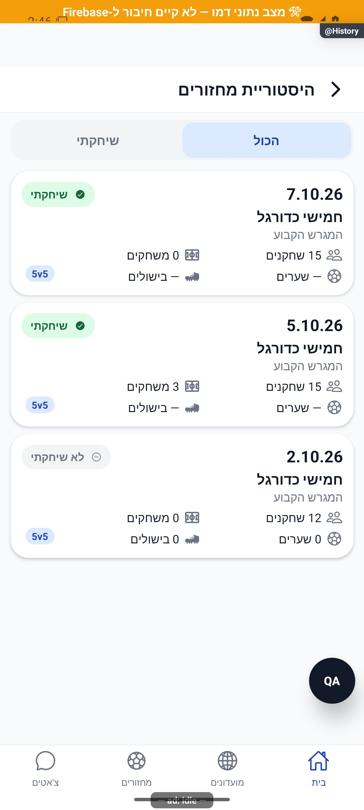
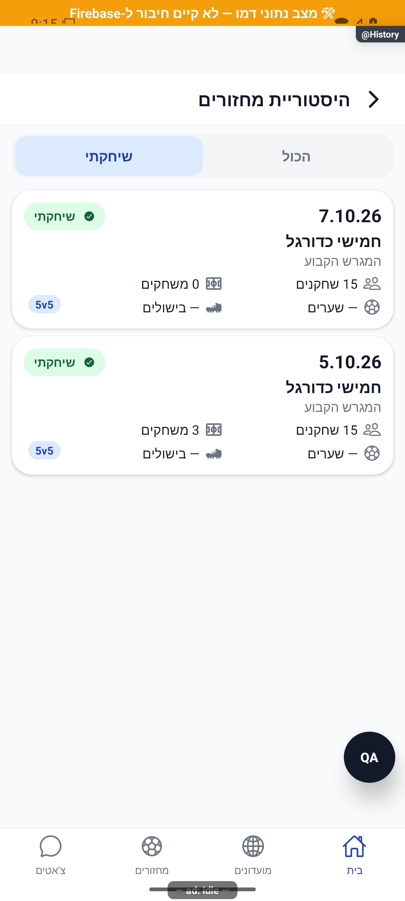
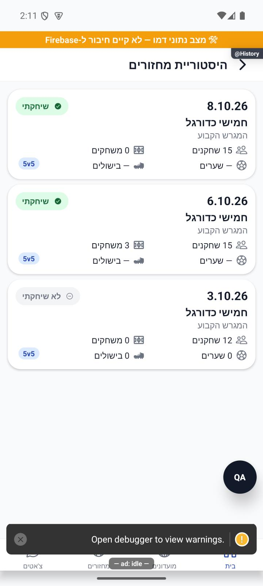

# היסטוריית המחזורים האישית

[לקריאה קצרה ופשוטה](personal-history.simple.md)

עודכן: 07.10.2026; מקור `8e8fde5`, `1.1.35` בבנייה. `src/screens/tabs/HistoryScreen.tsx`, מסלול `History`, כניסה מתפריט הבית. תפקיד: חשבון מלא; היסטוריה חוצת מועדונים.

## הגדרה ותצוגה

ההיסטוריה כוללת רישומים למחזורי עבר שהסתיימו: הרכב, המתנה ובקשות לפי `participantIds` או האיחוד התואם כשאין שדה. היא אינה אומרת שהמשתמש שיחק בכולם. בחירת הכול/שיחקתי הוסרה ב־8.10.2026. מוצגים כל הפריטים שמחזיר השירות; `viewerPlayed` נשאר מקור תגית ההשתתפות בכרטיס, בלי סינון מקומי.

כרטיס `src/components/match/CommunityHistoryRow.tsx` משותף להיסטוריית מועדון ולאישית: תאריך, תג שיחקתי/לא שיחקתי, שם מחזור, מגרש, מספר שחקנים, משחקונים, שערים ובישולים. מבנה המדדים נשאר אחיד. כאשר נתון אישי חסר הוא מוצג כקו, לא אפס. כיום עדיין מוצג שבב פורמט כגון `5v5` אם הוא קיים במקור; אין להניח שהשבב הוסר לפי סקיצה קודמת.

בצילום מחזור 7.10 עם 0 משחקונים ושערים/בישולים חסרים; 5.10 עם 3 משחקונים ונתונים חסרים; 2.10 לא שיחקתי עם אפסים. אלה נתוני דמו, לא הוכחה לתוכן קריאת המסד.

| תנאי/פעולה | תצוגה/מעבר | כתיבה | ראיה |
|---|---|---|---|
| טעינה | ארבעה שלדי כרטיסים | אין | קוד |
| קריאה נכשלה | הודעת כשל ונסה שוב | אין | קוד |
| הרשימה ריקה | הסבר היסטוריה אמיתי | אין | קוד |
| יש תוצאות | תאריך יורד; עד 50 כברירת שירות | אין | דמו וקוד |
| בחירת כרטיס | `MatchDetails` בתוך הערימה הנוכחית | אין | קוד |

## שירותים ובדיקות

`src/services/gameService.ts:getPersonalHistory`, `src/utils/personalHistory.ts`, `src/utils/eveningPlayed.ts`, `src/firebase/firestore.ts`. `isPersonalHistoryGame` בודק מחזור שהסתיים ותאריך לפני עכשיו; ספירת מחזורים ומצב שיחקתי אינם ספירת משחקונים. שינוי עונה אינו אמור למחוק היסטוריה אישית מצטברת. ממיר `GameSummary`/מחזור חייב להחזיר את המדדים החדשים בקריאה אמיתית.

בדיקות: `tests/logic/personalHistory.test.ts`, `tests/logic/seasonPersonal.test.ts`. לא בוצעה כאן בדיקת מסד חיה. שחזור: כמה מועדונים, המתנה בלבד, בקשה בלבד, אי הגעה, משחק בפועל, חוסר סטטיסטיקה, כשל קריאה, בחירת כרטיס וחזרה. אין מצב השתתפות לא תועדה במוצר הנוכחי; חוסר שערים הוא חוסר מדד ולא סטטוס שלישי.

## פירוט מימוש ונקודות שינוי — העמקה 07.10.2026

`isPersonalHistoryGame` דורש מזהה משתמש, `status === 'finished'`, זמן התחלה בעבר וחברות ב־`participantIds`; רק כשהשדה חסר משתמשים באיחוד שחקנים, המתנה ובקשות. מערך קיים ריק אינו ״חסר״ ולכן לא נופלים לתאימות. זה אינו מדד השתתפות, שהשירות מספק בנפרד ב־`viewerPlayed`.

`HistoryScreen` טוען בשינוי userId או `reload`, לא בכל מיקוד. הוא ממיין תאריך יורד ומציג את `items` ישירות ללא מסנן. אין שינוי במקור הנתונים או במונים. `alive` חוסם עדכון לאחר יציאה; catch מציג כשל נפרד וניסיון חוזר מעלה reload. `openDetails` מנווט ב־ProfileStack כדי שהחזרה תהיה להיסטוריה. שינוי עיצוב שורה נעשה ב־`CommunityHistoryRow` המשותף, ולכן מחייב בדיקת היסטוריית מועדון ואישית יחד. המגבלה בשירות היא עד 50 מחזורים; התצוגה אינה הבטחה לארכיון בלתי מוגבל.

הבדיקות, מצבי המסך והראיות שכבר פורטו במסמך נשמרו. ההעמקה מבוססת על קריאת מקור ולא על הרצת פעולות נוספות; שינוי עתידי יצריך עדכון של שני המסמכים ובחינת המצבים הממוקדים.

## ראיה היסטורית — תנועה ותיקוני דיווחים (לפני הסרת המסנן)

`ChangeMotion` עוטף את הרשימה עם `triggerKey=playedOnly` ו־240 אלפיות שנייה. אין החלפת מפתח של הרשימה, איפוס גלילה או שינוי חישוב ההשתתפות.

**ראיה ומגבלות:** הסינון הורץ בדמו: שלושה מחזורים הופיעו בהכול ושניים בסינון שיחקתי.

בדיקת הטיפוסים ו־183 חבילות הבדיקות עברו, 2,752 בדיקות. מצב המקור: `9ec0dfd` עם שינויים מקומיים; אין גרסה חדשה שפורסמה. [יומן השינוי וההקלטות](../../changes/2026-10-08-motion-and-pulse.md).

## הסרת המסנן האישי — 8.10.2026

מקור `a348b9f` עם שינויים מקומיים. הוסרו `playedOnly`, הכפתורים, סגנונותיהם ועטיפת `ChangeMotion` שהופעלה רק בהחלפת המסנן. `FlatList` מקבלת `items` ישירות. מצבי טעינה, כשל, ניסיון חוזר וריק נשמרים. היסטוריית המועדון והכרטיס המשותף אינם משתנים. בדיקות: `artifacts/history-no-filter-tsc.log` ו־`artifacts/history-no-filter-jest.log`.

נצפה באימולטור אנדרואיד בדמו: כותרת ואחריה הרשימה, ללא בחירת הכול/שיחקתי. לא הופעלו כתיבות. סימוני פיתוח בצילום אינם חלק מההפצה. אייפון לא הורץ.
