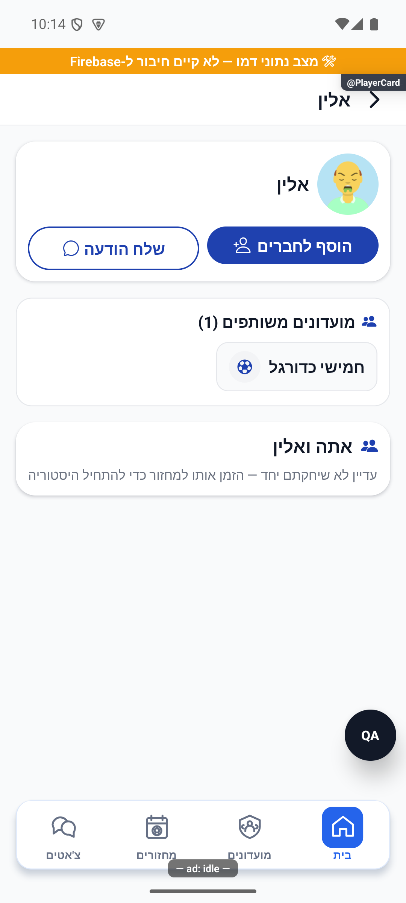

# כרטיס שחקן — עצמי, שחקן אחר ואורח

## עדכון מקומי — 10.10.2026: הישגים במידע שמור

בכרטיס עצמי, כשל `deriveCounters` אינו מוחק מדליות שכבר הושגו ואינו מייצר מונים של אפס. `achievementsService.buildList` משמר את הדרגה הגבוהה שכבר נשמרה ואת מועד הפתיחה, גם כשחלק מפעילות העבר אינה מגיעה. מופיעים אזהרה וניסיון חוזר; במודאל ההישג ההתקדמות המספרית מוסתרת עד לעדכון תקין. אין חגיגה או `persistDerivedUnlocks` על תוצאת מקור שנכשל. תנאי הכרטיס העצמי נשאר נפרד משחקן אחר ומאורח; כימיה וזוגות לא שונו בתיקון זה.

ראיה: מודול המקור במבחנים `tests/logic/clientAuditRecovery.test.ts`, שמירת דרגות ותאריכים וכשל מקורות. [דוח התיקון והגבולות](../../../artifacts/pre-release-2026-10-10/client-fixes.md). אין צילום חדש של מצב כשל הרשת, אין הענקת הישג אמיתי ואין להסיק מהצילום הרגיל שהופעל מקור כושל.

[לקריאה קצרה ופשוטה](player-card.simple.md)

עודכן: 07.10.2026; מקור `8e8fde5`, `1.1.35` בבנייה. `src/screens/players/PlayerCardScreen.tsx`, מסלול `PlayerCard` עם `userId` ו־`groupId?`. כניסה מרשימות שחקנים, חברים, בקשות והפניות; האווטאר בבית פותח עורך, לא מסך זה.

## תצוגה לפי הקשר

אורח מקבל זהות ציבורית מצומצמת וקריאה להרשמה ללא יציאה או התחברות אוטומטית. חשבון מלא רואה כרטיס עצמי או שחקן אחר. כרטיס אחר כולל שם/תמונה, פעולת חברות, שליחת הודעה, מועדונים משותפים וסיכום יחד/ראש בראש כאשר קיימים נתונים. `groupId` מפורש מאפשר קיצור להשוואה במועדון; בלעדיו סעיף הקשר קורא נתוני זוג גלובליים ולא מניח שכל היסטוריה שייכת למועדון הנבחר.

בצילום אלין עם הוספה לחברים, הודעה, מועדון משותף אחד והסבר שטרם שיחקו יחד. תמונת URI החיצונית של הדמו אינה האווטאר המובנה החדש; אין זו ראיה לכשל תאימות.

| תנאי | תוצאה ופעולה | כתיבה | ראיה |
|---|---|---|---|
| אורח | `usersPublic` בלבד וקריאה להרשמה | הרשמה רק בעקבות לחיצה | קוד |
| חשבון מלא, משתמש עצמי | נתוני עצמי, הפניות/הישגים לפי תנאים | פתיחות הישגים עשויות להישמר | קוד |
| שחקן אחר | `FriendActionButton`, הודעה וקשרים | חברות/צ׳אט בעקבות פעולה | דמו וקוד |
| `groupId` מפורש | כניסה ל־`PlayerCompare` בהקשר | אין בקריאה | קוד |
| זוג עם היסטוריה | יחד/מול, ניצחונות/הפסדים/תיקו ובישולים | אין | קוד |
| אין היסטוריה | הסבר להזמנה/יצירת היסטוריה | אין | דמו |
| קריאת משתמש נכשלת | עלולה להיראות כלא נמצא | אין | קוד; סיכון |
| קריאת קשר נכשלת | חלק מהחלופות הן אפסים/אין היסטוריה | אין | קוד; לא כשל חי שנמדד |

## מקורות וממיר

`src/services/userService.ts`, `src/services/gameService.ts:getPairStats`, `src/services/groupService.ts`, `src/services/friendsService.ts`, `src/services/chatService.ts:dmConvId`, `src/navigation/navigationRef.ts:goToDirectChat`, `src/utils/clubRoute.ts`, `src/services/achievementsService.ts`. זהות ציבורית משתמשת בממיר `PublicUser`; חשבון מלא בממיר `User` שב־`src/firebase/firestore.ts`. הנתונים הגלובליים נפרדים מ־`communityPairStats` העונתיים/מועדוניים.

הערות הכותרת על דירוג עמיתים וכפתור הזמנה מושבת שייכות לקוד קודם; חישובי מצב/דירוג שנשארו בקובץ אינם הוכחה לבקר דירוג מוצג. יש לקרוא את ענף התצוגה בפועל. [חברים](friends.md) מפרט את מצבי הכפתור; ההשוואה והציר מתועדים במסמכיהם הנפרדים.

## בדיקות ושחזור

לא בוצעה כאן כתיבת חברות/הודעה/הישג אמיתית. בדיקות סטטיסטיקה וזוגות קיימות אינן בדיקת כל ענפי הכרטיס. לבדוק עצמי, אחר, אורח, מזהה חסר, תמונה חיצונית, מזהה אווטאר ישן, מועדון מפורש/ללא מועדון, קשר חיובי/אפס/כשל וחזרה ליעד המקורי. אין לפתוח כרטיס עצמי בייצור כקריאה טהורה בלי לשקול `persistDerivedUnlocks` וחגיגות הישג.

## פירוט מימוש ונקודות שינוי — העמקה 07.10.2026

המסך מבחין עצמי/אחר/אורח לפני טעינת נתונים: אורח משתמש במראה הציבורית המצומצמת ומקבל הרשמה בהקשר, לא ניסיון לקרוא פרופיל פרטי. תצוגה עצמית כוללת הישגים ומספר מוזמנים כשחיובי; נגזרת הישגים יכולה גם לשמור דרגות, ולכן צפייה עצמית אינה תמיד קריאה בלבד.

כשיש groupId מפורש `PairEntry` יכול לפתוח השוואה בהקשר המועדון. בלעדיו `PairStats` מרכז קשר משותף ומועדונים, עם ניווט למסלולים הרשומים של המארחים; אין להמציא groupId כדי להתגבר על ניווט שקט. `FriendActionButton` מחזיק את יחסי החברות, והודעה משתמשת במזהה שיחה הנגזר מהמשתתפים. שינוי נתון צריך לבדוק את שירות הזוגות והמכנה שלו, לא לשנות תווית ״משחקים״ למספר של מחזורים. כשל זוגות עשוי להוביל לאפסים; אין לפרש אותם כממצא שאין קשר. שינוי תצוגת אווטאר צריך לזכור שתמונת URI גוברת על avatarId, כולל דמו Dicebear.

הבדיקות, מצבי המסך והראיות שכבר פורטו במסמך נשמרו. ההעמקה מבוססת על קריאת מקור ולא על הרצת פעולות נוספות; שינוי עתידי יצריך עדכון של שני המסמכים ובחינת המצבים הממוקדים.

## עבודת ציור וגלילה — 9.10.2026

מקור: שינויים מקומיים מעל `a348b9f`, טרם פורסמו. תשתית `ScrollSurface` מחוברת לפרטי מועדון, ללשוניות פרטי מחזור, לסטטיסטיקות מועדון ולסיכום האישי. היא מסמנת תחילת/סוף מחווה ותנופה בלבד; אין שינוי נתונים או עדכון מצב בכל פריים. `CountUp` ו־`StatDonut` מתייצבים לערך הסופי במהלך גלילה; שורות ללא שינוי מיקום אינן מתזמנות תנועה. אנימציות `LivingIcon` ו־`Breathing` נעצרות כשמסך המקור מאבד מיקוד, כשהיישום ברקע, בזמן גלילה ובהגדרת צמצום תנועה. תמונות פרופיל ורקע משתמשות ב־`resizeMethod=resize`, לצמצום פענוח באנדרואיד לפי גודל התצוגה.

אין שינוי בחישובים, במכנים, בשדות המסד או בהרשאות. [התנהגות, בדיקות ומגבלות](../shared/menus-and-motion.md) · [מדידות וראיות](../reviews/scroll-performance-2026-10-09.md). הבדיקה בדמו אינה אימות גרסת חנות במכשיר פיזי.

## תיקוני עיצוב ונגישות — 10.10.2026

מקור: `a348b9f235f1e1433497600555303231512a0834` עם שינויים מקומיים. אין בסעיף זה הוכחת גרסת חנות.

`FriendActionButton` מסדרת תווית לפני סמל בשורה רגילה, ולכן תחת הכיווניות הכפויה הסמל משמאל. אין שינוי בבקשת חברות, אישור, זהות או מסלול שיחה. נצפו בפועל פעולות הוספה לחברים והודעה בכרטיס שחקן בדמו; לא נשלחה בקשה או הודעה.

הצילום: אנדרואיד בדמו במעטפת פיתוח `1.1.33/1`, ללא שמירה חיה; אין הוכחת אייפון או קורא מסך.
