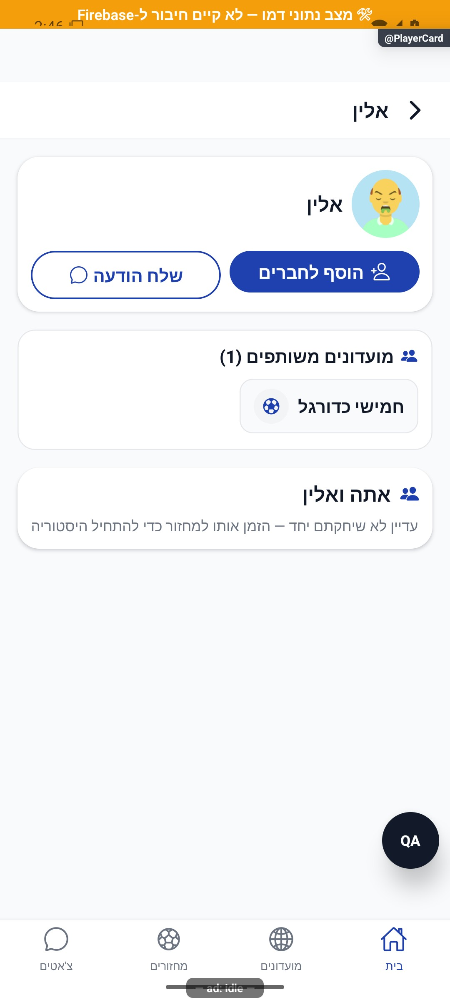

# כרטיס שחקן — עצמי, שחקן אחר ואורח — הסבר קצר

כרטיס שחקן מציג את הפרופיל שלו ואת המידע הרלוונטי למשחקים שלכם. אפשר לבקש חברות, לשלוח הודעה או לראות נתונים משותפים בהתאם להקשר.

[לפירוט הטכני](player-card.md)

הצילום מדגים את המראה בסביבת בדיקה, ולא מוכיח פעולה מול הנתונים האמיתיים.
