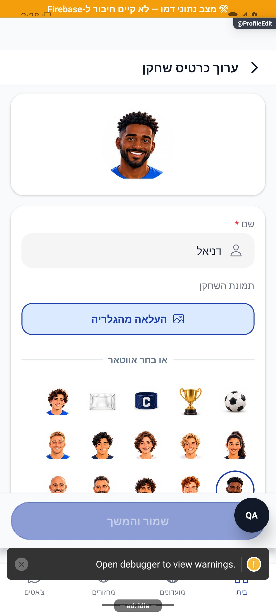

# עריכת כרטיס השחקן ותמונת הפרופיל

[לקריאה קצרה ופשוטה](profile-edit.simple.md)

עודכן: 07.10.2026; מקור `8e8fde5`, `1.1.35` בבנייה. `src/screens/tabs/ProfileEditScreen.tsx`, מסלול `ProfileEdit`, כניסה מהאווטאר בבית. תפקיד: המשתמש עורך את עצמו.

## אזורים ופעולות

שם שחקן, תמונה נוכחית, בחירת תמונה מהמכשיר או אווטאר מובנה, תצוגה מקדימה וכפתור שמירה. מערך האווטארים החדש מציג דיוקנאות קדמיים; `getAvatarById` משמר תאימות מזהי אווטארים ישנים. תמונת כתובת קיימת נשארת בעדיפות על מזהה מובנה, ולכן שחקני דמו עם `avatarUrl` חיצוני עשויים להיראות בסגנון אחר בלי כשל במיפוי המזהים.

בצילום נראה אווטאר כהה עם חולצה כחולה, בחירה במסגרת ומצב שמירה מושבת. תמונת משתמש חיצונית בעדיפות אינה מוחלפת אוטומטית בגלל עיצוב האווטארים.

## מצבים וכתיבות

| מצב/פעולה | תגובה | כתיבה | ראיה |
|---|---|---|---|
| ללא שינוי | שמירה מושבתת | אין | דמו וקוד |
| שם ריק/לא תקין | שמירה חסומה | אין | קוד |
| תמונה מהמכשיר | הרשאה, בחירה והעלאה; תצוגה מקדימה | אחסון תמונה ועדכון פרופיל בעת שמירה | קוד; לא הועלתה תמונה |
| בחירת אווטאר | תצוגה מקדימה; ניקוי תמונה בפרופיל הנשמר | הסרת תמונה ישנה אחרי הצלחת עדכון | קוד |
| שינוי שלא נשמר וחזרה | שמור / התעלם וצא / בטל | שמירה רק בבחירה המתאימה | קוד |
| כשל שמירה | הודעת כשל ושימור עריכה | אין הצלחה מדומה | קוד |

בחירת עמדה מועדפת הוסרה לבקשת הבעלים; סגנונות שנותרו בקובץ אינם הוכחה לבורר פעיל. הגדרת `dmFriendsOnly` אינה מוצגת בעורך הזה כיום. אין להחזיר תכונות מתוך הערות או סגנונות מתים.

## שירותים, ממיר ובדיקות

קרא `src/services/userService.ts`, מערך האווטארים, `UserAvatar`, `src/firebase/firestore.ts`, `src/utils/officialAccount.ts`. שינוי שדה שם/אווטאר/תמונה חייב להתאים גם לממיר המשתמש ולמראה הציבורית. ההבדל לעומת ההיכרות: כאן מחיקת התמונה הישנה נדחית עד אחרי עדכון פרופיל מוצלח.

בדיקה קיימת: `tests/logic/avatarCompatibility.test.ts`; הוקים וכיוון מלל נבדקים רוחבית. לא בוצעה שמירה חיה. לשחזור: תמונה קיימת→אווטאר, אווטאר→תמונה, ביטול הרשאה/בחירה, כשל העלאה, שם ארוך, עזיבה עם שינוי, והצגה בכרטיס שחקן/חברים/צ׳אט. תאימות מזהה ישן יש לבדוק גם בקריאת מסד אמיתית; דמו עוקף ממיר.

## פירוט מימוש ונקודות שינוי — העמקה 07.10.2026

`nameDirty` דורש שם לא ריק ששונה מהשם השמור; `photoDirty` ו־`avatarDirty` משווים את החלופות; `canSave` דורש שינוי, ללא `busy` או `uploading`. השדות מסונכרנים מחדש כשזהות המשתמש או ערכיו משתנים. `previewUser` מציג שם חלופי שמור אם הטיוטה ריקה, אבל תצוגה זו אינה עצמה כתיבה.

`beforeRemove` קורא `dirtyRef` ו־`savingRef` בזמן האירוע כדי למנוע חלון שמירה נוסף לפני הרינדור שאחרי הצלחה. `save` בונה patch רק משדות ששונו, ממתין ל־`updateProfile`, מנקה תמונה קודמת בניסיון שקט רק אחרי הצלחה, מאפס dirty ומנווט. בכשל שם שמור/אימייל מתקבל נוסח ייעודי; כשל אחר משאיר את הטופס. שינוי בחירת אווטאר אינו רשאי למחוק קובץ לפני השמירה, כי ביטול היה משאיר מסמך שמפנה לתמונה שנמחקה. בדיקות התאימות של האווטארים נוגעות למזהים קיימים, לא למסע העלאה חי.

הבדיקות, מצבי המסך והראיות שכבר פורטו במסמך נשמרו. ההעמקה מבוססת על קריאת מקור ולא על הרצת פעולות נוספות; שינוי עתידי יצריך עדכון של שני המסמכים ובחינת המצבים הממוקדים.
