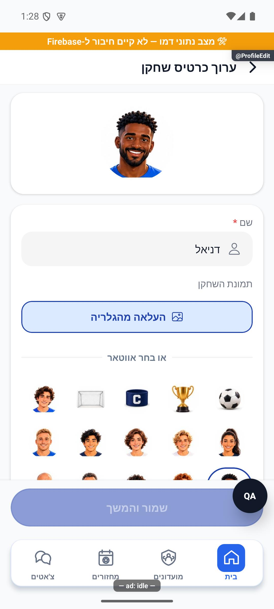

# עריכת כרטיס השחקן ותמונת הפרופיל — הסבר קצר

בעריכת הכרטיס אפשר לשנות שם ולבחור תמונה אישית או דמות מוכנה. רואים מיד את התוצאה, ושומרים כדי לעדכן את הכרטיס.

[לפירוט הטכני](profile-edit.md)

הצילום מדגים את המראה בסביבת בדיקה, ולא מוכיח פעולה מול הנתונים האמיתיים.

הדמויות המוכנות מוצגות כעת בחמש עמודות, וגודלן מותאם לרוחב המסך. הבחירה והשמירה פועלות באותו אופן.

## תיקוני עיצוב ונגישות — 10.10.2026

מקור: `a348b9f235f1e1433497600555303231512a0834` עם שינויים מקומיים. אין בסעיף זה הוכחת גרסת חנות.

השמות מיושרים לימין, וסמל שדה או העלאת תמונה מופיע משמאל לטקסט. שדות מלאים ניתנים לזיהוי גם בקורא מסך.
