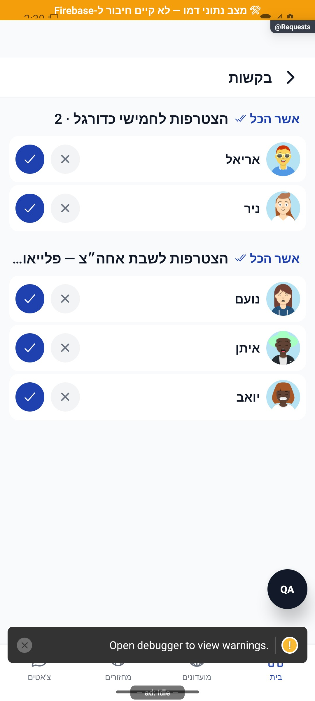

# בקשות ואישורים מאוחדים

[לקריאה קצרה ופשוטה](requests.simple.md)

עודכן: 07.10.2026; מקור `8e8fde5`, `1.1.35` בבנייה. `src/screens/RequestsScreen.tsx`, מסלול `Requests`; פעמון הבית וקישורי אישורים. תפקיד: משתמש לכל בקשות החברות, מנהל למחזורי/מועדוני סמכותו.

## תכולה

שלושה מקורות: בקשות חברות נכנסות, בקשות למועדונים שהמשתמש מנהל, ובקשות למחזור שיצר או שהוא מנהל בו. רשומות כוללות זהות, הקשר, כפתורי אישור/דחייה וכניסה ל־`PlayerCard`. פעולת אישור קבוצתית תלויה בקבוצה/מחזור ומטפלת גם בהצלחה חלקית.

בצילום נצפו חמש בקשות למחזור ושתי בקשות מועדון. התמונות החיצוניות של שחקני הדמו מקבלות קדימות על האווטאר המובנה; אין מכאן ראיה לכשל החלפת האווטארים.

| מצב/פעולה | התנהגות | כתיבה | ראיה |
|---|---|---|---|
| טעינה/רענון | איסוף תורים וזהויות | אין | קוד |
| אין בקשות | מצב ריק מאוחד | אין | קוד |
| אישור/דחייה בודדים | נעילה לפי פריט, עדכון ורענון | שירות חברות/מועדון/מחזור | קוד; לא בוצע חי |
| אישור כמה | תוצאות חלקיות אינן הצלחה של כולם | כל עסקה לפי הרשאה | קוד |
| מחזור מלא בעת אישור | תוצאה יכולה להיות המתנה | רישום לתוצאה האמיתית | קוד |
| לחיצה על שחקן | כרטיס שחקן בהקשר מתאים | אין | קוד |

## מקור אמת ובדיקות

`src/services/requestsService.ts`, `src/services/friendsService.ts`, `src/services/groupService.ts`, `src/services/gameService.ts`, `src/components/RequestsBell.tsx`. ספירה זולה לפעמון אינה תחליף לרשימת תורים מלאה. השמות נפתרים מהזהויות, וקבלת החלטה צריכה לאמת הרשאה ומצב מחודש בשירות. הממירים ב־`src/firebase/firestore.ts` קובעים אילו שדות בקשה/משתמש נשמרים בקריאה אמיתית.

בדיקות הרשמה וקיבולת: `tests/logic/registrationQa.test.ts`, `tests/logic/joinCtaCapacity.test.ts`; אין מכאן כיסוי אוטומטי לכל קומבינציית שלושת התורים. צילום דמו מוכיח תצוגה, לא החלטות שרת.

## שחזור וסיכונים

לבדוק משתמש ללא סמכות, מנהל בכמה מועדונים, שמות חסרים, פריט שהוכרע במכשיר אחר, בקשה למחזור שהתמלא, אישור קבוצתי עם כשל חלקי וחזרה מכרטיס שחקן. אין לאשר/לדחות בקשות ייצור לצורך המיפוי. לפני שינוי איחוד/ספירה, להבחין בין בקשת חברות, חברות מועדון והרכב מחזור.

## פירוט מימוש ונקודות שינוי — העמקה 07.10.2026

`load` קורא את התיבה המלאה ומתחדש במיקוד וברענון. `act(key, fn)` מסמן פעולה בתהליך, ממתין לשירות, מפעיל משוב ומרענן את הרשימה; מזהים בנויים מהסוג, המועדון/מחזור והמשתמש כדי להבדיל שורות. `approveAll` מבקש אישור מראש, מקבל `BulkResult` ומציג במפורש מספר הצלחות וכישלונות, לא ״הכול אושר״ כשיש כשל חלקי.

אישור חברות עובר דרך `friendsService.acceptRequest`, חברות מועדון דרך `approveMember`, ומחזור דרך `approveGameJoin`; אלה אינם אותו מושג או אותה כתיבה. האישור הקבוצתי צריך לכבד קיבולת ותוצאה של המתנה. `busy` הוא מזהה יחיד למסך, לא מפה של מספר פעולות מקבילות; שינוי מקביליות מחייב בדיקה של חסימת כל הכפתורים ושל רענון תוצאה מאוחרת. כשל טעינה נרשם אך לא מוצג כיום מצב שגיאה נפרד בתיבה; אין להפוך רשימה קודמת/ריקה להוכחה שאין בקשות.

הבדיקות, מצבי המסך והראיות שכבר פורטו במסמך נשמרו. ההעמקה מבוססת על קריאת מקור ולא על הרצת פעולות נוספות; שינוי עתידי יצריך עדכון של שני המסמכים ובחינת המצבים הממוקדים.
