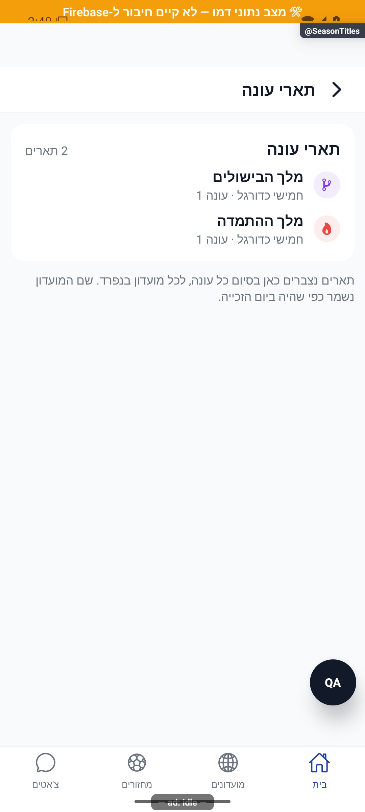

# תארי עונה אישיים — הסבר קצר

תארי העונות שומרים את הפרסים שזכיתם בהם לאורך העונות והמועדונים. אפשר לראות אותם גם בארון ההישגים, והם נשמרים גם אחרי שינוי שם המועדון.

[לפירוט הטכני](season-titles.md)

הצילום מדגים את המראה בסביבת בדיקה, ולא מוכיח פעולה מול הנתונים האמיתיים.
