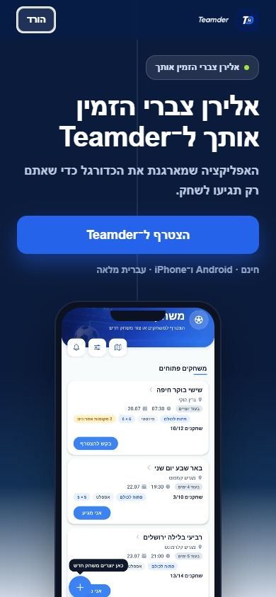
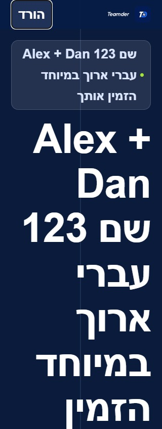

# כניסה והזמנות — תיקונים לאחר סקירה בשמונה סוכנים

עודכן: 9.10.2026. מקור: `a348b9f` עם שינויים מקומיים. התיקונים לא נפרסו ולא נבנתה גרסת חנות במשימה זו. לא שונו הרשאות ולא בוצעה הסבת נתוני משתמשים.

עדכון שחרור נפרד, 9.10.2026: דפי ההזמנה ושתי פונקציות ההזמנה נפרסו לאחר אישור, וגרסה `1.1.38 / 272` נקלטה במסלול הייצור והפנימי. [יומן השחרור וגבולות האימות](../../changes/2026-10-09-production-1.1.38.md). בדיקות ההתקנה והקישורים במכשיר המפורטות להלן עדיין לא בוצעו.

## כיצד נבדק

ארבעה סוכנים תכננו בנפרד את הסקירה: אחסון וייחוס, כתובות דפי הנחיתה, מכשירים והתקנה, ותכנון בדיקות וכשלים. אחריהם ארבעה סוכנים בדקו ניווט, ייחוס, התנהגות הדפים ונראות. העבודה חולקה לגלים בהתאם למגבלת הרצה של ארבעה סוכנים במקביל.

התוכניות, התוצאות והיומנים נשמרו בתיקיית `artifacts/onboarding-expanded`: קובצי `strategy-*.md`, `navigation-report.md`, `attribution-review.md`, `web-evidence.md`, `visual-review.md` וקובצי התוצאות של הדפדפן. הבדיקות משתמשות בקוד השירותים האמיתי, באחסון ובמסד מדומים ובסקריפטים המקוריים של הדפים. בדיקות הניווט מפעילות את גוף הצרכן והטיימרים, אך אינן מרנדר מקורי של מערכת ההפעלה.

## התיקונים

| תחום | התקלה שנמצאה | ההתנהגות החדשה |
|---|---|---|
| קדימות הזמנות | פעולה ישנה או שחזור התקנה הסתירו קישור שנלחץ עכשיו | קישור מפורש חדש מחליף יעד פתיחה ישן. שחזור מאוחר אינו מחליף לחיצה מפורשת; פעולה עסקית או טיוטה נשמרות |
| שימור ייחוס | פתיחת היעד וניקויו מחקו את המזמין לפני הרשמה | ייחוס נשמר בנפרד מפעולת הניווט, גם לאחר שהיעד נצרך |
| שני מקורות ייחוס | התקנה ללא מזמין נעלה את האפשרות לשחזר מזמין, או מקור מאוחר נעלם | המזמין הראשון הידוע ומקור ההגעה הראשון נשמרים בשני צירים עצמאיים, ללא ערבוב קמפיינים |
| ניווט אטי | בדיקת יעד ישנה ניווטה או ניקתה פעולה חדשה | בדיקת התאמת הפעולה והזהות נעשית שוב לאחר ההמתנה; ניקוי מותנה בפעולה המדויקת |
| מוכנות וחשבון | ניווט שלא הצליח או החלפת חשבון נעלו את הצרכן | צרכן אחד, נעילה רק בזמן ניסיון, בדיקת זהות חיה ושלושה ניסיונות חוזרים מדורגים; פעולה שלא נצרכה נשמרת |
| בחירת המשתמש | הצרכן הנוסף עקף בחירה מפורשת במסך הכניסה | יעד הזמנה נפתח רק דרך הצרכן המרכזי וכפוף להחלטה הנוכחית במסך הכניסה |
| קישור קצר ללא רשת | הכתובת נשכחה אם פתרון הקוד נכשל | כתובת נתמכת נשמרת ללא המצאת יעד או זקיפת מזמין מהשאילתה; שלושה ניסיונות בכל חלון חזרה לקדמה |
| הרשמה לפני שחזור | חשבון חדש נוצר לפני שהקוד נפתר ונשאר ללא ייחוס | כרטיס מקומי ל־24 שעות מאפשר השלמה רק לאותו חשבון חדש ולתאריך יצירה תואם; חשבון קיים אינו מזוכה בדיעבד |
| תחרות באחסון | רישום כרטיס ושחזור קוד יכלו להשאיר כרטיס במצב לא פתור | רישום הכרטיס וסימון הפתרון משתמשים באותו תור כתיבה |
| השהיית קריאת יעד | קריאת מסד שלא הסתיימה עיכבה ניווט ללא גבול | בדיקה מקדימה מוגבלת לארבע שניות; המסך המיועד ממשיך לטפל בטעינה ובגישה |
| ספירת ביקורים | פתרון קוד בתוך האפליקציה נספר כביקור נוסף | `resolve=1` מחזיר מידע בלבד. דף שנספר בשרת מסומן `clickTracked`; תשובת הדף אינה נשמרת במטמון |
| מזמין בקוד קצר | ערך מזמין מהשאילתה עקף את בעל הקוד או נספר מוקדם | רק המזמין הקנוני של הקוד משמש לייחוס ולספירה, גם כשהוא ריק; הספירה ממתינה לפתרון |
| בטיחות תצוגה | שם מזמין פורש כעיצוב, ומטען מוזר יכול היה לסגור תגית סקריפט | שם נכתב כטקסט; מידע מוזרק עובר בריחת `<` לפני הכללתו בדף |
| לחיצה מוקדמת | כפתורים נלחצו לפני פתרון היעד או נשארו עם כתובת ישנה | כל כפתורי הפתיחה וההורדה ממתינים לפתרון מוגבל; יעד הכפתור מתעדכן |
| כתובות חלופיות | `/app?code`, `/go?code`, דף הראשי ו־`/get` איבדו הקשר | מסלולים חלופיים משמרים שאילתה והקשר. כשל פתרון מועבר לחנות באמצעות `invite_url` |
| תאימות | זיהוי אייפד, מקור מקודד פגום ומזהה מקודד שיבשו יעד או מקור | זיהוי אייפד במצב דפדפן שולחני, מקור חלופי בעת כשל קידוד ופענוח מזהה פעם אחת |
| מחזור שהסתיים | יעד הוחלף למועדון האב בחלק מהמסלולים | ההזמנה ממשיכה להצביע למחזור המקורי ומציגה את מצבו |
| נראות ונגישות | שמות ארוכים וכפתורים גדולים נחתכו; כפתור דביק מוסתר נשאר נגיש | שבירת טקסט, גובה כפתור גמיש, בידוד שמות מעורבים, תגיות מתונות ומיקוד בהתאם לנראות |
| מסך כוונה מקורי | גובה קשיח ושתי שורות הגבילו תוכן, וכיווניות כפולה שיבשה יישור | גובה מינימלי, תוכן שאינו מוגבל לשתי שורות, תיאור נגיש ובידוד שם המזמין. אומת בקוד ובבדיקות; צילום מקורי עדכני עדיין חסר |

עשרת הסעיפים R01–R10 מ[הסקירה החוזרת](onboarding-second-audit-2026-10-08.md) טופלו מקומית במסגרת זו. אין מדובר בסגירת כל ממצא היסטורי מחוץ לתהליך הכניסה וההזמנות.

## מטריצת הקישורים והבדיקות

מסלולים מכוסים: `/`, `/get`, `/app`, `/go`, `/session/:id`, `/team/:id`, `/c/:id`, `/i/:code` ו־`/app?code=...`. בנוסף נבדקו `/go?code=...`, סכמות האפליקציה, קישורי מקור וקמפיין, מזהים חסרים וקלט פגום.

נבדקו 39 מסלולי התנהגות בדפדפן, כולל 16 מעברים שבהם ההעתקה הושלמה לפני מעבר מדומה לחנות באייפון ובאייפד. נבדקו גם 72 שילובי תצוגה: תשעה מסלולים, ארבעה רוחבים — 320, 390, 430 ו־1,024 — וגופן רגיל או כפול. בדיקה ממוקדת נוספת נערכה לאחר עידון התגית והגופן. אלה הרצות דפדפן מקומיות עם נתוני בדיקה ובקשות חיצוניות חסומות, לא ביקורים באתר הפרוס.

בדיקות רגרסיה נוספו לקדימות, ייחוס לאחר ניקוי, החלפת זהות, כשל כתיבה, יעד חדש במהלך המתנה, קישור קצר ללא רשת, התחברות לפני פתרון, כפתורים מוקדמים, מטען סקריפט, ספירה ללא כפילות ונגישות. הספים בבדיקות הביצועים לא שונו. תוצאות ההרצה הסופית נשמרות ב־`artifacts/onboarding-expanded/full-suite.log` וב־`typecheck.log`.

הרצה סופית: **202 חבילות ו־2,969 בדיקות עברו**, בדיקת הטיפוסים נקייה ובניית קוד השרת עברה. בודק התיעוד עבר גם הוא. בדיקות דפי הנחיתה כוללות כעת 47 מקרים, לאחר הוספת בדיקה שמונעת ספירת מזמין מהשאילתה לפני פתרון קוד.

נרשמו ואומתו 11 רשומות תיקון מקומי ב־`appConfig/releaseLog`, עם צילום דפדפן ב־`releaseShots`. ההערות מציינות במפורש שהתיקונים לא פורסמו ושצילום הדפדפן אינו אימות של מסך הכניסה המקורי. הקבלה נשמרה ב־`artifacts/onboarding-expanded/release-log-receipt.json`.

## גבולות האימות

- לא בוצעה התקנה נקייה מהחנויות, ולא נבדקו בפועל קישור אוניברסלי או קישור אפליקציה בבינארי החדש. עדכון שיוך כתובות מחייב בהמשך פריסה ובנייה מאושרות.
- לא היה אייפון לבדיקה. באייפון שחזור דרך לוח ההעתקה תלוי בהרשאה; כשל מוסבר עם חזרה לקישור המקורי. אין הבטחה לשחזור אוטומטי אם מערכת ההפעלה מסרבת.
- הגדלת הגופן בדפדפן אינה בדיקת הגדלת גופן מערכתית באפליקציה. ניסיון חיבור לאמולטור נכשל בהרשאת יצירת תיקיית `adb`; לא הופעלה פעולה על חשבון הייצור לצורך צילום.
- צילומי מסמך מלא עלולים להציג רכיב דביק מוסתר מחוץ לחלון בצורה מטעה; צילומי חלון ומדדי נראות נשמרו בנפרד.
- סגירת תהליך באמצע כתיבה ורשת אמיתית משתנה אינן מובטחות על ידי בדיקות אחסון מדומה. הנתונים נשמרים לניסיון הבא; אין עסקאות אוטומטיות של הצטרפות בעקבות קישור בלבד.

מסמכי המימוש: [כניסה](../entry/boot-and-intent.md), [פעולה ממתינה](../entry/pending-actions.md), [הזמנה אישית](../entry/personal-invite.md), [התחברות](../entry/authentication.md), [דפי הזמנה](../clubs/covers-and-invitations.md).
