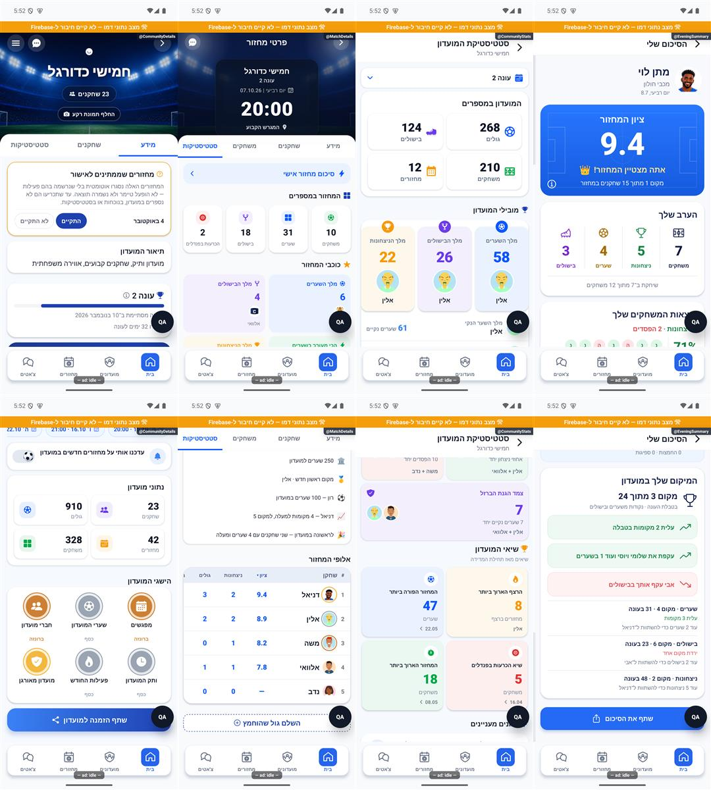

# בדיקת גלילה — 9.10.2026

המשתמש דיווח על גלילה קופצנית בפרטי מחזור, פרטי מועדון, סטטיסטיקות וסיכום אישי. לא נמסרו דגם מכשיר או גרסת התקנה. בתחילה נערכה בדיקה בלבד. בעקבות אישור הבעלים בוצעו תיקוני קוד מקומיים המתועדים בהמשך, ללא שינוי נתוני מוצר או פריסה.

## שחזור ומדידה

נפתחו ארבעה מסכים באימולטור האנדרואיד הקיים, במצב פיתוח עם נתוני דמו וללא חיבור למסד. המסך זוהה בצילום לפני כל מדידה. לאחר המתנה של שלוש שניות אופסו מוני `dumpsys gfxinfo`, ובוצעו שלוש מחוות גלילה מ־`850,1750` ל־`850,750`, כל אחת במשך 550 מילישניות. ההמתנה בין מחוות הייתה חצי שנייה. המונים מייצגים את חלון המדידה כולו, כולל מנוחה בין מחוות, ולא כל פריים של תנועת האצבע בלבד.

| מסך | פריימים שנמדדו | החמיצו מועד ציור | זמן חציוני | אחוזון 95 |
|---|---:|---:|---:|---:|
| פרטי מועדון, מידע | 179 | 39 — 21.79% | 34 מילישניות | 61 מילישניות |
| פרטי מחזור, סטטיסטיקות | 100 | 43 — 43.00% | 34 מילישניות | 61 מילישניות |
| סטטיסטיקות מועדון | 74 | 51 — 68.92% | 46 מילישניות | 133 מילישניות |
| סיכום אישי, מצטיין | 88 | 41 — 46.59% | 34 מילישניות | 85 מילישניות |

מקור: `artifacts/scroll-audit/measure.py`, `measurements.json` וקובצי `*-gfx.txt`. צילומי המסכים לפני ואחרי נשמרו באותה תיקייה. אלו ראיות בדיקה, לא צילומי שינוי חזותי במוצר.

## מה הוכח ומה עדיין השערה

נמדדה החמצת מועדי ציור באימולטור בארבעת המסכים. במדדים יש גם אירועי איטיות של חוט הממשק ושל פקודות ציור. בשלושה מסכים לא נרשמו העלאות תמונה איטיות; בסטטיסטיקות המועדון נרשמו שש. לפיכך אין בסיס לייחס את כל ההאטה לטעינת תמונות בלבד.

קריאת הקוד: הסיכום האישי ב־`EveningSummaryScreen` ו־`EveningSummaryCard` אינו מפעיל אנימציה רציפה או מטפל בכל אירוע גלילה. גם בו נמדדה האטה. אנימציית סימון הלשונית ב־`NavigationDock` מופעלת בעת שינוי לשונית או רוחב, ואינה מחוברת לגלילה. לא זוהה בקוד הממוקד מנגנון שינוי מצב בכל אירוע גלילה שמסביר את ארבעת המסכים.

מוקדים אפשריים לבדיקה מבוקרת:

- `CommunityStatsTable` מצייר את כל שורות הטבלה ואת תאיה בתוך גלילה אופקית; המסך החיצוני הוא גלילה אנכית. מחיר הציור עולה עם מספר שחקנים ועמודות. עדיין לא הוכח שזה מקור ההאטה במדגם.
- מסכי פרטים וסיכום כוללים כרטיסים עם צללים, תמונות ושכבות. יש להשוות את אותו מסך עם שינוי בודד בכל פעם ולמדוד, לפני שינוי העיצוב.
- ברשימות הראשיות כרטיסים מצוירים באמצעות `map` בתוך `ScrollView`, ללא חלון רינדור של רשימה. זהו מוקד נוסף לרשימות ארוכות; אינו הסבר מוכח לסיכום האישי.
- `PressableScale` מכווץ תוכן בתחילת מגע ומשחרר בקפיץ. בכרטיסים שניתן לגלול עליהם הדבר עשוי להיראות כקפיצה בתחילת מחווה. אינו משותף לכל ארבעת המסכים שנמסרו.
- בסטטיסטיקות `CountUp` מעדכן טקסט בזמן אנימציית הפתיחה. יש להפריד בדיקה בזמן כניסה מגלילה לאחר שהאנימציה הסתיימה.

## גבולות והמשך האימות

לא נמדדה גרסת החנות בטלפון פיזי או באייפון; לא נמדדה מהירות בסיס של האימולטור מול מסך מקורי; לא בוצעה השוואה מבוקרת עם רכיבי עיצוב מושבתים. לכן שיעורי ההחמצה אינם שיעורי ההחמצה אצל המשתמש, ולא נקבע גורם שורש. אין להסיק שהסרת אנימציות או החלפת רשימות לבדה פותרות את הבעיה.

השלב הבא הוא מדידה בגרסה מותאמת להפצה על המכשיר המדווח, כולל מסכים עמוסים, ולאחר מכן שינוי יחיד והשוואה באותם תנאים. לא הורצו מחדש בדיקות טיפוסים או יחידה במשימת הבדיקה, משום שלא שונה קוד יישום.

## תיקון לאחר אישור הבעלים

בוצעו צמצום עדכוני מונים, ביטול תנועה של שורות שלא זזו, השהיית תגובת כיווץ בכרטיס לחיץ ב־100 מילישניות, עצירת לולאות `LivingIcon` ו־`Breathing` במסכים לא פעילים וברקע, והתאמת פענוח תמונות לגודל התצוגה באנדרואיד. בארבע נקודות הכניסה הוחלפה מעטפת הגלילה ב־`ScrollSurface`, המסמנת פעילות רק בגבולות מחווה ותנופה. אין שינוי בחישובים, נתוני משתמש, הרשאות, מסלולי ניווט או תוכן מסך. [הפונקציות ומחזור החיים](../shared/menus-and-motion.md).

ניסוי מרקמי חומרה בכרטיסים הוסר לאחר שהתוצאות לא היו עקביות. הוא אינו כלול בתיקון. לא הופעלה הסרת תתי־תצוגות מחוץ למסך ולא הוחלפו טבלאות ברשימות חדשות. חסימת תיקיות עותקי המקור והכלים ב־`metro.config.js` פתרה כשלים בסריקת שרת הפיתוח; אין לייחס לה שיפור ציור בגרסת חנות.

### שתי המדידות האחרונות

אותו אימולטור, נתוני דמו, ארבעה מסכים ושלוש מחוות של 550 מילישניות. בזמן שתי הריצות לא שונה קוד היישום ולא הורצו בדיקות הפרויקט. המקור הוא `artifacts/scroll-audit/final-ambient` ו־`final-repeat`; הסקריפטים והפלט הגולמי נשמרו לצד התמונות. הסיכום האישי בריצה האחרונה כולל גם תיקון המשכיות יעד באמצע ספירה, שאינו משנה את תוכן הדמו היציב.

| מסך | פריימים בשתי ריצות | שיעור מאחרים בשתי ריצות | אחוזון 95 בשתי ריצות |
|---|---|---|---|
| פרטי מועדון | 173 / 206 | 10.40% / 3.88% | 44 / 48 מילישניות |
| פרטי מחזור | 162 / 162 | 6.79% / 11.73% | 34 / 44 מילישניות |
| סטטיסטיקות מועדון | 152 / 151 | 26.32% / 26.49% | 48 / 48 מילישניות |
| סיכום אישי | 168 / 173 | 10.71% / 7.51% | 36 / 34 מילישניות |

הטבלה הראשונית למעלה נשמרה כתיעוד, אך אינה ניסוי מבוקר שמבודד שינוי אחד: בין הבסיס הראשוני לסיום הוחלף גם שרת הפיתוח. בבסיס נוסף לאחר החלפת השרת ולפני התיקון נמדדו 28.57% בפרטי מועדון, 34.33%–51.55% בפרטי מחזור, 26.49%–42.64% בסטטיסטיקות, ו־17.39% בסיכום אישי. המדידה הנוספת של הסיכום בזמן החלפת קוד לא שימשה להשוואה. גם ריצות ביניים בעת החלפת ניסויים לא שימשו להוכחת שיפור. השונות, במיוחד בסטטיסטיקות, מונעת ייחוס אחוז שיפור מדויק לכל תיקון בנפרד.

מסקנה: נמצאו ותוקנו מקורות עבודה מיותרת ונמדד שיפור בשתי ריצות סיום מול הבדיקה הראשונית; אין הוכחה שכל קפיצה בכל טלפון נפתרה. גם בסיום סטטיסטיקות המועדון אינן עומדות בכל מועדי הציור באימולטור. זמני החציון סביב 27–32 מילישניות אינם הוכחה לגלילה יציבה של 60 פריימים לשנייה. נדרשת בדיקת גרסה להפצה במכשיר פיזי לפני טענה כזו; אייפון לא נבדק.

### אימות תצוגה

ב־`artifacts/scroll-audit/verification` נלכדו לכל ארבעת המסכים ראש המסך, גלילה מטה וחזרה לראש. נבדקו הכותרות, תוכן הכרטיסים, מיקום עברית ולשוניות נצמדות. חלון הסבר הציון נפתח לאחר החזרה לראש הסיכום. בסטטיסטיקות נבדקו גם הגעה לקצה המסך, גלילה אופקית בטבלה וחזרה למעלה. לא בוצעו פעולות הרסניות או כתיבת נתונים. בדיקת צילום שיתוף מלא לא בוצעה במשימה זו.

הצילום כולל מחוון דמו, כלי בדיקה ונתונים מדומים; אינו צילום גרסת החנות. המקור והחותמות נרשמו במניפסט. מצב הקוד `a348b9f` עם שינויים מקומיים; שום גרסה חדשה לא פורסמה במשימה זו.

בדיקות: `tests/scrollAnimationLifecycle.test.ts` כוללת 11 בדיקות מחזור חיים, עם מארחים מקוריים מדומים. התוצאות המלאות של בדיקות טיפוסים ושל כלל החבילות נשמרות ב־`artifacts/scroll-audit/tsc-final.log` וב־`jest-final.log`. הבדיקות אינן מדידת מכשיר ואינן מחליפות בדיקת תצוגה.

בדיקות הסיום עברו: בדיקת טיפוסים נקייה, 204 חבילות ו־2,986 בדיקות, כולל 11 בדיקות מחזור החיים החדשות.
