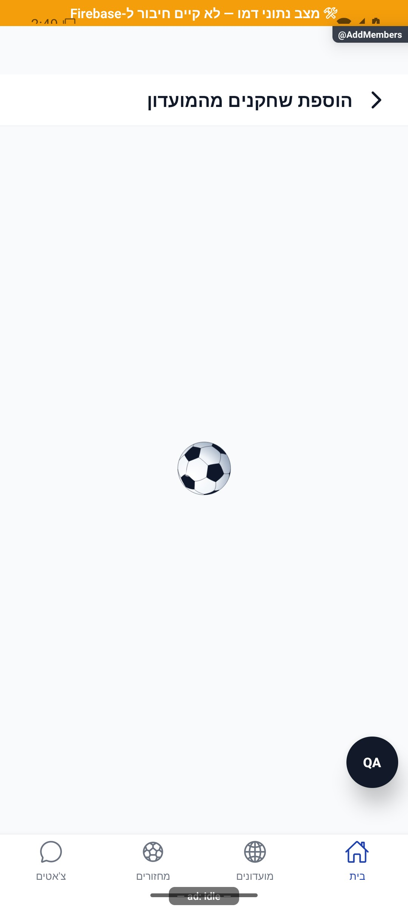

# רישום חברי מועדון ושריון מקומות — הסבר פשוט

מנהל בוחר חברי מועדון ומוסיף אותם למחזור. אם ההרשמה עדיין לא פתוחה, אותה פעולה מוצגת כשריון. כשהמחזור מלא, השרת יכול להעביר עודפים להמתנה.

[להסבר המעמיק ולמפת הקוד](add-members.md)

## צילום והיקף ההוכחה

הצילומים מציגים רק את המצבים המתועדים במסמך המעמיק. חלקם נתוני דמו, חלקם הוכחות מתיקון קודם, ובכמה מהם טעינה או הודעת הגנה; הם אינם אישור שכל התהליך או השרת נבדקו.

