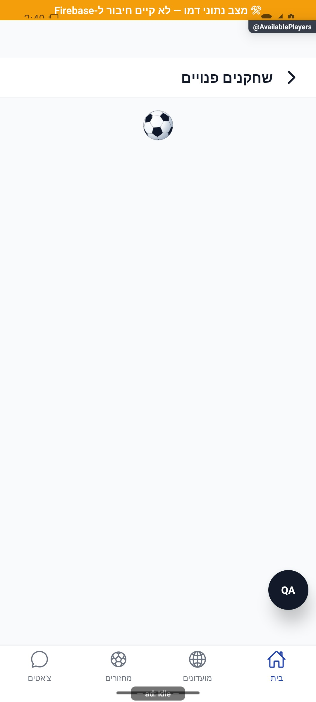

# איתור שחקנים זמינים והזמנות — הסבר פשוט

מארגן יכול למצוא שחקנים שסימנו זמינות ולשלוח להם הזמנה למחזור. אפשר גם לשלוח פנייה לשחקנים מתאימים באזור. הזמנה עדיין אינה הרשמה של השחקן.

[להסבר המעמיק ולמפת הקוד](available-players.md)

## צילום והיקף ההוכחה

הצילומים מציגים רק את המצבים המתועדים במסמך המעמיק. חלקם נתוני דמו, חלקם הוכחות מתיקון קודם, ובכמה מהם טעינה או הודעת הגנה; הם אינם אישור שכל התהליך או השרת נבדקו.

