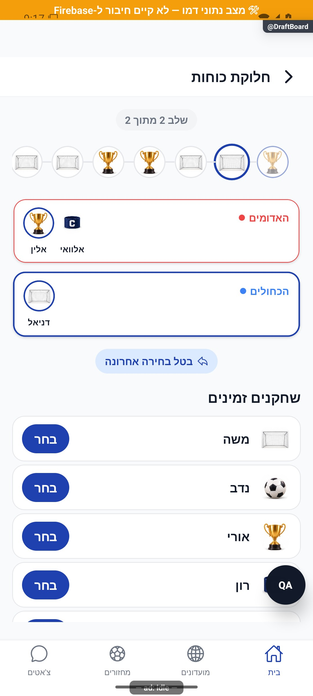

# לוח בחירה, החלפה ופרסום קבוצות

עודכן: 7.10.2026. מקור הקוד: `8e8fde5`, גרסה `1.1.35`. מסמך זה מתאר את הקוד; מצב חנות ופריסת שרת דורשים ראיה נפרדת.

## כניסה ותפקידים

DraftSetup → DraftBoard {gameId,captainIds,method,resume,readOnly}

מנהל בוחר/מתקן; צופה readOnly רואה חלוקה בלי סמכות כתיבה.

## רכיבים ומצבים

| רכיב / מצב | התנהגות וחוזה |
|---|---|
| בחירה | רשימת משתתפים שנותרו, תור קפטן ושיטת סדר; אורחים מסומנים בשם ואינם משתמשים |
| שיקום | resume משחזר בחירות מסגל חי ומסנן מי שאינו פעיל; צבעי קבוצות משוקמים |
| תנועה | בחירה וביטול עם מעבר גודל/פריט; בזמן תנועה לא מקבלים פעולה נוספת |
| סיכום | קבוצות, שינוי צבעים, גרירה בין קבוצות ותיקון ידני |
| שמירה ופרסום | saveDraftTeams שומר; פרסום והודעת הקבוצות נעשים בפרטי המחזור בנפרד |
| קריאה בלבד | אין פעולות עריכה; ייתכנו נתונים ישנים שמשוקמים חלקית |

## מסלול נתונים ומקומות שינוי

[`src/screens/games/DraftBoardScreen.tsx`](../../../src/screens/games/DraftBoardScreen.tsx); [`src/components/draft/DraftTeamCard.tsx`](../../../src/components/draft/DraftTeamCard.tsx)

gameService.saveDraftTeams; מודל DraftTeamsResult ודירוגים; byId עשוי להכיל שמות מהמתנה אך participants בפועל מסנן waitlisted. יש לעקוב דרך הממיר ולא להסתמך על נתוני דמו.

ממיר המחזור: [`src/firebase/firestore.ts`](../../../src/firebase/firestore.ts), `gameDocConverter.fromFirestore`; סוגים: [`src/types`](../../../src/types). שינוי שדה דורש מעקב כתיבה → ממיר → שירות/חנות → רכיב. ניווט: [`GameStack.tsx`](../../../src/navigation/GameStack.tsx), ובמסכים משותפים גם המחסניות שמארחות אותם.

## בדיקות וראיות

draftTeamsView, draft, draftStore ובדיקות balanceMeta; לראות שמות ארוכים, לטיניים, אורחים וצבעים.

צילומי המיפוי מהאמולטור נעשו במצב נתוני דמו, המסומן בפס כתום. הם מוכיחים את הרכיב והמצב המוצגים בלבד, ולא ממירי Firebase, נתוני ייצור או כתיבה. צילומי תיקונים קודמים מסומנים בנפרד. שגיאת מזהה, מצב טעינה או שער הגנה אינם הוכחת הפעולה המלאה.

## גבולות והערות תחזוקה

פרסום אינו תוצאה של עצם פתיחת הלוח. שינוי קבוצה בסוף ערב אינו מקור לדקות משחק של מי שעזב מוקדם.

לפני שינוי פתח את הקוד המקושר ואת [כללי הפרויקט](../../../AGENTS.md). לאחר שינוי עדכן במסמך זה את התאריך, נקודת הקוד, המצבים שהתעדכנו, הבדיקות והצילום. אין לטעון שכל מצב/תפקיד נבדק רק משום שקיים צילום אחד.

## פירוט טכני ממוקד: זרימה, חישוב ונקודות שינוי

[הסבר פשוט למשתמש](draft-board.simple.md)

העמקה: 07.10.2026, מול קוד המקור שב־`8e8fde5`. בעת הכתיבה HEAD הוא `50d508f`; בדיקת ההפרש בין הנקודות ב־`src` וב־`functions` לא מצאה שינוי קוד. הסעיפים וההסתייגויות הקיימים נשמרו. זו קריאת קוד ותיעוד, בלי הרצת תרחישי כתיבה חדשים.

הכניסה נושאת `captainIds/method/resume/readOnly`. סדר בחירת הקפטנים קובע שיוך קבוצות; `snake` משנה את כיוון הסבב ו־`regular` חוזר לאותו כיוון. לדוגמה בשלוש קבוצות סדר נחש הוא א,ב,ג,ג,ב,א, ואילו רגיל א,ב,ג,א,ב,ג. זו דוגמת סדר, לא חלוקת דירוג.

ב־`resume` יש לשחזר סגל פעיל וצבעים, לא להחזיר שחקן שכבר עבר להמתנה. מזהה אורח חייב להשתמש באותה מוסכמה של הלוח והחלוקה; שם מתוך `byId` אינו הוכחה שהזהות עדיין מועמדת לבחירה. מצב `readOnly` צריך לחסום גם פעולות החלפה ולא רק כפתור שמירה.

`saveDraftTeams` שומר הרכבים ומטא־נתוני איזון; הפרסום בפרטי המחזור נפרד. אנימציה וחסימת פעולה נוספת בזמן מעבר מונעות שתי בחירות מקומיות לאותו תור, אך סמכות ההרכב נמצאת בנתונים שנשמרו. בדוק חזרה בזמן מעבר, משתמש שהוסר, אורח קפטן, שמירה שנכשלה וכניסה לצפייה בלבד. שינוי סדר התורות צריך להגיע גם לשיקום בחירות ולמבחני `draft`.

## עדכון 8.10.2026 — תנועה ותיקוני דיווחים

`GrowIn` ו־`ShrinkOut` משלבים אטימות, תזוזה אופקית עד 16 והגדלה 0.85–1 במשך 240 אלפיות שנייה. `ShrinkOut` קורא `onDone` רק בסיום שהושלם; פירוק מבטל את התנועה. `DraftOrderPath` מפעיל פעימה על תוכן הסמל ומשאיר את הגדלת התור הפעיל במעטפת. סדר הבחירה, החישובים ופרסום הקבוצות לא השתנו.

**ראיה ומגבלות:** נבחרו שחקנים בדראפט מקומי בדמו ונצפה מעבר התור. לא נלחץ פרסום ואין כאן הוכחת שמירת חלוקה בייצור.

בדיקת הטיפוסים ו־183 חבילות הבדיקות עברו, 2,752 בדיקות. מצב המקור: `9ec0dfd` עם שינויים מקומיים; אין גרסה חדשה שפורסמה. [יומן השינוי וההקלטות](../../changes/2026-10-08-motion-and-pulse.md).

## תיקוני סבב הבאגים — 8.10.2026

B13: כניסה לעריכה ב־DraftBoard מאמתת ייחודיות קפטנים ונוכחותם בסגל הפעיל. resume מסננת גם אורחים בהמתנה. לפני finish נקרא מחזור עדכני ונבדקים קפטנים ובחירות מול סגל פעיל; אי התאמה עוצרת שמירה ומסבירה לחזור להגדרה. saveDraftTeams מופעלת עם validateActiveRoster:true; השירות קורא את הסגל ובודק קפטנים וכל playerIds בתוך אותה טרנזקציה שכותבת את החלוקה. שינוי סגל מקביל גורם לקריאה מחודשת או DRAFT_ROSTER_CHANGED במקום שמירת קפטן ממתין. מסלולי חלוקה אחרים שומרים את החוזה הקיים. בדיקה מבודדת של השירות דוחה קפטן בהמתנה ללא כתיבה ומאשרת אותו אחרי הפיכתו לפעיל.

[ראיות, בדיקות ומגבלות](../../changes/2026-10-08-audit-fixes.md).
