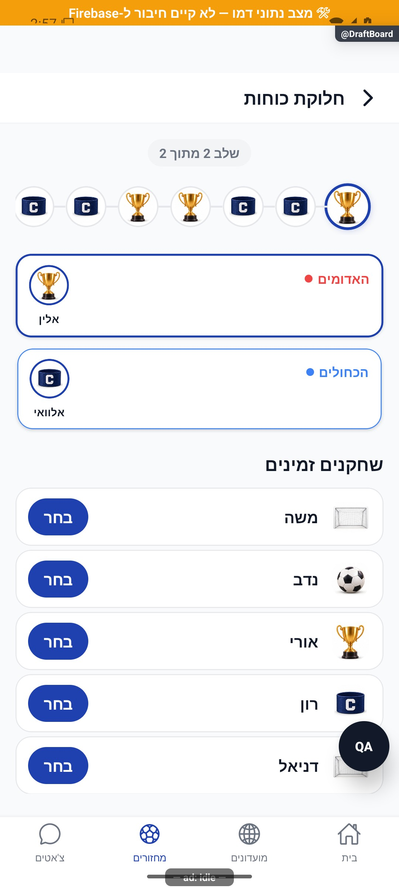

# לוח בחירה, החלפה ופרסום קבוצות — הסבר פשוט

הקפטנים בוחרים שחקנים בתורות עד שמתקבלות הקבוצות. אפשר לחזור לחלוקה קיימת ולתקן אותה בהתאם להרשאה. שמירת החלוקה אינה פרסום שלה לכל השחקנים.

[להסבר המעמיק ולמפת הקוד](draft-board.md)

## צילום והיקף ההוכחה

הצילומים מציגים רק את המצבים המתועדים במסמך המעמיק. חלקם נתוני דמו, חלקם הוכחות מתיקון קודם, ובכמה מהם טעינה או הודעת הגנה; הם אינם אישור שכל התהליך או השרת נבדקו.

