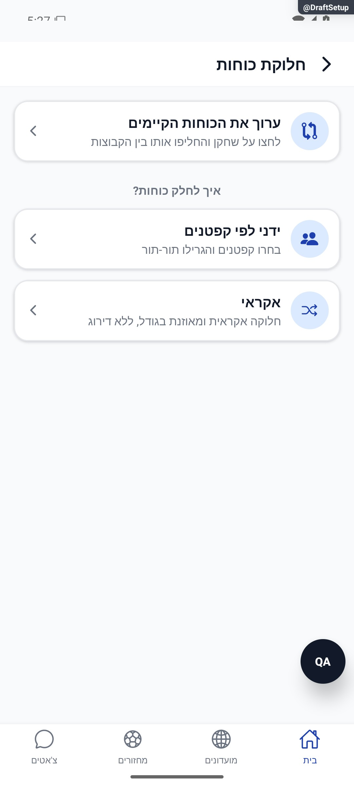

# הגדרת חלוקת כוחות

עודכן: 7.10.2026. מקור הקוד: `8e8fde5`, גרסה `1.1.35`. מסמך זה מתאר את הקוד; מצב חנות ופריסת שרת דורשים ראיה נפרדת.

## כניסה ותפקידים

MatchDetails → חלוקה → DraftSetup {gameId}

מנהל; חילוק אוטומטי לפי דירוג זמין כשיש דירוג פנימי, ואקראי הוא חלופה.

## רכיבים ומצבים

| רכיב / מצב | התנהגות וחוזה |
|---|---|
| שיטה | אוטומטי מאוזן / אקראי / בחירה ידנית |
| קבוצות | 2–7, מוגבל גם בגודל הסגל; ברירת מספר קבוצות מהמחזור |
| קפטנים | בחירת מספר קפטנים השווה למספר קבוצות; צריך לפחות משתתף אחד שאינו קפטן |
| סדר | נחש או רגיל, וסדר הקפטנים; בחירה מגדירה תורות בהמשך |
| אוטומטי | דירוגי מנהל ודירוג אורח משוער >0; אורחים בהמתנה אינם נכנסים לריצה |
| תוצאה | פער, טווח, חזרות, ממוצעי קבוצות, חסרי דירוג וחלופה; balanceMeta נשמר |
| שמירה | saveDraftTeams עם published:false; מעבר ללוח בחירה אינו פרסום לכל המשתתפים |

## מסלול נתונים ומקומות שינוי

[`src/screens/games/DraftSetupScreen.tsx`](../../../src/screens/games/DraftSetupScreen.tsx)

getRecentSplits בלי המחזור הנוכחי בשיטה מאוזנת; balanceTeams עם seed וחיפוש קבוע; שיטה אקראית אינה קוראת היסטוריה. rating_balanced_v2 נשמר ב־balanceMeta. קיימת רצפת זמן תצוגה כ־300 אלפיות שנייה שאינה מדד זמן האלגוריתם.

ממיר המחזור: [`src/firebase/firestore.ts`](../../../src/firebase/firestore.ts), `gameDocConverter.fromFirestore`; סוגים: [`src/types`](../../../src/types). שינוי שדה דורש מעקב כתיבה → ממיר → שירות/חנות → רכיב. ניווט: [`GameStack.tsx`](../../../src/navigation/GameStack.tsx), ובמסכים משותפים גם המחסניות שמארחות אותם.

## בדיקות וראיות

tests/logic/draft.test.ts, balanceTeams.test.ts, balanceVariety.test.ts, מבחני התאמה ודירוג. כל 2749 בדיקות עברו לאחר תיקון סביבת Jest בלבד; אין שינוי סף.

צילומי המיפוי מהאמולטור נעשו במצב נתוני דמו, המסומן בפס כתום. הם מוכיחים את הרכיב והמצב המוצגים בלבד, ולא ממירי Firebase, נתוני ייצור או כתיבה. צילומי תיקונים קודמים מסומנים בנפרד. שגיאת מזהה, מצב טעינה או שער הגנה אינם הוכחת הפעולה המלאה.

## גבולות והערות תחזוקה

פער בדיקה להמשך: הרשימה הידנית participants כוללת גם אורחים waitlisted, בשונה מהאוטומטי ומלוח הבחירה. נמצא בקוד, לא שוחזר בחשבון אמיתי.

לפני שינוי פתח את הקוד המקושר ואת [כללי הפרויקט](../../../AGENTS.md). לאחר שינוי עדכן במסמך זה את התאריך, נקודת הקוד, המצבים שהתעדכנו, הבדיקות והצילום. אין לטעון שכל מצב/תפקיד נבדק רק משום שקיים צילום אחד.

## פירוט טכני ממוקד: זרימה, חישוב ונקודות שינוי

[הסבר פשוט למשתמש](draft-setup.simple.md)

העמקה: 07.10.2026, מול קוד המקור שב־`8e8fde5`. בעת הכתיבה HEAD הוא `50d508f`; בדיקת ההפרש בין הנקודות ב־`src` וב־`functions` לא מצאה שינוי קוד. הסעיפים וההסתייגויות הקיימים נשמרו. זו קריאת קוד ותיעוד, בלי הרצת תרחישי כתיבה חדשים.

מסלול אוטומטי ב־`runGenerate`: בניית רשומים+אורחים פעילים → דירוגי מנהל/אורח → `getRecentSplits` בלי המחזור הנוכחי בשיטה המאוזנת → [ליבת איזון](../../../src/utils/teamBalanceCore.ts) → `saveDraftTeams` עם `published:false`. המסלול האקראי אינו צריך את היסטוריית החזרות. מסלול קפטנים דורש בדיוק מספר קפטנים צפוי, לפחות שחקן שאינו קפטן ובחירת סדר.

חלוקת הגדלים: `placed=min(count,numTeams×capacity)`, גודל בסיס `floor(placed/numTeams)`, ושארית `placed%numTeams` ניתנת לקבוצות שנבחרו באקראי לפי הזרע. 14 שחקנים בשלוש קבוצות שקיבולתן 5 נותנים 5,5,4; הקבוצה הגדולה אינה תמיד הראשונה.

ממוצע קבוצה הוא סכום הדירוגים חלקי מספר שחקניה; פער הוא הממוצע הגבוה פחות הנמוך. 16 נקודות ל־5 שחקנים מול 12.4 ל־4 הם ממוצעים 3.2 ו־3.1, פער 0.1, אף שסכומי הדירוג שונים. חסר דירוג מקבל בסיס ניטרלי 3; `normalizeRating` תומך בערכי עבר מעל 5.

החיפוש בונה 64 מועמדים, משפר בהחלפות, מפזר קצוות ומשקלל חזרות. `balancePenalty` רציף: בפער 0.1 העלות 0.15; בפער 0.15 היא 0.5; בפער 0.2 היא 1.2. חזרות זוגות משוקללות לפי מפגשים אחרונים 1,0.6,0.3, ומנורמלות למבנה הקבוצות; אין להשוות עונש גולמי של שניים מול שבעה צוותים בלי המכנה.

נקודות שינוי: המסך לבחירה והצגה, הליבה והעותק בשרת לחישוב, `balanceMeta` והממיר להסבר שנשמר. יש לבדוק אותו זרע ואותו קלט, קיבולת, דירוגי עבר, חזרות וביצועים. רצפת זמן תצוגה אינה זמן האלגוריתם; אין להגדיל סף כדי להסתיר האטה.

### הנוסחאות וסדר הסינון בליבה

`normalizeRating(v) = clamp(v > 5 ? v/2 : v, 0, 5)`: למשל דירוג עבר 8 הופך ל־4, ודירוג חדש 0.5 נשאר 0.5. דירוג חסר מטופל ב־3 במסלול בניית הקלט; אין להחליף אפס תקף ב־3.

עונש האיזון לפער `g` הוא פונקציה רציפה:

| טווח | `balancePenalty(g)` |
|---|---|
| עד 0.10 | `0.15 × g/0.10` |
| עד 0.15 | `0.15 + 0.35 × (g-0.10)/0.05` |
| עד 0.20 | `0.50 + 0.70 × (g-0.15)/0.05` |
| מעל 0.20 | `1.20 + 6 × (g-0.20)` |

`repeatPenalty` מסכמת משקל חזרה לכל זוג באותה קבוצה. `repeatScale = max(1, 0.2 × Σ(nTeam × (nTeam-1)/2))`. לדוגמה, שלוש קבוצות של חמישה מכילות 30 זוגות אפשריים; המכנה 6. שישה זוגות שחזרו מהמפגש האחרון מוסיפים עלות 1. בשיטת `A`, עלות מועמד היא `balancePenalty(gap) + repeatPenalty/repeatScale`, ולכן לא מנרמלים ביחס למועמדים האחרים שנולדו באותה ריצה.

לאחר 64 המועמדים מחשבים `minGap`. אם הוא עד 0.2, מגבלת הקבלה היא 0.2; אחרת `minGap+0.03`. בתוך המועמדים הקבילים בוחרים את עומס הקצוות המינימלי; אם נותרו פחות משמונה מועמדים, מרחיבים ל־`minStack+2`. בחירת `A` מסירה הרכבים כפולים, מסננת לעלות הטובה ביותר ועוד `SELECT_MAX_TRADE` ומגבילה ל־`FINALISTS` לפני בחירה אקראית. אין לבלבל את סף המועמדים הזה עם `COST_EPSILON` שמשמש בהליכה הצדית. אחרי הבחירה מותרת הליכה של עשר החלפות, תחת מגבלת פער `min(gapLimit, chosenGap+0.03)`; המדדים מחושבים מחדש אחרי ההליכה.

שיטת `B` היא מסלול בחירה נפרד ב־`pickStrategyB`; אין לייחס לה את נוסחת העלות של `A`. הקלט `strategy` ואת אתר הקריאה צריך לבדוק כשמשנים הגדרה. שינוי ליבה מחייב יצירה מחדש של עותק השרת באמצעות `scripts/genTeamBalanceCore.mjs` ומבחן ההתאמה `balanceParity.test.ts`; אין לערוך ידנית שני אלגוריתמים נפרדים.

## תיקוני סבב הבאגים — 8.10.2026

B13: DraftSetupScreen.participants מסננת guest.waitlisted ושומרת מזהי אורחים עם guest:. כמות הקפטנים חייבת להתאים למספר הקבוצות; צריך גם שחקן שאינו קפטן. בדיקה מבודדת מאמתת שאורח בהמתנה אינו מועמד.

[ראיות, בדיקות ומגבלות](../../changes/2026-10-08-audit-fixes.md).

תפריט שיטות החלוקה בדמו; קפטן בהמתנה ושינוי סגל נבדקו בשירות מבודד.
