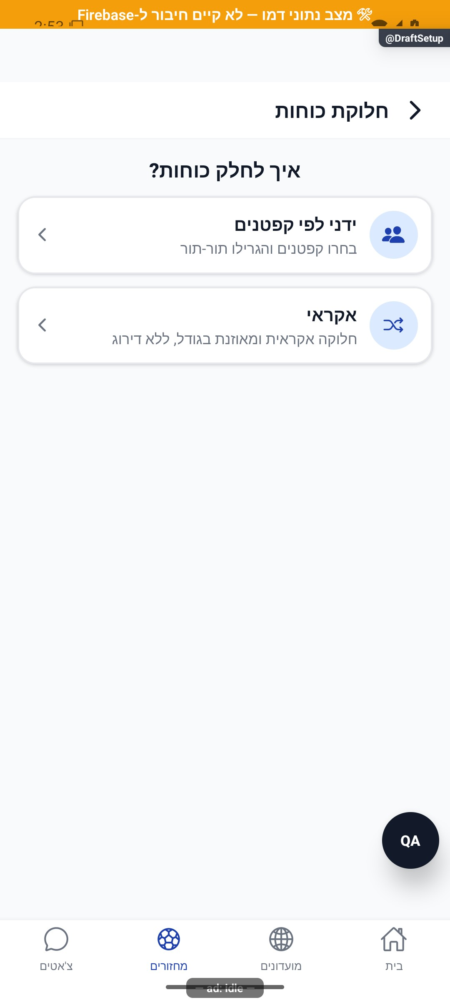
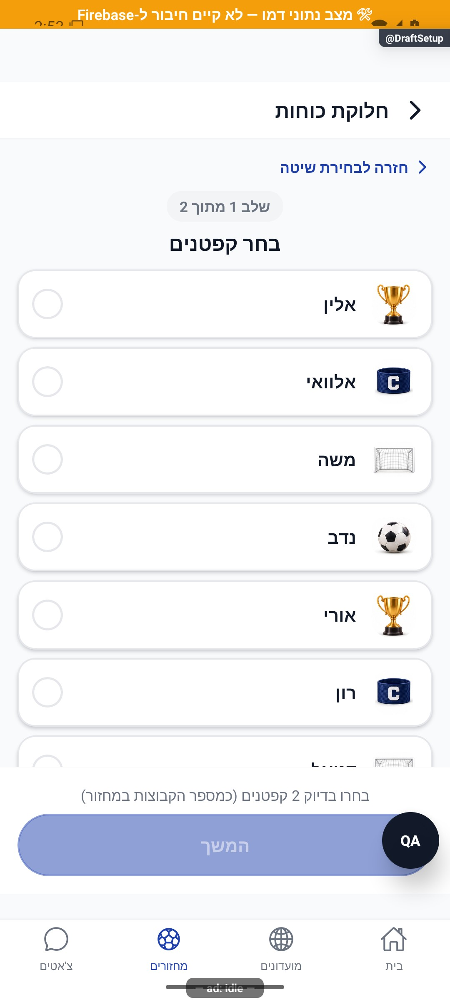
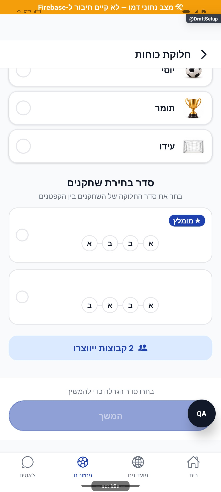

# הגדרת חלוקת כוחות — הסבר פשוט

כאן מחלקים את השחקנים לקבוצות לפני המשחק. אפשר לבחור חלוקה מאוזנת לפי דירוג, חלוקה אקראית או בחירה של קפטנים. לפני שממשיכים בודקים את מספר הקבוצות ואת דרך הבחירה.

[להסבר המעמיק ולמפת הקוד](draft-setup.md)

## צילום והיקף ההוכחה

הצילומים מציגים רק את המצבים המתועדים במסמך המעמיק. חלקם נתוני דמו, חלקם הוכחות מתיקון קודם, ובכמה מהם טעינה או הודעת הגנה; הם אינם אישור שכל התהליך או השרת נבדקו.

