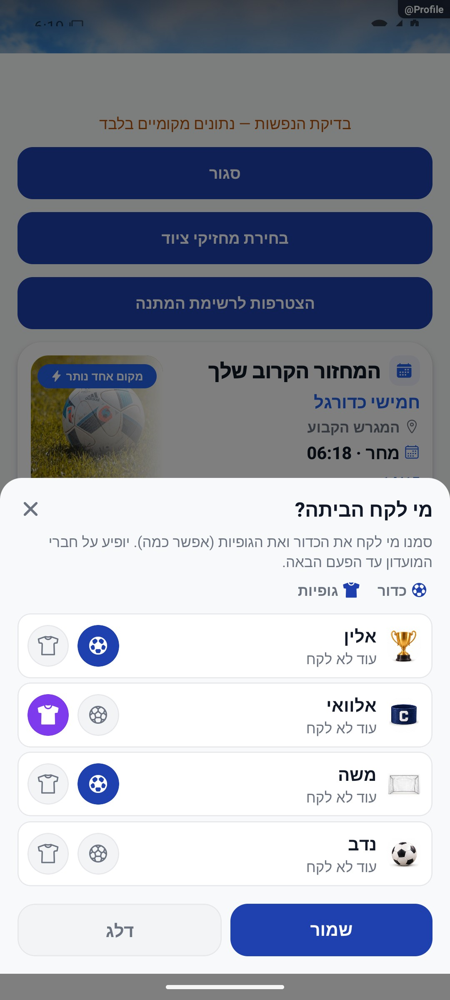
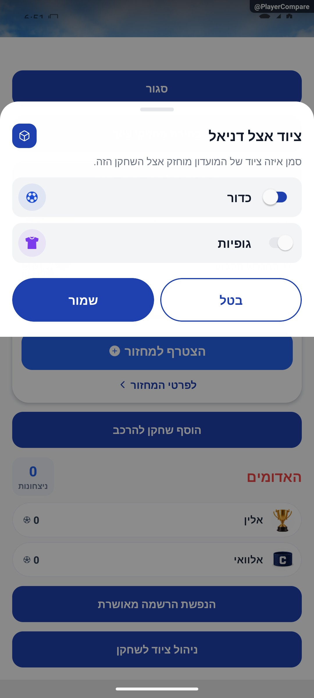

# מסירת כדור וחולצות בסיום

## עדכון מקומי — 10.10.2026

הבחנה בחוזה השמירה: `ManageEquipmentSheet` דרך סגל המועדון משתמשת כעת ב־`setPlayerEquipment`, עסקה לשחקן יחיד, כמפורט ב־[ניהול שחקן](../clubs/player-management.md). מסירת הציוד ב־`AdvancedLiveScreen` ממשיכה להפעיל `setEquipmentHolders` עם מערכי המחזיקים המלאים שאושרו. זו פעולה מפורשת של החלפת סגל מחזיקים, ולא עדכון חלקי לשחקן. חישוב ההוגנות, ההנפשה, `initial/lastTaken` ודילוג לא שונו. מבחן הרגרסיה לעדכון שחקן מוודא שמירת מחזיקים אחרים ודגלי שינוי; מסירת הרשימה המלאה לא הורצה מול מסד.

**מצב האימות:** תיקון מקומי, 10.10.2026. ראיות השירותים ופונקציות המקור ב־`tests/logic/clientAuditRecovery.test.ts`; הריצה הממוקדת המתועדת עברה 417 בדיקות ב־8 חבילות; השלמת שחזור מאוחר תועדה בדוח התיקון. [דוח התיקון והגבולות](../../../artifacts/pre-release-2026-10-10/client-fixes.md). לא הורצו כאן פעולות מול מסד אמיתי ולא צולמו מצבי כשל רשת חדשים; התמונות ההיסטוריות אינן הוכחה לתיקון זה.

עודכן: 7.10.2026. מקור הקוד: `8e8fde5`, גרסה `1.1.35`. מסמך זה מתאר את הקוד; מצב חנות ופריסת שרת דורשים ראיה נפרדת.

## כניסה ותפקידים

סיום מחזור מועדון → חלונית מסירת ציוד

מנהל; רק חברי מועדון רשומים מוצעים, ללא אורחים ידניים.

## רכיבים ומצבים

| רכיב / מצב | התנהגות וחוזה |
|---|---|
| שני פריטים | בחירה עצמאית בכדור ובחולצות, עם אפשרות לכמה מחזיקים |
| סדר | מיון לפי זמן לקיחה אחרון; ללא היסטוריה קודם; המינימום בין שני פריטי הציוד משמש לסידור |
| בחירה מוקדמת | בחירת ההוגנים ביותר לכל סוג, עם אותו מספר מחזיקים כמו קודם; ללא היסטוריה נופל למחזיקים הקודמים |
| מידע | lastTaken מתוך communityEvents; תאריך יום.חודש, ובשנה ישנה גם שנה |
| שמירה | onSave → setEquipmentHolders; מזהי מחזיקים ו־updatedAt נכתבים לקבוצה |
| דלג | onSkip אינו משנה מחזיקים; עדכון חנות הקבוצה אחרי שמירה |

## מסלול נתונים ומקומות שינוי

[`src/components/match/EquipmentHandoffModal.tsx`](../../../src/components/match/EquipmentHandoffModal.tsx)

נתוני group ו־communityEvents, setEquipmentHolders ב־groupService; ballHolderIds ו־jerseysHolderIds. הוגנות מחושבת בנפרד לפריט ולא רק על בסיס סדר רשימה.

ממיר המחזור: [`src/firebase/firestore.ts`](../../../src/firebase/firestore.ts), `gameDocConverter.fromFirestore`; סוגים: [`src/types`](../../../src/types). שינוי שדה דורש מעקב כתיבה → ממיר → שירות/חנות → רכיב. ניווט: [`GameStack.tsx`](../../../src/navigation/GameStack.tsx), ובמסכים משותפים גם המחסניות שמארחות אותם.

## בדיקות וראיות

לא נמצאה בדיקה ייעודית למסירת ציוד. להשלים תרחישים: אפס/אחד/רבים, ללא היסטוריה, חבר לא משתתף, דילוג וכשל שירות.

בעת המיפוי הראשוני לא נאסף צילום. צילום חלונית המסירה נוסף בסעיף השלמת ההנפשות להלן; שאר תרחישי השרת נשארים ללא הוכחה.

## גבולות והערות תחזוקה

עדכון 8.10: חלונית המסירה צולמה בדמו מקומי, ללא שמירת שירות. מסך ManageEquipmentSheet במועדון הוא הקשר נוסף למסירת ציוד.

לפני שינוי פתח את הקוד המקושר ואת [כללי הפרויקט](../../../AGENTS.md). לאחר שינוי עדכן במסמך זה את התאריך, נקודת הקוד, המצבים שהתעדכנו, הבדיקות והצילום. אין לטעון שכל מצב/תפקיד נבדק רק משום שקיים צילום אחד.

## פירוט טכני ממוקד: זרימה, חישוב ונקודות שינוי

[הסבר פשוט למשתמש](equipment.simple.md)

העמקה: 07.10.2026, מול קוד המקור שב־`8e8fde5`. בעת הכתיבה HEAD הוא `50d508f`; בדיקת ההפרש בין הנקודות ב־`src` וב־`functions` לא מצאה שינוי קוד. הסעיפים וההסתייגויות הקיימים נשמרו. זו קריאת קוד ותיעוד, בלי הרצת תרחישי כתיבה חדשים.

החלונית מקבלת `players/initial/lastTaken`; היא אינה טוענת לבדה היסטוריית ציוד. `took(id,item)` מחזיר זמן או 0; מיון השורות משתמש במינימום זמן הכדור והחולצות, בעוד המלצה נעשית בנפרד לכל פריט.

לדוגמה שחקן א לקח כדור אתמול ולא חולצות, ושחקן ב לקח חולצות אתמול ולא כדור: לשניהם המינימום 0, אך ההמלצה לכדור תעדיף את ב ולחולצות את א. `fairest(item,k)` משמר את מספר המחזיקים הקודם ככל שהקלט מאפשר; בהיעדר היסטוריה הבחירה חוזרת למחזיקים הראשוניים.

`onSave` מעביר `ballHolderIds/jerseysHolderIds` ל־`setEquipmentHolders`; `onSkip` אינו מסירת ציוד חדשה. יש לבדוק שהשירות מחזיר כתיבה מוצלחת לפני עדכון חנות/סגירה. מערכי מחזיקים אינם מונה מצטבר ואין להציג שמירת מערך כאידמפוטנטיות של אירועי ההיסטוריה. עדכון מקביל משני מנהלים דורש בדיקה ממוקדת.

נקודות שינוי: הוגנות בחלונית, הרשאה/שמירה בשירות המועדון, וחיבור סיום הערב במסך. הבדיקה הייעודית עדיין חסרה; יש לכסות אפס/אחד/רבים, ללא היסטוריה, דילוג וכשל.

## השלמת הנפשות — 8.10.2026

EquipmentChoiceRow מודדת onLayout של תמונת השחקן ושל שני כפתורי הציוד באותה שורה. בחירה שאינה מסומנת יוצרת IconFlight עם key חדש, נקודת מקור ונקודת יעד במידות השורה. TransferIcon נע 340 אלפיות שנייה עם קשת בגובה 12 ועוצמת Math.sin(progress*PI); ביטול בחירה אינו יוצר העברה הפוכה. תנועת האווטאר נובעת מצמד ballOn/jerseyOn. אלה מצבי טיוטה בלבד; onSave עדיין מעביר מערכי ballHolderIds/jerseysHolderIds והאלגוריתם fairest לא השתנה. ManageEquipmentSheet מדגישה את אייקון הפריט לפי value בלי לשנות שאר מחזיקים. מצב הפחתת תנועה מבטל את העברת האייקון והפעימה; החלונית המקורית עדיין משתמשת בפתיחת Modal slide הקיימת. הצילום וההקלטה הם חלונית המסירה עם כמה בחירות, ללא שמירת שירות. ניהול ציוד לשחקן נבדק בנפרד בחלונית בדיקה מקומית.

[פרטי האימות והמגבלות](../../changes/2026-10-08-motion-completion.md). מקור: `9ec0dfd` עם שינויים מקומיים; טרם פורסמה גרסה.

